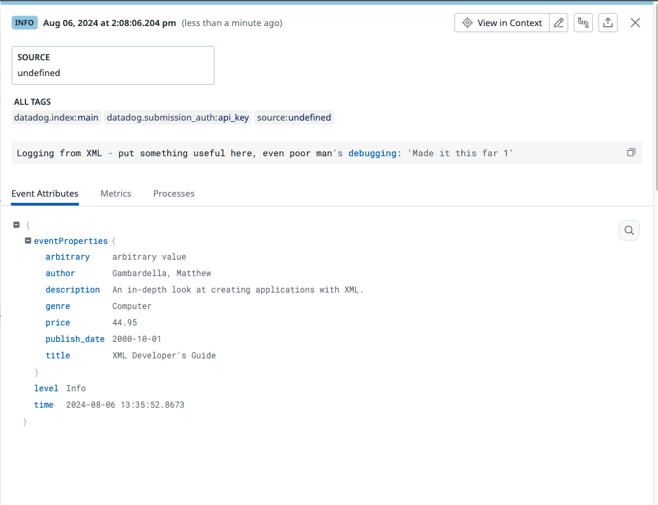

# .NET logging XML Example

Example application that logs structured logs (JSON) using NLog.

In scenario #1 it takes an XML object and extracts certain fields to be added
to the log, rather than logging the entire XML object.

In scenario #2 is chunks an XML file (object) into 1MB log events (the DD
API Logs Ingest limit) and submits them to Datadog.

# Prerequisites

- .Net installed locally (https://dotnet.microsoft.com/en-us/download/dotnet/8.0)

# Running

- `dotnet run` - will produce json output to `mylog.log`
    - If you want console logging, uncomment in `nlog.config` but with Scenario
    #2 we would not recommend it (a lot of output)

# Logs in Datadog

## Scenario #1
Configure your agent to read from whatever directory you've checked this repo
out into and tail the file `mylog.log`, see https://docs.datadoghq.com/agent/logs/?tab=tailfiles

It will look something like:

## Scenario #2
Configure your agent to read from whatever directory you've checked this repo
out into and tail the file `mylog.log`, see https://docs.datadoghq.com/agent/logs/?tab=tailfiles

It will look something like:

