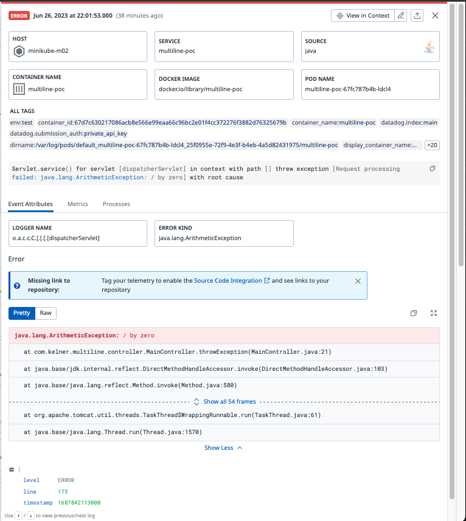
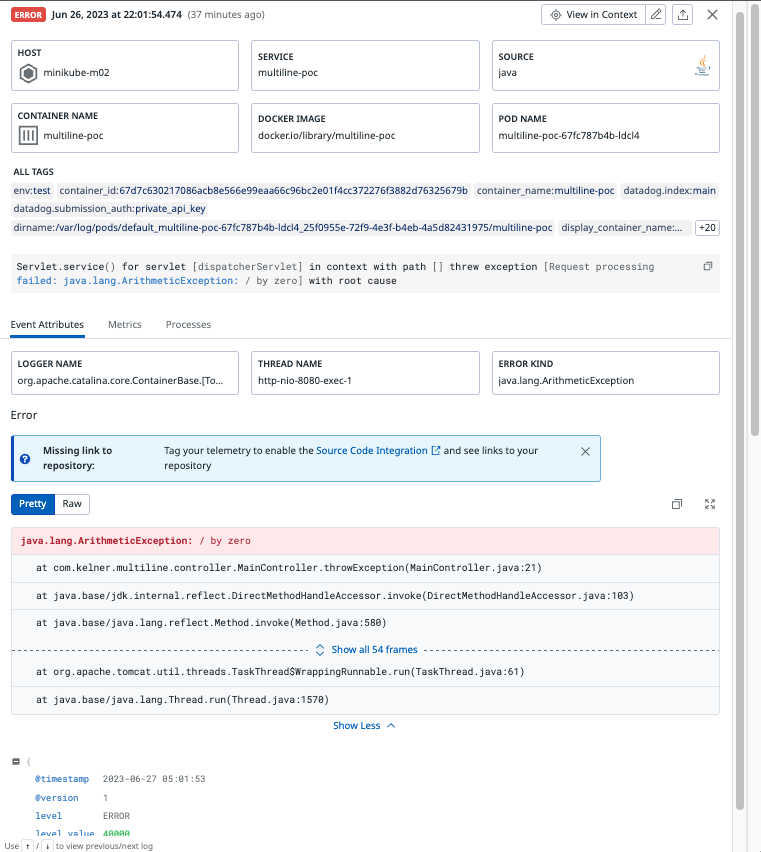

# Containized Java Multi-line logging POC

Proof of concept to show Datadog's multi-line logging capability, reproducting
a customer environment. A simple java application that throws an exception run
from k8s, with containerized Datadog agent configured via helm.

<!-- START doctoc generated TOC please keep comment here to allow auto update -->
<!-- DON'T EDIT THIS SECTION, INSTEAD RE-RUN doctoc TO UPDATE -->
**Table of Contents**

- [Specfic Requirements](#specfic-requirements)
- [NOTEWORTHY](#noteworthy)
  - [Logback Config](#logback-config)
  - [Helm Values vs Pod Annotations](#helm-values-vs-pod-annotations)
- [Datadog docs for reference](#datadog-docs-for-reference)
- [Prerequestites](#prerequestites)
- [Setup test environment](#setup-test-environment)
- [Build & Push](#build--push)
- [Running locally](#running-locally)
- [Triggering logs](#triggering-logs)
- [View your logs in Datadog](#view-your-logs-in-datadog)
- [See your logs before they get shipped](#see-your-logs-before-they-get-shipped)
- [Cleanup](#cleanup)
  - [Screen-recording: triggering logs and comparing JSON / Non-JSON logs](#screen-recording-triggering-logs-and-comparing-json--non-json-logs)
- [Example output](#example-output)
  - [Not JSON](#not-json)
  - [JSON](#json)

<!-- END doctoc generated TOC please keep comment here to allow auto update -->

## Specfic Requirements

To reproduce the given environment:

- Use Logback
- Do NOT use `LogstashEncoder` (recommended by Datadog)
  - _CAVEAT: we have both: we are double logging in plaintext and JSON which can be observed by tailing the container_
- Use K8s
- Use Helm

## NOTEWORTHY

### Logback Config

At the time of writing we didn't have all the details on the exact Logback configuration
being used in the evironment, but after some investigation using the `LogstashEncoder` we
noted that the environment was most likely not using it, as the attributes and formatting of
the log were quite dissimilar from what was provided to us.

This POC logs in both formats, see [Example output](#example-output) for comparison and
[`POCs/containers/java/multi-line-logging/multiline-poc/src/main/resources/logback.xml`](POCs/containers/java/multi-line-logging/multiline-poc/src/main/resources/logback.xml) for details.

### Helm Values vs Pod Annotations

Both are possible, and there are other methods as well, however charts and pod annotations are
easier to maintain and far more human friendly and readable.

Rather than setting `--set agents.containers.agent.envDict.DD_LOGS_CONFIG_AUTO_MULTI_LINE_EXTRA_PATTERNS` via
helm, and setting patterns across all containers, we assumed that customers would be ok using pod annotations in their
charts, as described here: <https://docs.datadoghq.com/containers/kubernetes/log/?tab=kubernetes#configuration>

1. `--set agents.containers.agent.envDict.DD_LOGS_CONFIG_AUTO_MULTI_LINE_EXTRA_PATTERNS='(..@timestamp|\\d{4}-\\d{2}-\\d{2}T\\d{2}:\\d{2}:\\d{2})'` will still work here, but it will apply to all containers, and we want to set additional annotations
to ensure the log has appropriate tags and is going through the correct pipeline
    a. As described here:
            - <https://docs.datadoghq.com/logs/log_collection/java/?tab=logback#configure-the-datadog-agent>
            - <https://docs.datadoghq.com/agent/logs/advanced_log_collection/?tab=configurationfile>)

## Datadog docs for reference

- <https://docs.datadoghq.com/agent/logs/advanced_log_collection/?tab=configurationfile#multi-line-aggregation>
- <https://docs.datadoghq.com/logs/log_collection/java/?tab=logback>
- <https://www.datadoghq.com/blog/multiline-logging-guide/>

## Prerequestites

- openjdk 20.0.1 or equivilant
- Maven
- Helm
- k8s cluster
  - _the author is using minikube_

## Setup test environment

- `minikube start --driver=docker --memory 2048 --cpus 2 --nodes 2`
- `minikube addons enable metrics-server`

## Build & Push

- `mvn clean install -f ./multiline-poc/pom.xml`
- `fakever=$(date +%s)`
- `docker build . -t multiline-poc:$fakever`
- `minikube image load multiline-poc:$fakever`

## Running locally

- `helm repo add datadog https://helm.datadoghq.com`
- `helm repo update`
- Customer's preferred method of deploy/configure (rather than yaml):
        helm upgrade \
        -n default \
        -i datadog-agent \
        --set datadog.apiKey=<REPLACE_WITH_YOUR_ENV_VAR_OR_STRING> \
        --set datadog.kubelet.tlsVerify=false \
        --set datadog.logs.enabled=true \
        --set datadog.logs.containerCollectAll=true \
        --set datadog.logs.autoMultiLineDetection=true \
        datadog/datadog
- Deploy our java app
        helm upgrade multiline-poc ./k8s/multiline-poc/ --install \
        -f ./k8s/multiline-poc/values.yaml \
        --set-string image.tag="$fakever"
- `minikube tunnel`
- Open <http://127.0.0.1:8080/>

## Triggering logs

Open <http://127.0.0.1:8080/exception> -- exceptions will log both normally and as JSON for comparison

## View your logs in Datadog

<https://app.datadoghq.com/logs?query=service%3Amultiline-poc>

## See your logs before they get shipped

`k logs --tail=100 -f deployment/multiline-poc`

## Cleanup

- `minikube stop`
- `minikube delete`

### Screen-recording: triggering logs and comparing JSON / Non-JSON logs

<https://a.cl.ly/4guXJRpn>

## Example output

### Not JSON

Screenshot (same as inline below): <https://a.cl.ly/nOuLnQxQ>

Example in Datadog:


Raw (from container):

```text
2023-06-27 05:01:53 ERROR o.a.c.c.C.[.[.[.[dispatcherServlet]:175 - Servlet.service() for servlet [dispatcherServlet] in context with path [] threw exception [Request processing failed: java.lang.ArithmeticException: / by zero] with root cause
java.lang.ArithmeticException: / by zero
    at com.kelner.multiline.controller.MainController.throwException(MainController.java:21)
    at java.base/jdk.internal.reflect.DirectMethodHandleAccessor.invoke(DirectMethodHandleAccessor.java:103)
    at java.base/java.lang.reflect.Method.invoke(Method.java:580)
    at org.springframework.web.method.support.InvocableHandlerMethod.doInvoke(InvocableHandlerMethod.java:207)
    at org.springframework.web.method.support.InvocableHandlerMethod.invokeForRequest(InvocableHandlerMethod.java:152)
    at org.springframework.web.servlet.mvc.method.annotation.ServletInvocableHandlerMethod.invokeAndHandle(ServletInvocableHandlerMethod.java:118)
    at org.springframework.web.servlet.mvc.method.annotation.RequestMappingHandlerAdapter.invokeHandlerMethod(RequestMappingHandlerAdapter.java:884)
    at org.springframework.web.servlet.mvc.method.annotation.RequestMappingHandlerAdapter.handleInternal(RequestMappingHandlerAdapter.java:797)
    at org.springframework.web.servlet.mvc.method.AbstractHandlerMethodAdapter.handle(AbstractHandlerMethodAdapter.java:87)
    at org.springframework.web.servlet.DispatcherServlet.doDispatch(DispatcherServlet.java:1081)
    at org.springframework.web.servlet.DispatcherServlet.doService(DispatcherServlet.java:974)
    at org.springframework.web.servlet.FrameworkServlet.processRequest(FrameworkServlet.java:1011)
    at org.springframework.web.servlet.FrameworkServlet.doGet(FrameworkServlet.java:903)
    at jakarta.servlet.http.HttpServlet.service(HttpServlet.java:564)
    at org.springframework.web.servlet.FrameworkServlet.service(FrameworkServlet.java:885)
    at jakarta.servlet.http.HttpServlet.service(HttpServlet.java:658)
    at org.apache.catalina.core.ApplicationFilterChain.internalDoFilter(ApplicationFilterChain.java:205)
    at org.apache.catalina.core.ApplicationFilterChain.doFilter(ApplicationFilterChain.java:149)
    at org.apache.tomcat.websocket.server.WsFilter.doFilter(WsFilter.java:51)
    at org.apache.catalina.core.ApplicationFilterChain.internalDoFilter(ApplicationFilterChain.java:174)
    at org.apache.catalina.core.ApplicationFilterChain.doFilter(ApplicationFilterChain.java:149)
    at org.springframework.web.filter.RequestContextFilter.doFilterInternal(RequestContextFilter.java:100)
    at org.springframework.web.filter.OncePerRequestFilter.doFilter(OncePerRequestFilter.java:116)
    at org.apache.catalina.core.ApplicationFilterChain.internalDoFilter(ApplicationFilterChain.java:174)
    at org.apache.catalina.core.ApplicationFilterChain.doFilter(ApplicationFilterChain.java:149)
    at org.springframework.web.filter.FormContentFilter.doFilterInternal(FormContentFilter.java:93)
    at org.springframework.web.filter.OncePerRequestFilter.doFilter(OncePerRequestFilter.java:116)
    at org.apache.catalina.core.ApplicationFilterChain.internalDoFilter(ApplicationFilterChain.java:174)
    at org.apache.catalina.core.ApplicationFilterChain.doFilter(ApplicationFilterChain.java:149)
    at org.springframework.web.filter.ServerHttpObservationFilter.doFilterInternal(ServerHttpObservationFilter.java:109)
    at org.springframework.web.filter.OncePerRequestFilter.doFilter(OncePerRequestFilter.java:116)
    at org.apache.catalina.core.ApplicationFilterChain.internalDoFilter(ApplicationFilterChain.java:174)
    at org.apache.catalina.core.ApplicationFilterChain.doFilter(ApplicationFilterChain.java:149)
    at org.springframework.web.filter.CharacterEncodingFilter.doFilterInternal(CharacterEncodingFilter.java:201)
    at org.springframework.web.filter.OncePerRequestFilter.doFilter(OncePerRequestFilter.java:116)
    at org.apache.catalina.core.ApplicationFilterChain.internalDoFilter(ApplicationFilterChain.java:174)
    at org.apache.catalina.core.ApplicationFilterChain.doFilter(ApplicationFilterChain.java:149)
    at org.apache.catalina.core.StandardWrapperValve.invoke(StandardWrapperValve.java:166)
    at org.apache.catalina.core.StandardContextValve.invoke(StandardContextValve.java:90)
    at org.apache.catalina.authenticator.AuthenticatorBase.invoke(AuthenticatorBase.java:482)
    at org.apache.catalina.core.StandardHostValve.invoke(StandardHostValve.java:115)
    at org.apache.catalina.valves.ErrorReportValve.invoke(ErrorReportValve.java:93)
    at org.apache.catalina.core.StandardEngineValve.invoke(StandardEngineValve.java:74)
    at org.apache.catalina.valves.RemoteIpValve.invoke(RemoteIpValve.java:738)
    at org.apache.catalina.connector.CoyoteAdapter.service(CoyoteAdapter.java:341)
    at org.apache.coyote.http11.Http11Processor.service(Http11Processor.java:391)
    at org.apache.coyote.AbstractProcessorLight.process(AbstractProcessorLight.java:63)
    at org.apache.coyote.AbstractProtocol$ConnectionHandler.process(AbstractProtocol.java:894)
    at org.apache.tomcat.util.net.NioEndpoint$SocketProcessor.doRun(NioEndpoint.java:1741)
    at org.apache.tomcat.util.net.SocketProcessorBase.run(SocketProcessorBase.java:52)
    at org.apache.tomcat.util.threads.ThreadPoolExecutor.runWorker(ThreadPoolExecutor.java:1191)
    at org.apache.tomcat.util.threads.ThreadPoolExecutor$Worker.run(ThreadPoolExecutor.java:659)
    at org.apache.tomcat.util.threads.TaskThread$WrappingRunnable.run(TaskThread.java:61)
    at java.base/java.lang.Thread.run(Thread.java:1570)
```

### JSON

Screenshot (same as inline below): <https://a.cl.ly/6quJPwlX>



```json
{
  "@timestamp": "2023-06-27 05:01:53",
  "@version": "1",
  "message": "Servlet.service() for servlet [dispatcherServlet] in context with path [] threw exception [Request processing failed: java.lang.ArithmeticException: / by zero] with root cause",
  "logger_name": "org.apache.catalina.core.ContainerBase.[Tomcat].[localhost].[/].[dispatcherServlet]",
  "thread_name": "http-nio-8080-exec-1",
  "level": "ERROR",
  "level_value": 40000,
  "stack_trace": "java.lang.ArithmeticException: / by zero\n\tat com.kelner.multiline.controller.MainController.throwException(MainController.java:21)\n\tat java.base/jdk.internal.reflect.DirectMethodHandleAccessor.invoke(DirectMethodHandleAccessor.java:103)\n\tat java.base/java.lang.reflect.Method.invoke(Method.java:580)\n\tat org.springframework.web.method.support.InvocableHandlerMethod.doInvoke(InvocableHandlerMethod.java:207)\n\tat org.springframework.web.method.support.InvocableHandlerMethod.invokeForRequest(InvocableHandlerMethod.java:152)\n\tat org.springframework.web.servlet.mvc.method.annotation.ServletInvocableHandlerMethod.invokeAndHandle(ServletInvocableHandlerMethod.java:118)\n\tat org.springframework.web.servlet.mvc.method.annotation.RequestMappingHandlerAdapter.invokeHandlerMethod(RequestMappingHandlerAdapter.java:884)\n\tat org.springframework.web.servlet.mvc.method.annotation.RequestMappingHandlerAdapter.handleInternal(RequestMappingHandlerAdapter.java:797)\n\tat org.springframework.web.servlet.mvc.method.AbstractHandlerMethodAdapter.handle(AbstractHandlerMethodAdapter.java:87)\n\tat org.springframework.web.servlet.DispatcherServlet.doDispatch(DispatcherServlet.java:1081)\n\tat org.springframework.web.servlet.DispatcherServlet.doService(DispatcherServlet.java:974)\n\tat org.springframework.web.servlet.FrameworkServlet.processRequest(FrameworkServlet.java:1011)\n\tat org.springframework.web.servlet.FrameworkServlet.doGet(FrameworkServlet.java:903)\n\tat jakarta.servlet.http.HttpServlet.service(HttpServlet.java:564)\n\tat org.springframework.web.servlet.FrameworkServlet.service(FrameworkServlet.java:885)\n\tat jakarta.servlet.http.HttpServlet.service(HttpServlet.java:658)\n\tat org.apache.catalina.core.ApplicationFilterChain.internalDoFilter(ApplicationFilterChain.java:205)\n\tat org.apache.catalina.core.ApplicationFilterChain.doFilter(ApplicationFilterChain.java:149)\n\tat org.apache.tomcat.websocket.server.WsFilter.doFilter(WsFilter.java:51)\n\tat org.apache.catalina.core.ApplicationFilterChain.internalDoFilter(ApplicationFilterChain.java:174)\n\tat org.apache.catalina.core.ApplicationFilterChain.doFilter(ApplicationFilterChain.java:149)\n\tat org.springframework.web.filter.RequestContextFilter.doFilterInternal(RequestContextFilter.java:100)\n\tat org.springframework.web.filter.OncePerRequestFilter.doFilter(OncePerRequestFilter.java:116)\n\tat org.apache.catalina.core.ApplicationFilterChain.internalDoFilter(ApplicationFilterChain.java:174)\n\tat org.apache.catalina.core.ApplicationFilterChain.doFilter(ApplicationFilterChain.java:149)\n\tat org.springframework.web.filter.FormContentFilter.doFilterInternal(FormContentFilter.java:93)\n\tat org.springframework.web.filter.OncePerRequestFilter.doFilter(OncePerRequestFilter.java:116)\n\tat org.apache.catalina.core.ApplicationFilterChain.internalDoFilter(ApplicationFilterChain.java:174)\n\tat org.apache.catalina.core.ApplicationFilterChain.doFilter(ApplicationFilterChain.java:149)\n\tat org.springframework.web.filter.ServerHttpObservationFilter.doFilterInternal(ServerHttpObservationFilter.java:109)\n\tat org.springframework.web.filter.OncePerRequestFilter.doFilter(OncePerRequestFilter.java:116)\n\tat org.apache.catalina.core.ApplicationFilterChain.internalDoFilter(ApplicationFilterChain.java:174)\n\tat org.apache.catalina.core.ApplicationFilterChain.doFilter(ApplicationFilterChain.java:149)\n\tat org.springframework.web.filter.CharacterEncodingFilter.doFilterInternal(CharacterEncodingFilter.java:201)\n\tat org.springframework.web.filter.OncePerRequestFilter.doFilter(OncePerRequestFilter.java:116)\n\tat org.apache.catalina.core.ApplicationFilterChain.internalDoFilter(ApplicationFilterChain.java:174)\n\tat org.apache.catalina.core.ApplicationFilterChain.doFilter(ApplicationFilterChain.java:149)\n\tat org.apache.catalina.core.StandardWrapperValve.invoke(StandardWrapperValve.java:166)\n\tat org.apache.catalina.core.StandardContextValve.invoke(StandardContextValve.java:90)\n\tat org.apache.catalina.authenticator.AuthenticatorBase.invoke(AuthenticatorBase.java:482)\n\tat org.apache.catalina.core.StandardHostValve.invoke(StandardHostValve.java:115)\n\tat org.apache.catalina.valves.ErrorReportValve.invoke(ErrorReportValve.java:93)\n\tat org.apache.catalina.core.StandardEngineValve.invoke(StandardEngineValve.java:74)\n\tat org.apache.catalina.valves.RemoteIpValve.invoke(RemoteIpValve.java:738)\n\tat org.apache.catalina.connector.CoyoteAdapter.service(CoyoteAdapter.java:341)\n\tat org.apache.coyote.http11.Http11Processor.service(Http11Processor.java:391)\n\tat org.apache.coyote.AbstractProcessorLight.process(AbstractProcessorLight.java:63)\n\tat org.apache.coyote.AbstractProtocol$ConnectionHandler.process(AbstractProtocol.java:894)\n\tat org.apache.tomcat.util.net.NioEndpoint$SocketProcessor.doRun(NioEndpoint.java:1741)\n\tat org.apache.tomcat.util.net.SocketProcessorBase.run(SocketProcessorBase.java:52)\n\tat org.apache.tomcat.util.threads.ThreadPoolExecutor.runWorker(ThreadPoolExecutor.java:1191)\n\tat org.apache.tomcat.util.threads.ThreadPoolExecutor$Worker.run(ThreadPoolExecutor.java:659)\n\tat org.apache.tomcat.util.threads.TaskThread$WrappingRunnable.run(TaskThread.java:61)\n\tat java.base/java.lang.Thread.run(Thread.java:1570)\n"
}
```
