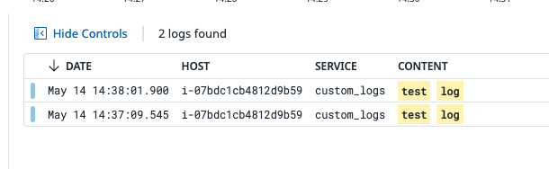

# Datadog Agent Custom Check to OP

Collect output from arbitrary bash script via DD Agent Custom Check and submit it as a log to be sent to observability pipelines.

## Install the Agent

Install page: https://app.datadoghq.com/fleet/install-agent/latest?platform=overview

```bash
DD_API_KEY=abc...123 \
DD_SITE="datadoghq.com" \
bash -c "$(curl -L https://install.datadoghq.com/scripts/install_script_agent7.sh)"
```

## Configure the agent to collect logs

Configuration could be done via your configuration management tool of choice, for the sake of brevity in testing showcasing how to do so manually.

Config options: https://github.com/DataDog/datadog-agent/blob/main/pkg/config/config_template.yaml

- Uncomment `logs_enabled` [link](https://github.com/DataDog/datadog-agent/blob/main/pkg/config/config_template.yaml#L941-L949) and set it to `true`

```yaml
##################################
## Log collection Configuration ##
##################################

## @param logs_enabled - boolean - optional - default: false
## @env DD_LOGS_ENABLED - boolean - optional - default: false
## Enable Datadog Agent log collection by setting logs_enabled to true.
#
logs_enabled: true
```

## Configure the agent to listen for logs on a TCP port

This will be used to send logs from our custom check. Instead of writing to a file and tailing the file, which is a viable alternative.

- `sudo mkdir /etc/datadog-agent/conf.d/custom_logs.d/`
- `sudo vi /etc/datadog-agent/conf.d/custom_logs.d/conf.yaml`

    ```yaml
    logs:
        - type: tcp
            port: 10518
            service: "<APP_NAME>"
            source: "<CUSTOM_SOURCE>"
    ```

- Where `service` and `source` can be any values you like
  - `source` is used by Datadog SaaS pipelines to apply out-of-the-box log pipelines, you can write your own custom pipeline to parse logs as well

Restart the agent service: `sudo systemctl restart datadog-agent`

## Test sending logs over TCP

`curl telnet://localhost:10518/ -m 2 <<< '{"message":"test log"}'`



## Configure a custom agent check

- `sudo vi /etc/datadog-agent/conf.d/custom_checkvalue.yaml`

    ```yaml
    init_config:

    instances:
        - min_collection_interval: 5
    ```

- `min_collection_interval` is in seconds and can be adjusted to the user's needs
- `sudo vi /etc/datadog-agent/checks.d/custom_checkvalue.py`
  - Copy the contents of [custom_checkvalue.py](./custom_checkvalue.py) into the file
- `sudo vi /opt/custom_bash.sh`
  - Copy the contents of [custom_bash.sh](./custom_bash.sh) into the file
- Restart the agent service: `sudo systemctl restart datadog-agent`
- Test the custom check: `sudo -u dd-agent datadog-agent check custom_checkvalue`:

    ```bash
    Running Checks
    ==============

    custom_checkvalue (unversioned)
    -------------------------------
      Instance ID: custom_checkvalue:fe880881f3bd8083 [OK]
      Configuration Source: file:/etc/datadog-agent/conf.d/custom_checkvalue.yaml
      Total Runs: 1
      Metric Samples: Last Run: 0, Total: 0
      Events: Last Run: 0, Total: 0
      Service Checks: Last Run: 0, Total: 0
      Average Execution Time : 3.08s
      Last Execution Date : 2025-05-14 22:01:03 UTC (1747260063000)
      Last Successful Execution Date : 2025-05-14 22:01:03 UTC (1747260063000)
    ```

- Verify logs show up in Datadog log explorer:

    

## Install Observability Pipelines worker

In a production setting you'd deploy Observability Pipelines in a managed instance group (e.g. autoscaling group) behind a load balancer, similar to the diagram below, for testing purposes herein we will deploy OP locally to our linux host.


- Navigate to https://app.datadoghq.com/observability-pipelines
- Select "Log Volume Control"
- Select "Datadog Agent" as your source
- Select "Datadog" as your destination
- Remove all processes except "Edit Fields"
- Modify the "Edit Fields" processor as follows:
  - "Add Field"
  - "Filter query": `*`
  - "Field to add": `custom_check_op`
  - "Value to add": `true`
- It should look like the following:

    

- Click "Next: install" in the top right of the screen
- Choose your target platform, in our test case here, Ubuntu
- Fill in the "Listener address" as `0.0.0.0:8282`
  - OPW listens on all interfaces on port `8282`
- Select an API Key with Remote Config enabled
- Copy the install command and run it on your host:

    ```bash
    sudo DD_API_KEY=abc...123 DD_OP_PIPELINE_ID=45aa6a56-3113-11f0-a489-da7ad0900002 DD_SITE=datadoghq.com DD_OP_SOURCE_DATADOG_AGENT_ADDRESS='0.0.0.0:8282' bash -c "$(curl -L https://install.datadoghq.com/scripts/install_script_op_worker2.sh)"
    ```

- Click "Deploy Pipeline" in the UI
- After a moment you should see that your pipeline configuration has been delivered to your worker(s) via remote configuration:

    

## Configure the Agent to send logs to Observability Pipelines Worker

In most production settings you'd deploy the OP workers in a managed instance pool (e.g. autoscaling group) behind a load balancer and point to your load balancer URL. Here we have installed OP locally for easy test reproduction. Potentially this setup could be used in a production environment as well should it suffice for your needs.

- `sudo vi /etc/datadog-agent/datadog.yaml`
- Uncomment `observability_pipelines_worker` [link](https://github.com/DataDog/datadog-agent/blob/main/pkg/config/config_template.yaml#L647)
- Uncomment `observability_pipelines_worker.logs`, `observability_pipelines_worker.logs.enabled`, `observability_pipelines_worker.logs.url` [link](https://github.com/DataDog/datadog-agent/blob/main/pkg/config/config_template.yaml#L669-L681)
- Set `observability_pipelines_worker.logs.enabled` to `true`
- Set `observability_pipelines_worker.logs.url` to `http://127.0.0.1:8282`

```yaml
## Configuration for forwarding telemetry to an Observability Pipelines Worker instead of Datadog.
## https://www.datadoghq.com/product/observability-pipelines/
#
observability_pipelines_worker:

  ## @param  logs - custom object - optional
  ## Specific configurations for logs
  #
  logs:

    ## @param enabled - boolean - optional - default: false
    ## @env DD_OBSERVABILITY_PIPELINES_WORKER_LOGS_ENABLED - boolean - optional - default: false
    ## Enables forwarding of logs to an Observability Pipelines Worker
    #
    enabled: true

    ## @param url - string - optional - default: ""
    ## @env DD_OBSERVABILITY_PIPELINES_WORKER_LOGS_URL - string - optional - default: ""
    ## URL endpoint for the Observability Pipelines Worker to send logs to
    #
    url: "http://127.0.0.1:8686"
```

- Restart the agent service: `sudo systemctl restart datadog-agent`

## Verify logs are flowing through OP

- Back on your OP Pipeline overview page, click the gear icon on your source and click "View Details"

    

- In the slide out panel you can verify events are flowing through OP:

    

- In the log explorer you can search for logs flowing through OP by targeting the attribute we added to our logs via the "Edit Fields" processor. Search for `@custom_check_op:true`: https://app.datadoghq.com/logs?query=%40custom_check_op%3Atrue as seen below:

    

## Finish

We now have a custom check running a bash script from the Datadog agent, that custom check is submitting logs over a TCP socket to the agent, and those logs are being sent to Datadog SaaS via Observability Pipelines.
