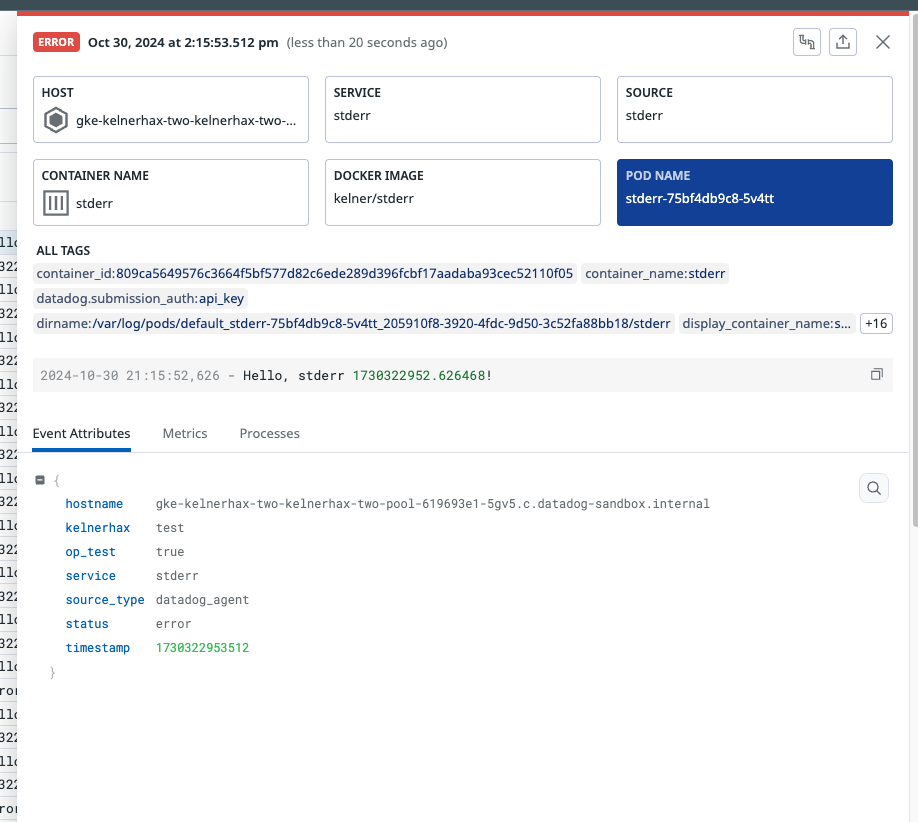
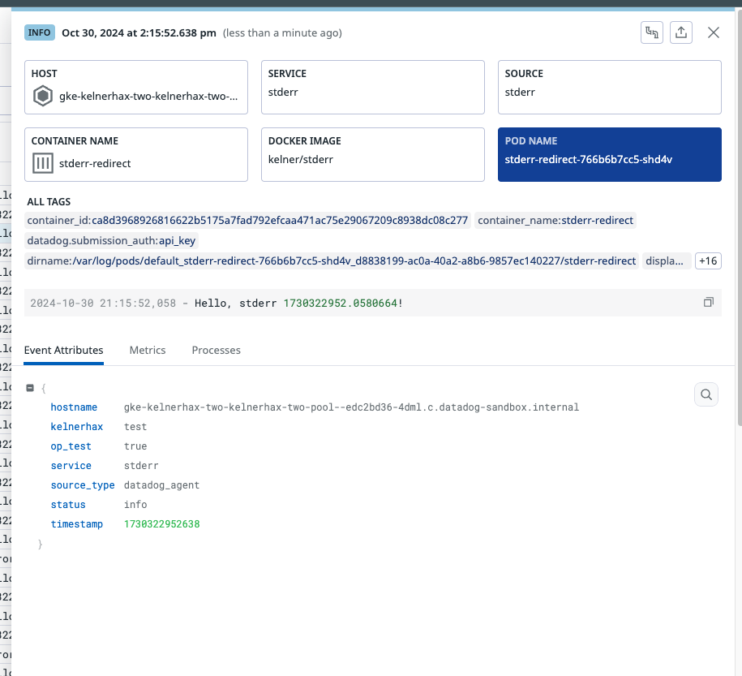

# Redirecting stderr logging to stdout & sent via OP

Prerequesites:
- k8s cluster
- Datadog agent with logging enabled & Observability Pipelines configured
- Observability Pipelines configured with Datadog agent source and Datadog destination

- Build and publish -- change `kelner` to your own docker user
    - `docker build --platform=linux/amd64,linux/arm64 -t kelner/stderr:v1 .`
    - `docker push kelner/stderr:v1`
- Run two deployments in k8s, one uses `2>&1` to redirect stderr to stdout
    - `k apply -f stderr.yaml`
    - `k apply -f stderr-redirect.yaml`

Note that those without `2>&1` redirect get `status:error` attribute due to nature of `stream` written to k8s log files on k8s nodes under `/var/logs/pods/...` something like:

Containerd:
```
2024-10-30T21:15:52.528544325Z stderr F 2024-10-30 21:15:52,058 - Hello, stderr 1730322952.0580664!
```

Docker:
```
{"log":"2024-10-30 21:15:52,058 - Hello, stderr 1730322952.0580664!","stream":"stderr","time":"2024-10-30T21:15:52.528544325Z"}
```

Which results in this in Datadog:


Whereas those using `2>&1` get `status:info` attribute and result in `stderr` being replaced with `stdout` in the raw log examples above.
This results in this in Datadog:


If an organization has other identifying attributes, such as `@level` for their logs, then we can rely on Datadog SaaS Intake pipelines and processing to appropriately label logs.
