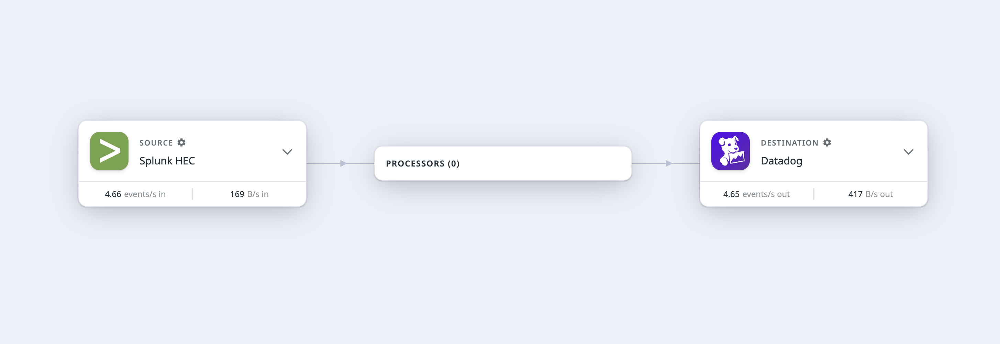

# Observability Pipelines on EKS with public load balancer

## Setup OP Worker(s) in EKS

- In Datadog navigate to https://app.datadoghq.com/observability-pipelines
- Select a template that fits your use case
- Fill in the source, destinations, and processors you want
    - For simplicity sake you can remove all processors for now and OP will act as a "pass through"
        - You can add processors later
- Choose “Next: Install” at top right of pipeline builder
- Choose “Kubernetes” and “Amazon EKS”
- For your source address: this is the local socket that OPW will be listening on to receive logs from your collector/forwarders (e.g. Datadog Agent, Rsyslog, Splunk Forwarders, etc)
    - In the supplied values file below this will also be exposed via a Load Balancer
- Note: You'll see the instructions "Download the Helm chart `values.yaml` file" - this **does not** contain a load balancer, this repo [contains a `values.yaml` that configured an exposed LB for you](./values.yaml)
    - You can find all available values in the helm chart here: https://github.com/DataDog/helm-charts/blob/main/charts/observability-pipelines-worker/values.yaml
- Run the helm install command:

    ```
    helm upgrade --install opw \
	-f values.yaml \
	--set datadog.apiKey=XXXXXXXXXXXXXXXXXXXXXX \
	--set datadog.pipelineId=df657176-745e-11ef-9ff0-da7ad0900002 \
	--set env[0].name=DD_OP_SOURCE_SPLUNK_HEC_ADDRESS,env[0].value='0.0.0.0:8888' \
	--set service.ports[0].name=dd-op-source-splunk-hec-address-port,service.ports[0].protocol=TCP,service.ports[0].port=8888,service.ports[0].targetPort=8888 \
	datadog/observability-pipelines-worker
    ```

- Get your Load Balancer with: `kubectl get svc` and you should get output like:

    ```
    NAME                                      TYPE           CLUSTER-IP      EXTERNAL-IP                             PORT(S)          AGE
kubernetes                                    ClusterIP      172.20.0.1      <none>                                  443/TCP          79m
opw-observability-pipelines-worker            LoadBalancer   172.20.190.54   <your-id>.us-east-2.elb.amazonaws.com   8888:32702/TCP   4m
opw-observability-pipelines-worker-headless   ClusterIP      None            <none>                                  8888/TCP         57m

    ```

- While your load balancer address may show here, it does take some time to provision, so you'll need to check its status via `kubectl describe svc opw-observability-pipelines-worker` or via AWS console https://us-west-2.console.aws.amazon.com/ec2/home?region=us-west-2#LoadBalancers:v=3;$case=tags:false%5C,client:false;$regex=tags:false%5C,client:false (search for your LB and check its status is `active`)
- You can now submit logs to this load balancer from the internet via curl:

    ```
    curl -k http://<your-id>.us-east-2.elb.amazonaws.com:8888/services/collector/event -d '{ "event": "this is my log message"}'
    {"text":"Success","code":0}
    ```

- And you should be able to see event statistics showing up in the DD OP Control Plane:


