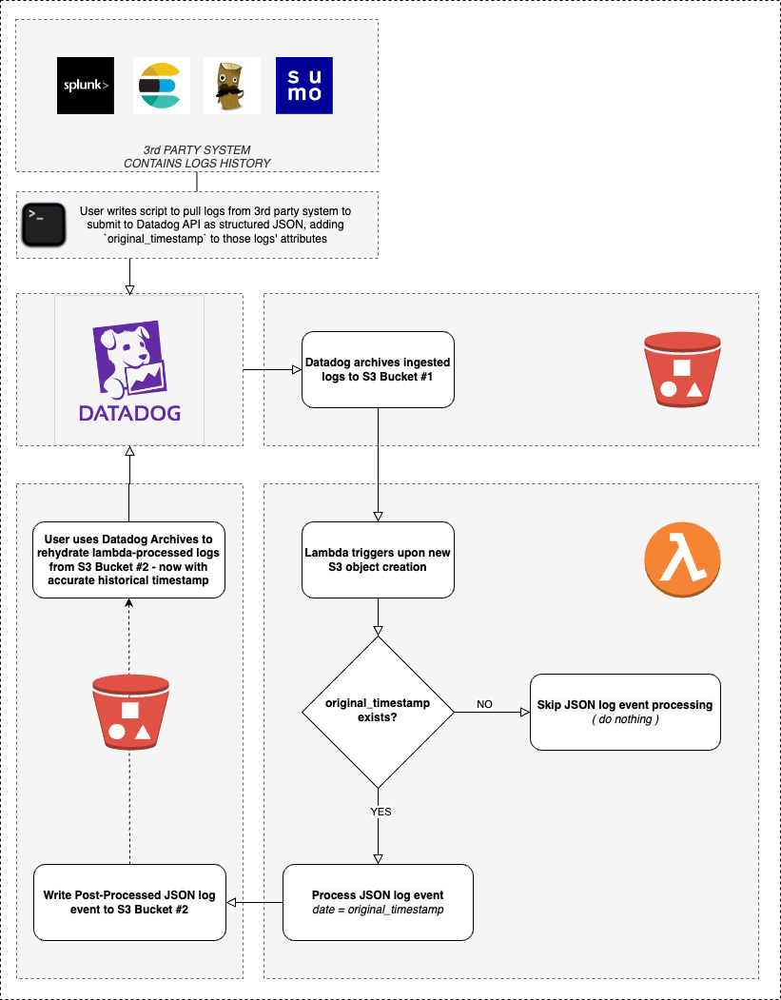
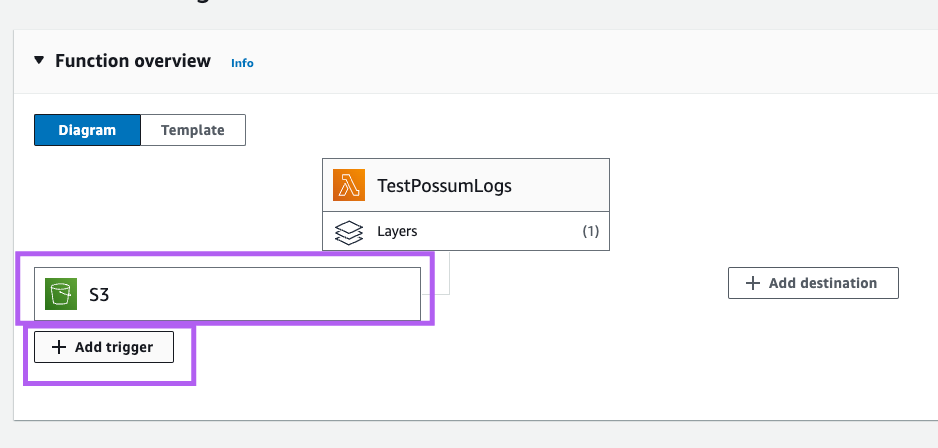
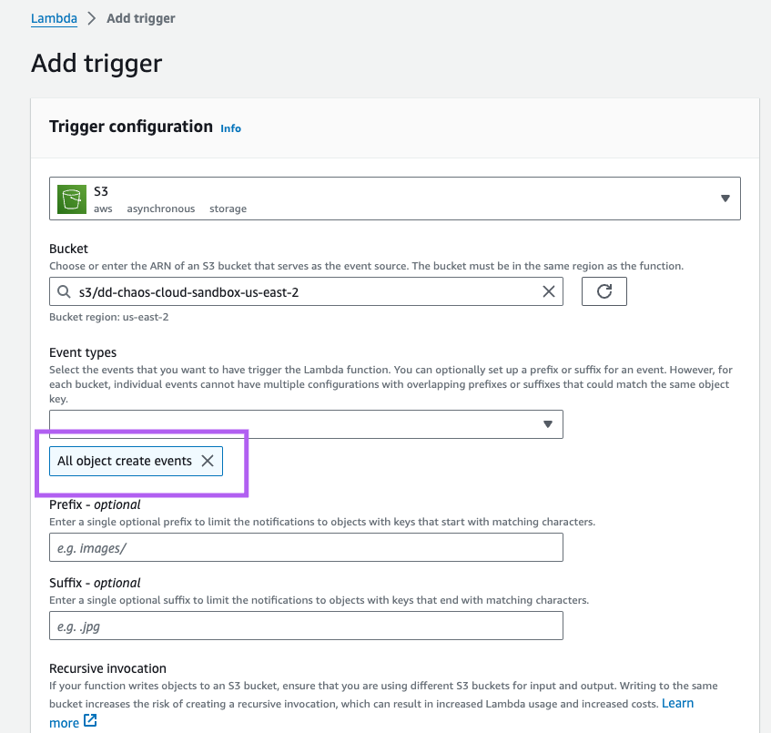

# Rehydrate Old Logs [Proof of Concept]

## TODO (Kelner)

- [ ] Write up requirements for logs being sent for rehydration
- [ ] Write up cost considerations of doing it (double charged)
- [ ] Consider removing the lambda requirement, and lean on customers to find their own way to push logs to an S3 archive
- [ ] Watch <https://drive.google.com/file/d/1kExUCiYFRmSmuXydCWs7Qi29i-xHHy8c/view> to see if there's details to be gleaned.
- [ ] Go through steps of setup, capture the steps, make sure it works and there are no gaps

## Disclaimer

These projects are not a part of Datadog's subscription services and are provided for example purposes only. They are NOT guaranteed to be bug free and are not production quality. If you choose to use to adapt them for use in a production environment, you do so at your own risk.

<!-- START doctoc generated TOC please keep comment here to allow auto update -->
<!-- DON'T EDIT THIS SECTION, INSTEAD RE-RUN doctoc TO UPDATE -->
**Table of Contents**

- [Overview](#overview)
  - [Is this an official Datadog Solution?](#is-this-an-official-datadog-solution)
  - [Log Retention Considerations](#log-retention-considerations)
  - [Two Methods](#two-methods)
    - [Pre-requisites for each](#pre-requisites-for-each)
    - [Manual Method](#manual-method)
    - [Lambda Method](#lambda-method)
- [Manual script](#manual-script)
  - [dd-rehydrate-past.py](#dd-rehydrate-pastpy)
  - [Brief](#brief)
  - [DD Compliant Logs Archive](#dd-compliant-logs-archive)
  - [Logic flow](#logic-flow)
  - [Basic Usage](#basic-usage)
  - [Available Options](#available-options)
  - [Advanced Usage](#advanced-usage)
    - [Filtered by day](#filtered-by-day)
    - [Filtered by day & hour](#filtered-by-day--hour)
    - [Filtered using RegEx](#filtered-using-regex)
    - [Debug Output](#debug-output)
  - [Example](#example)
- [Lambda Function](#lambda-function)
  - [Negative Attributes of this method](#negative-attributes-of-this-method)
  - [lambda.py: Noteworthy](#lambdapy-noteworthy)
  - [Highlevel Lambda Setup & Flow Overview](#highlevel-lambda-setup--flow-overview)
    - [Setup](#setup)
    - [Continual running process until all historical logs have been ingested](#continual-running-process-until-all-historical-logs-have-been-ingested)
    - [Flowchat](#flowchat)
  - [Configuration > AWS > S3 Buckets](#configuration--aws--s3-buckets)
  - [Configuration > AWS > Lambda Function / S3 Trigger](#configuration--aws--lambda-function--s3-trigger)
  - [Datadog](#datadog)
    - [Log Archives](#log-archives)
      - [Config Overview in UI](#config-overview-in-ui)
      - [Archive Config](#archive-config)
      - [Rehydrate Config](#rehydrate-config)
    - [Pipelines](#pipelines)
  - [Misc. findings](#misc-findings)
    - [Log Archives naming](#log-archives-naming)
  - [Extra Tooling](#extra-tooling)
    - [Dummy Log Event Generator](#dummy-log-event-generator)
    - [Usage](#usage)
    - [Example Message](#example-message)
    - [Credentials](#credentials)

<!-- END doctoc generated TOC please keep comment here to allow auto update -->

# Overview

## Is this an official Datadog Solution?

No. It is admittedly a “hack“ of our own solution. The principle behind it is to trick Datadog into thinking it is rehydrating archives it previously created, while actually rehydrating logs which

The idea is to kickstart a prospect or customer into building their own solution to import historical logs from their former system into Datadog, hence the Proof-Of-Concept / non-official-solution disclaimers.

## Log Retention Considerations

Under the scenes, rehydrating effectively creates a new index which obeys the customer’s contractual log retention for their given DD org.

Should you require a log retention increase (say 6 months / 180 days for instance), this should occur before rehydration as the resulting index can only retain rehydrated logs for as long as the contractual retention period at the time of rehydration.

## Two Methods

Below are two methods in which you can restore logs to the Datadog platform. A brief description of the requirements, commonalities, and details of each is in the following two headings. Below this section you'll find top level headings for each.

### Pre-requisites for each

- You must write a script to pull your historical logs from some third-party location, such as Splunk, Elastic, Sumo, or blob storage such as S3.
- You must format those logs in JSON
- You must copy the original timestamp (usually `date` or `timestamp`) field to a new field on the log: `original_timestamp`
- You must replace the `date`/`timestamp` field with the current timestamp
- Then either write your logs to a DD compliant S3/GCP/Azure archive, or submit them to the Datadog API to be written to a bucket on your behalf via DD Archives
  - For writing logs to a DD compliant archive see the section [DD Compliant Logs Archive](#dd-compliant-archive) under the `Manual Script` section.

_There is more setup for the Lambda Function solution, it is detailed in the sections below_

### Manual Method

### Lambda Method

[Lambda Function details](#lambda-function)

In short a script that you've (the customer) has written submits logs to the DD API with todays date as the official timestamp while also including a `original_timestamp` field, that is then written to an S3 bucket via DD Archives (DD SaaS platform functionality), then you rehydrate these logs into the DD platform under their original timestamp for querying.

**NOTE**: This method does have flaws. While it makes it easier to get logs into a Datadog compliant blob store, it also incurs some negatives, see the details section for more info.

# Manual script

## dd-rehydrate-past.py

## Brief

This is an early version of the lambda script for manual testing. It recursively parses an entire S3 bucket looking for matching archives to process with some super basic support for date filters. Then it submits those to a target bucket that can be used for rehydration purposes in Datadog.

It is still useful now for a method which skips writting to the Datadog API and thus being charged twice for the same logs (once for the original DD submission that gets forwarded to the blob store, and again for rehydrating the log).

## DD Compliant Logs Archive

## Logic flow

- Parse `source_bucket` for log events archives matching `.*/archive_.*.json.gz`
  - Optionally, restrict to `YYYYMMDD` / `HH`
- Parse log archives looking for `JSON` log events
- Process log events by updating `date` with `original_timestamp`
- Write processed & sorted log events to hourly archives in `target_bucket`

## Basic Usage

`python3 dd-rehydrate-past.py source_bucket target_bucket`

## Available Options

| option          | description           | required |
|-----------------|-----------------------|----------|
| `source_bucket` | _bucket to read from_ | **Y**    |
| `target_bucket` | _bucket to write to_  | **Y**    |
| `YYYYMMDD`      | _filter by day_       |   N      |
| `HH`            | _filter by hour_      |   N      |

## Advanced Usage

### Filtered by day

`python3 dd-rehydrate-past.py source_bucket target_bucket YYYYMMDD`

### Filtered by day & hour

`python3 dd-rehydrate-past.py source_bucket target_bucket YYYYMMDD HH`

### Filtered using RegEx

`python3 dd-rehydrate-past.py source_bucket target_bucket YYYY.*`

### Debug Output

`DEBUG=true python3 dd-rehydrate-past.py source_bucket target_bucket`

- All **DEBUG** information is gets written **to stderr**
- **stdout** only **returns JSON**

## Example

```bash
DEBUG=true python3 dd-rehydrate-past.py d1c7d0a8 7c5fa03b 20200714 09
 TOTAL OBJECTS : 2
 READ s3://d1c7d0a8/dt=20200714/hour=09/archive_090520.5947.y7A1F0KAQa-xDePWJH757A.json.gz
 TEXT LINES COUNT : 1
 READ s3://d1c7d0a8/dt=20200714/hour=09/archive_090523.7324.IO5bcdvcRIKMHZEV7q0yDw.json.gz
 TEXT LINES COUNT : 1
 PROCESSED LINES COUNT : 2
 CREATING s3://7c5fa03b/dt=20200115/hour=09/archive.json.gz
 {"_id": "AXNMkkGJ2h5H-KmRnQAA", "date": "2020-01-15T09:05:19.000Z", "service": "checkout", "host": "sesame-angles", "message": "Consonant Anteater Zoning", "status": "info", "source": "nginx", "attributes": {"env": "dev", "duration": "1.9793", "hostname": "sesame-angles", "provider": "azure", "service": "checkout", "id": "9a392359", "region": "eu-east-1", "operation": "update"}}
 {"_id": "AXNMkkiLncRhsC1IjQAA", "date": "2020-01-15T09:05:21.000Z", "service": "checkout", "host": "devotion-scope", "message": "Gout Blatantly Unify", "status": "info", "source": "postgresql", "attributes": {"env": "int", "duration": 1170800.0, "hostname": "devotion-scope", "provider": "gcp", "service": "checkout", "id": "493a8c71", "region": "eu-east-1", "operation": "read"}}
```

# Lambda Function

## Negative Attributes of this method

1. Double charged for logs in Datadog: Once for API Submission, Once for rehydration using original timestamp.
2. You have logs in Datadog which may be confusing to users searching and troubleshooting. This method does not provide any tagging strategy or other mechanisms to help you differentiate between the two.
  2a. However, you can use a strategy of exclusion filters to prevent them from being indexed but will still go to the archive. Discussed in more detail in [Lambda Method details](#lambda-method) below.
3. Focuses only on an AWS solution.
4. Requires additional infrastructure setup for temporary ingest of a finite amount of historical logs.

## lambda.py: Noteworthy

`target_bucket` and `original_timestamp` here are hard-coded in the script, please update these with a bucket you've created to have logs written to, and if using another attribute than `original_timestamp` on the incoming log, please update the variable with the correct value.

## Highlevel Lambda Setup & Flow Overview

### Setup

- User creates two buckets in their AWS account `source_bucket` and `target_bucket`
  - Bucket names can be whatever you like, see the `Configuration > AWS > S3 Buckets` section for details
- User creates Datadog log archives for `source_bucket` and `target_bucket`
  - See the `Log Archives` section below for details
- User writes a script to pull/scrape their historical logs from a given source, formats them as structured JSON (if not already JSON), copies the timestamp on the log into the field `original_timestamp`, then overwrites the standard `timestamp`/`date` field with the current timestamp, then submits the logs to the Datadog API
  - User should not run this script UNTIL the lambda and Datadog archives are setup first
- User installs `lambda.py` in their AWS account and sets up an S3 trigger for writes to `source_bucket`

### Continual running process until all historical logs have been ingested

- User runs their script to scrape/pull logs and submit to Datadog API
- Dataodg Archives writes logs submitted to Datadog API to `source_bucket`
- Custom Lambda gets triggered (invoked) for each log written by Datadog in `source_bucket`
- Custom Lambda parses `source_bucket` for log events archives matching `.*/archive_.*.json.gz`
- Custom Lambda parses log archives looking for `JSON` log events
- Custom Lambda processes log events by updating `date` with `original_timestamp`
- Custom Lambda writes processed & sorted log events to hourly archives in `target_bucket`
- User uses Datadog Archives to rehydrate log archives from `target_bucket` now with accurate timestamp

### Flowchat



## Configuration > AWS > S3 Buckets

Create two buckets

| bucket name   | description                                                               |
|---------------|---------------------------------------------------------------------------|
| d1c7d0a8      | _"source_bucket" - the bucket that Datadog will archive ingested logs to_ |
| 7c5fa03b      | _"target_bucket" - the bucket that Datadog will read archived logs from_  |

While it is possible to use the same bucket, **it is better practice to use distinct buckets** for a number of reasons:

- AWS cautions against it, when setting up bucket triggers:

> I acknowledge that using the same S3 bucket for both input and output is not recommended and that this configuration can cause recursive invocations, increased Lambda usage, and increased costs.

- Using distinct source / destination buckets guarantees that the bucket containing the **archives created by Datadog remains "pristine"**.
- Leaving their contents untouched / unmodified **ensures they can be used as the "source of truth"**.
- It also **provides more flexibility** later on in the process :
  - Should the S3-triggered Lambda post-processing fail for some reason, it remains possible to entirely wipe the target bucket and start over and re-process all events from the source bucket.

## Configuration > AWS > Lambda Function / S3 Trigger

Create an S3 trigger for your bucket with the `All object create events` for your "Event Types".




## Datadog

### Log Archives

<https://docs.datadoghq.com/logs/log_configuration/archives/?tab=awss3>

| config | archival                   | rehydration                   |
|--------|----------------------------|-------------------------------|
| filter | `*`                        |   `-*`                        |
| bucket | d1c7d0a8 (`source_bucket`) |   7c5fa03b (`target_bucket`)  |

#### Config Overview in UI


#### Archive Config


#### Rehydrate Config


### Pipelines

If you have many pipelines set for ingestion in Datadog, **a good practice would be to somehow distinguish Live Logs from Historical Logs**.

This is **especially important if you are using the date_mapper filter**.

This is because the lambda that will post-process logs will require specific attributes to exist in the JSON events to determine whether or not a specific log event should be processed.

## Misc. findings

### Log Archives naming

Datadog is actually able to rehydrate archives using a static / generic archive name such as `archive.json.gz`, providing:

- The S3 path to the archive does reflect the log's timestamp ( _/dt=YYYYMMDD/hour=HH/archive.json.gz_ )
- The `date` attribute does match the S3 path

## Extra Tooling

### Dummy Log Event Generator

Ship dummy log event using DD API

Depends on :

- `curl`
- `gdate` from `coreutils` brew package
- `diceware` `python3-pip` package

### Usage

`bash dd-ship-dummy-log.sh`

### Example Message

```json
 {
     "ddsource": "elasticsearch",
     "ddtags": "env:int,service:checkout,provider:gcp,region:eu-west-1,operation:read,id:47640a2c",
     "hostname": "emu-joylessly",
     "duration": "4.4431",
     "@timestamp": "2020-07-14T09:08:25.771Z",
     "original_timestamp": "2020-01-15T09:08:25.000Z",
     "message": "Lumpiness Freeness Result",
     "env":"int",
     "service":"checkout",
     "provider":"gcp",
     "region":"eu-west-1",
     "operation":"read",
     "id":"47640a2c"
 }
 ```

### Credentials

```bash
cat .env

 DD_CLIENT_API_KEY=01****************************7e
 DD_CLIENT_APP_KEY=aa************************************cf
```
