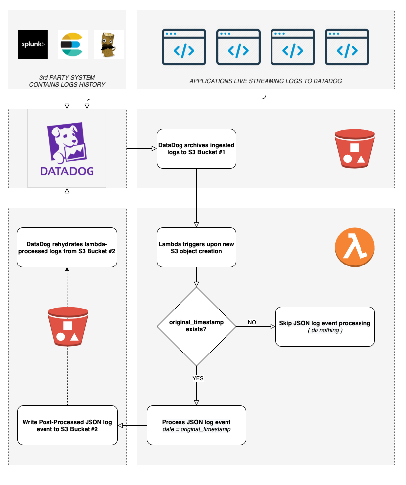
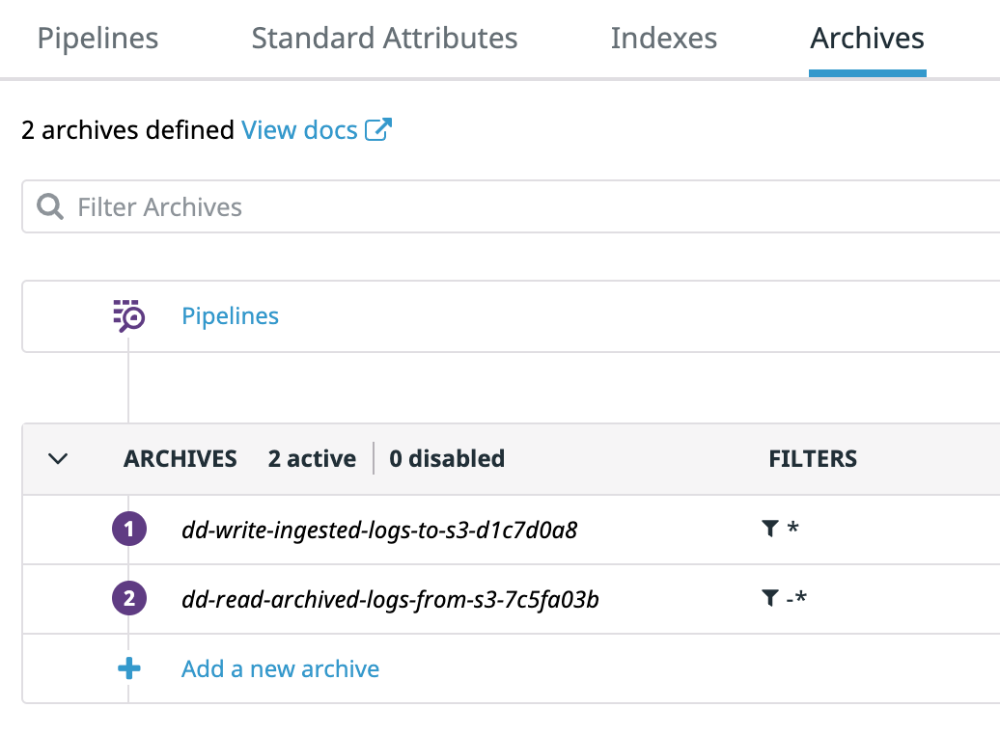
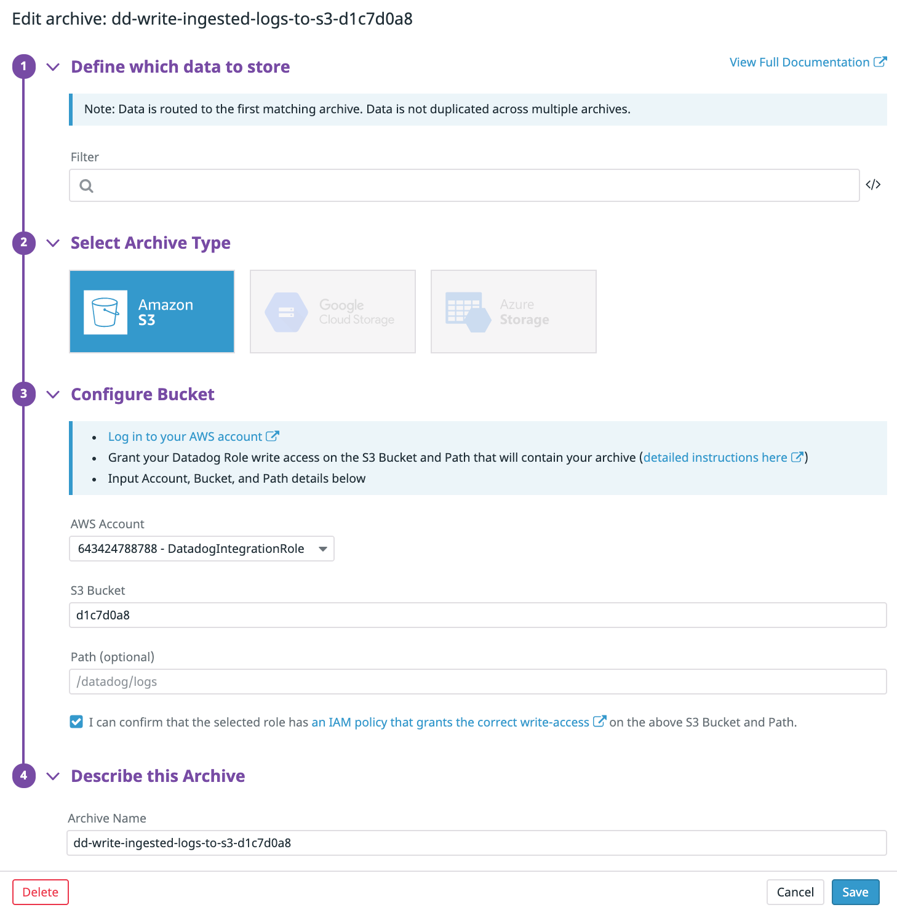
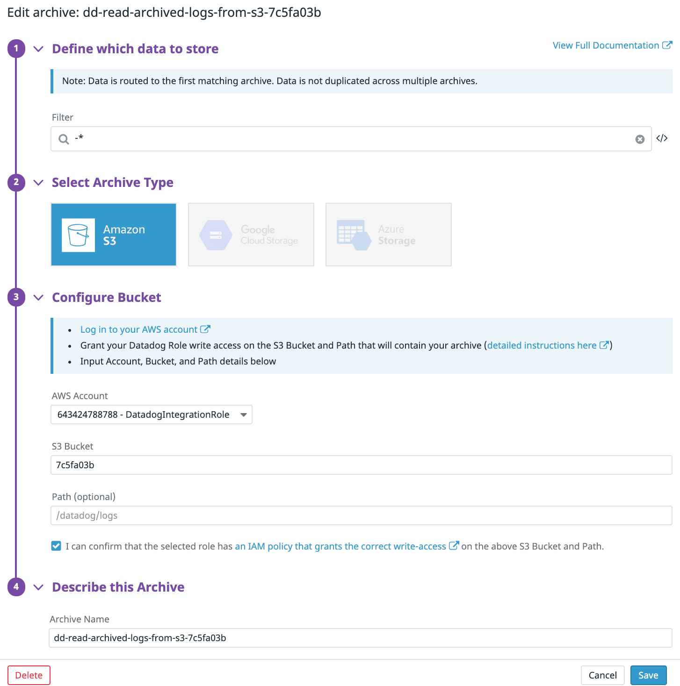

# Rehydrate Proof of Concept

## TODO (Kelner)

- [ ] Write up clearer overview of how this works
    - missing bits about sending logs to Datadog with `original_timestamp` field to have DD write them to an archive to then rehydrate them with original timestamps
    - No discussion about extracting logs and formatting them
    - No clear notes on pipeline processing
- [ ] Write up Lambda configuration and setup - zero docs on how to do it from original source
- [ ] Write up requirements for logs being sent for rehydration
- [ ] Write up cost considerations of doing it (double charged)
- [ ] Consider removing the lambda requirement, and lean on customers to find their own way to push logs to an S3 archive
- [ ] Watch https://drive.google.com/file/d/1kExUCiYFRmSmuXydCWs7Qi29i-xHHy8c/view to see if there's details to be gleaned.
- [ ] Go through steps of setup, capture the steps, make sure it works and there are no gaps

## Disclaimer

These projects are not a part of Datadog's subscription services and are provided for example purposes only. They are NOT guaranteed to be bug free and are not production quality. If you choose to use to adapt them for use in a production environment, you do so at your own risk.

<!-- START doctoc generated TOC please keep comment here to allow auto update -->
<!-- DON'T EDIT THIS SECTION, INSTEAD RE-RUN doctoc TO UPDATE -->
**Table of Contents**

- [POC Overview](#poc-overview)
  - [Is this an official Datadog Solution?](#is-this-an-official-datadog-solution)
  - [Log Retention Considerations](#log-retention-considerations)
  - [Process Overview](#process-overview)
- [Lambda Python Code: lambda.py](#lambda-python-code-lambdapy)
  - [Configuration > AWS > S3 Buckets](#configuration--aws--s3-buckets)
  - [Datadog](#datadog)
    - [Pipelines](#pipelines)
    - [Log Archives](#log-archives)
      - [Config Overview in UI](#config-overview-in-ui)
      - [Archive Config](#archive-config)
    - [Rehydrate Config](#rehydrate-config)
  - [Misc. findings](#misc-findings)
    - [Log Archives naming](#log-archives-naming)
- [Manual script to rehydrate: dd-rehydrate-past.py](#manual-script-to-rehydrate-dd-rehydrate-pastpy)
  - [Description](#description)
  - [Basic Usage](#basic-usage)
  - [Available Options](#available-options)
  - [Advanced Usage](#advanced-usage)
    - [Filtered by day](#filtered-by-day)
    - [Filtered by day & hour](#filtered-by-day--hour)
    - [Filtered using RegEx](#filtered-using-regex)
    - [Debug Output](#debug-output)
  - [Examples](#examples)
    - [Example 1](#example-1)
    - [Example 2](#example-2)
  - [Sample Processed Log Event](#sample-processed-log-event)
  - [Extra Tooling](#extra-tooling)
    - [Dummy Log Event Generator](#dummy-log-event-generator)
    - [Usage](#usage)
    - [Example Message](#example-message)
    - [Credentials](#credentials)

<!-- END doctoc generated TOC please keep comment here to allow auto update -->

# POC Overview

## Is this an official Datadog Solution?

No. It is admittedly a “hack“ of our own solution which leverages the flexibility provided by AWS S3 & Lambda. The principle behind it is to “trick Datadog into thinking it is ReHydrating archives it previously created”.

The idea is to kickstart a prospect or customer into building their own solution to import historical logs from their former system into Datadog, hence the Proof-Of-Concept / non-official-solution disclaimers.

## Log Retention Considerations

Under the scenes, rehydrating effectively creates a new index which obeys the customer’s contractual log retention for their given DD org.

Should you require a log retention increase (say 6 months / 180 days for instance), this should occur before rehydration as the resulting index can only retain rehydrated logs for as long as the contractual retention period at the time of rehydration.

## Process Overview

- Datadog creates log archives and writes them to `source_bucket`
- Custom Lambda gets triggered (invoked) for each Log Archive written by Datadog in `source_bucket`
- Custom Lambda parses `source_bucket` for log events archives matching `.*/archive_.*.json.gz`
- Custom Lambda parses log archives looking for `JSON` log events
- Custom Lambda processes log events by updating `date` with `original_timestamp`
- Custom Lambda writes processed & sorted log events to hourly archives in `target_bucket`
- Datadog Rehydrates log archives from `target_bucket`



# Lambda Python Code: lambda.py

Note: A few things here are hard-coded (target bucket names, original_timestamp matched attribute) so minor changes are required to make it work in the target AWS account.

## Configuration > AWS > S3 Buckets

| bucket   | description                                             |
|----------|---------------------------------------------------------|
| d1c7d0a8 | _the bucket that Datadog will archive ingested logs to_ |
| 7c5fa03b | _the bucket that Datadog will read archived logs from_  |

While it is possible to use the same bucket, **it is better practice to use distinct buckets** for a number of reasons:

- Using distinct source / destination buckets guarantees that the bucket containing the **archives created by Datadog remains "pristine"**.
- Leaving their contents untouched / unmodified **ensures they can be used as the "source of truth"**.
- It also **provides more flexibility** later on in the process :
  - Should the S3-triggered Lambda post-processing fail for some reason, it remains possible to entirely wipe the target bucket and start over and re-process all events from the source bucket.

## Configuration > AWS > Lambda Function / S3 Trigger

TBD (_Note from Kelner: isn't there in any original docs_)

## Datadog

### Pipelines

If you have many pipelines set for ingestion in Datadog, **a good practice would be to somehow distinguish Live Logs from Historical Logs**.

This is **especially important if you are using the date_mapper filter**.

This is because the lambda that will post-process logs will require specific attributes to exist in the JSON events to determine wether or not a specific log event should be processed.

### Log Archives

| config | archival | rehydration |
|--------|----------|-------------|
| filter |    *     |    -*       |
| bucket | d1c7d0a8 |   7c5fa03b  |

#### Config Overview in UI



#### Archive Config



### Rehydrate Config



## Misc. findings

### Log Archives naming

Datadog is actually able to rehydrate archives using a static / generic archive name such as `archive.json.gz`, providing:

- The S3 path to the archive does reflect the log's timestamp ( _/dt=YYYYMMDD/hour=HH/archive.json.gz_ )
- The `date` attribute does match the S3 path

# Manual script to rehydrate: dd-rehydrate-past.py

## Brief

This is an early version of the lambda script that did not yet include the AWS Lambda event scaffolding (i.e. upon object creation in S3, AWS invokes Lambda with the newly-created S3 Object Path as the Lambda input).

It recursively parses an entire bucket looking for matching archives to process with some super basic support for date filters.

This allowed securing the mechanism and validating the viability of the whole processing while testing locally (all that’s needed is S3 Read/Write access IAM authorisation really).

It is still useful now for the same reason, just validating the process without having to go through the whole S3 <> Lambda setup.

## Logic flow

- Parse `source_bucket` for log events archives matching `.*/archive_.*.json.gz`
  - Optionally, restrict to `YYYYMMDD` / `HH`
- Parse log archives looking for `JSON` log events
- Process log events by updating `date` with `original_timestamp`
- Write processed & sorted log events to hourly archives in `target_bucket`

## Basic Usage

`python3 dd-rehydrate-past.py source_bucket target_bucket`

## Available Options

| option          | description           | required |
|-----------------|-----------------------|----------|
| `source_bucket` | _bucket to read from_ | **Y**    |
| `target_bucket` | _bucket to write to_  | **Y**    |
| `YYYYMMDD`      | _filter by day_       |   N      |
| `HH`            | _filter by hour_      |   N      |

## Advanced Usage

### Filtered by day

`python3 dd-rehydrate-past.py source_bucket target_bucket YYYYMMDD`

### Filtered by day & hour

`python3 dd-rehydrate-past.py source_bucket target_bucket YYYYMMDD HH`

### Filtered using RegEx

`python3 dd-rehydrate-past.py source_bucket target_bucket YYYY.*`

### Debug Output

`DEBUG=true python3 dd-rehydrate-past.py source_bucket target_bucket`

- All **DEBUG** information is gets written **to stderr**
- **stdout** only **returns JSON**

## Examples

### Example 1

```bash
DEBUG=true python3 dd-rehydrate-past.py d1c7d0a8 7c5fa03b 20200714 09
 TOTAL OBJECTS : 2
 READ s3://d1c7d0a8/dt=20200714/hour=09/archive_090520.5947.y7A1F0KAQa-xDePWJH757A.json.gz
 TEXT LINES COUNT : 1
 READ s3://d1c7d0a8/dt=20200714/hour=09/archive_090523.7324.IO5bcdvcRIKMHZEV7q0yDw.json.gz
 TEXT LINES COUNT : 1
 PROCESSED LINES COUNT : 2
 CREATING s3://7c5fa03b/dt=20200115/hour=09/archive.json.gz
 {"_id": "AXNMkkGJ2h5H-KmRnQAA", "date": "2020-01-15T09:05:19.000Z", "service": "checkout", "host": "sesame-angles", "message": "Consonant Anteater Zoning", "status": "info", "source": "nginx", "attributes": {"env": "dev", "duration": "1.9793", "hostname": "sesame-angles", "provider": "azure", "service": "checkout", "id": "9a392359", "region": "eu-east-1", "operation": "update"}}
 {"_id": "AXNMkkiLncRhsC1IjQAA", "date": "2020-01-15T09:05:21.000Z", "service": "checkout", "host": "devotion-scope", "message": "Gout Blatantly Unify", "status": "info", "source": "postgresql", "attributes": {"env": "int", "duration": 1170800.0, "hostname": "devotion-scope", "provider": "gcp", "service": "checkout", "id": "493a8c71", "region": "eu-east-1", "operation": "read"}}
```

### Example 2

```bash
DEBUG=true python3 dd-rehydrate-past.py d1c7d0a8 7c5fa03b 20200714 10

 TOTAL OBJECTS : 0
 PROCESSED LINES COUNT : 0
```

## Sample Processed Log Event

```json
 {
   "*id": "AXNMi2FNaGp-*-GTSYAA",
   "date": "2020-01-15T08:57:48.000Z",
   "service": "payment",
   "host": "landfall-dehydrate",
   "message": "Nectar Snare Psychic",
   "status": "info",
   "source": "redis",
   "attributes": {
     "env": "dev",
     "duration": "2.13628",
     "hostname": "landfall-dehydrate",
     "provider": "ovh",
     "service": "payment",
     "id": "e2bb09df",
     "region": "eu-west-1",
     "operation": "write"
   }
 }
```

## Extra Tooling

### Dummy Log Event Generator

Ship dummy log event using DD API

Depends on :

- `curl`
- `gdate` from `coreutils` brew package
- `diceware` `python3-pip` package

### Usage

`bash dd-ship-dummy-log.sh`

### Example Message

```json
 {
     "ddsource": "elasticsearch",
     "ddtags": "env:int,service:checkout,provider:gcp,region:eu-west-1,operation:read,id:47640a2c",
     "hostname": "emu-joylessly",
     "duration": "4.4431",
     "@timestamp": "2020-07-14T09:08:25.771Z",
     "original_timestamp": "2020-01-15T09:08:25.000Z",
     "message": "Lumpiness Freeness Result",
     "env":"int",
     "service":"checkout",
     "provider":"gcp",
     "region":"eu-west-1",
     "operation":"read",
     "id":"47640a2c"
 }
 ```

### Credentials

```bash
cat .env

 DD_CLIENT_API_KEY=01****************************7e
 DD_CLIENT_APP_KEY=aa************************************cf
```
