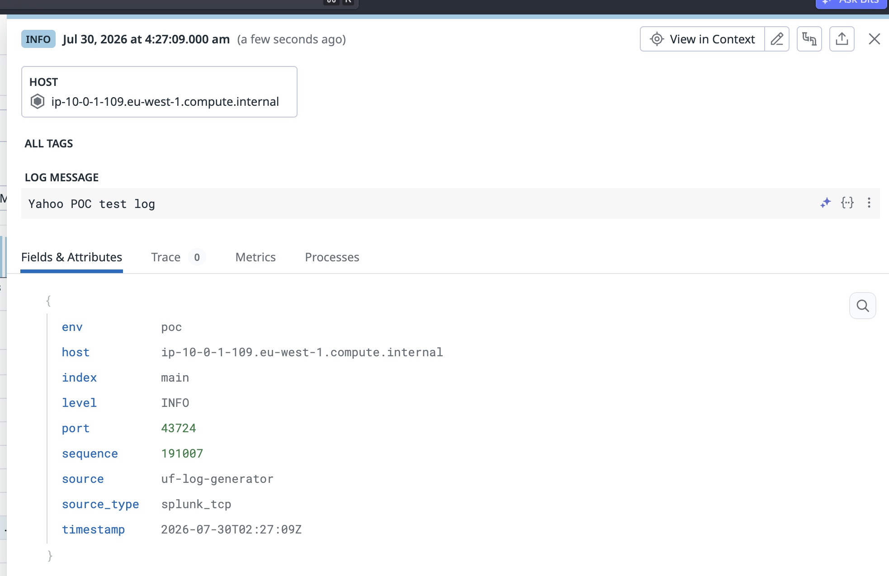
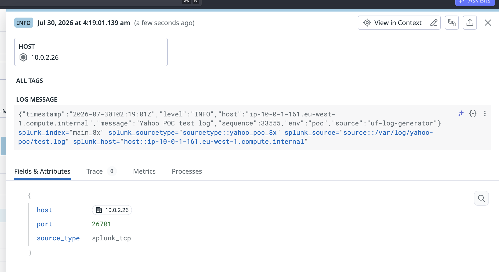
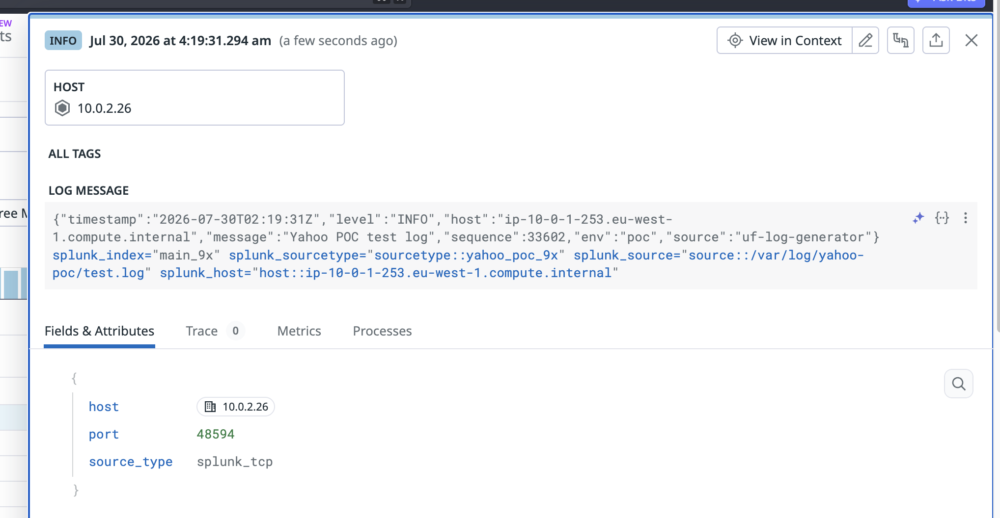

# Splunk UF transforms.conf - Embedding S2S Metadata into _raw

When a Splunk Universal Forwarder sends data with `sendCookedData=false` (raw S2S protocol), the S2S envelope metadata is stripped:
- Index name
- Sourcetype
- Source path
- Host

This means the downstream receiver (OPW, HF, indexer) receives only the raw log text with no Splunk metadata context. For a customer's deployment, this metadata must survive the raw S2S path.

## transforms.conf metadata embedding

Use `transforms.conf` to write Splunk internal metadata keys into `_raw` BEFORE the UF forwards the data. Since `_raw` IS the forwarded content in raw S2S mode, the metadata survives stripping.

### SOURCE_KEY naming

Only `_MetaData:Index` has a leading underscore. The other three keys do NOT:

| Field | SOURCE_KEY | Notes |
|-------|-----------|-------|
| Index | `_MetaData:Index` | Leading underscore |
| Sourcetype | `MetaData:Sourcetype` | NO leading underscore |
| Source | `MetaData:Source` | NO leading underscore |
| Host | `MetaData:Host` | NO leading underscore |

Splunk 9.x logs a warning for incorrect key names:

```
Undocumented key used in transforms.conf; stanza='embed-host' setting='SOURCE_KEY' key='_MetaData:Host'
```

Splunk 8.x silently ignores incorrect keys (no warning, transform just doesn't match).

### force_local_processing

`force_local_processing = true` must be set in `props.conf` for the target sourcetype. Without it, the UF defers transform execution to the downstream indexer - but with `sendCookedData=false`, there is no downstream Splunk indexer to execute them.

## Test Configuration

### transforms.conf (both 8.x and 9.x)

```ini
[embed-index]
SOURCE_KEY = _MetaData:Index
REGEX = ^(.+)$
DEST_KEY = _raw
FORMAT = $0 splunk_index="$1"

[embed-sourcetype]
SOURCE_KEY = MetaData:Sourcetype
REGEX = ^(.+)$
DEST_KEY = _raw
FORMAT = $0 splunk_sourcetype="$1"

[embed-source]
SOURCE_KEY = MetaData:Source
REGEX = ^(.+)$
DEST_KEY = _raw
FORMAT = $0 splunk_source="$1"

[embed-host]
SOURCE_KEY = MetaData:Host
REGEX = ^(.+)$
DEST_KEY = _raw
FORMAT = $0 splunk_host="$1"
```

### props.conf

```ini
[<sourcetype>]
force_local_processing = true
TRANSFORMS-embed-meta = embed-index, embed-sourcetype, embed-source, embed-host
```

Transforms are chained left-to-right. Each one appends to `_raw` in order.

### outputs.conf

```ini
[tcpout:via_op_worker]
server = <NLB_DNS>:9997
sendCookedData = false
useSSL = true
sslRootCAPath = /opt/splunkforwarder/etc/auth/ca.crt
sslCertPath = /opt/splunkforwarder/etc/auth/client.pem
compressed = false
useACK = false
```

## Test Results

### btool confirms transform resolution

Both 8.x and 9.x UFs resolve the transforms correctly via `splunk btool`:

```
[embed-index]
SOURCE_KEY = _MetaData:Index
DEST_KEY = _raw
FORMAT = $0 splunk_index="$1"
REGEX = ^(.+)$

[embed-sourcetype]
SOURCE_KEY = MetaData:Sourcetype
DEST_KEY = _raw
FORMAT = $0 splunk_sourcetype="$1"
REGEX = ^(.+)$

[embed-source]
SOURCE_KEY = MetaData:Source
DEST_KEY = _raw
FORMAT = $0 splunk_source="$1"
REGEX = ^(.+)$

[embed-host]
SOURCE_KEY = MetaData:Host
DEST_KEY = _raw
FORMAT = $0 splunk_host="$1"
REGEX = ^(.+)$
```

Props.conf btool shows `force_local_processing = true` and `TRANSFORMS-embed-meta` correctly bound to the sourcetype.

### per-event byte size

The 8.x UF shows 3.87x larger events with transforms enabled. The ~267 byte increase per event is consistent with appending four `splunk_<field>="<value>"` strings.

## Expected _raw format after transforms

Given a log line:
```json
{"timestamp":"2026-07-29T17:00:00Z","level":"INFO","message":"test log"}
```

After transforms, the forwarded `_raw` becomes:
```
{"timestamp":"2026-07-29T17:00:00Z","level":"INFO","message":"test log"} splunk_index="main_8x" splunk_sourcetype="poc_8x" splunk_source="/var/log/poc/test.log" splunk_host="ip-10-0-1-161.eu-west-1.compute.internal"
```

The downstream receiver (OPW) can parse these key=value pairs from `_raw` using VRL transforms to reconstruct the original Splunk metadata.

## Messages might be misformated

Messages could become mangled, e.g. a json log is no longer json after appending this metadata, see end-to-end below.

### End-to-end

Before:



After 8.x



After 9.x



## Reproduction

Requires a Splunk UF (8.x or 9.x) with a downstream receiver (OPW, HF, or indexer) accepting raw S2S on port 9997. The UF must send `sendCookedData=false`. This was predicated on previous work done (splunk UF and OPW setup).

### Deploy configs to the UF

Copy these files to `/opt/splunkforwarder/etc/system/local/`:

- `transforms.conf` - from `config/transforms-embed.conf`
- `props.conf` - from `config/props-8x.conf` (8.x) or `config/props-9x.conf` (9.x)
- `inputs.conf` - from `config/inputs-8x-transforms.conf` (8.x) or `config/inputs-9x-transforms.conf` (9.x)
- `outputs.conf` - from `config/outputs-transforms.conf` (edit `server` to your receiver)

### Restart the UF

```bash
/opt/splunkforwarder/bin/splunk restart
```

### 4. Verify transforms are loaded

```bash
/opt/splunkforwarder/bin/splunk btool transforms list embed-index
/opt/splunkforwarder/bin/splunk btool props list poc_8x   # or poc_9x
```
