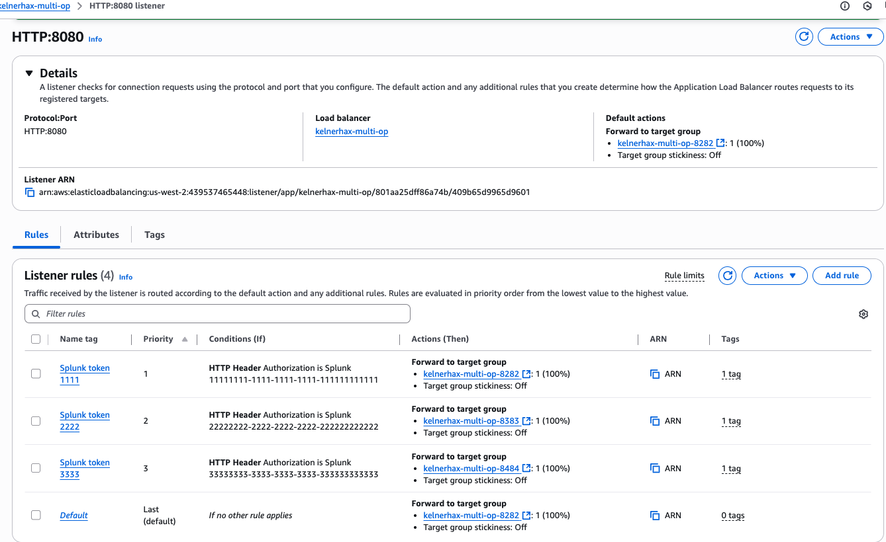

# Token Based Routing to Multiple OPW on the same host

Example of how to set up token based routing using an AWS ELB to OP Workers running on the same  host with Splunk Universal Forwarders sending traffic to the ELB.

## Log generation & Splunk UF

- Spin up 3 Ubuntu EC2 instances

### Log generation

On each server do the following:

- `mkdir /var/log/fakelogs/ /opt/fakelogs`
- Copy one unique [log generation script](./scripts/) per server to `/opt/fakelogs`
    - That is server 1 gets `fakelogs-nginx.sh`, server 2 gets `fakelogs-redis.sh`, server 3 gets `fakelogs-iis.sh`
- `vi /etc/logrotate.d/fakelogs`:

    ```
    /var/log/fakelogs/fakelog.log {
        hourly
        size 100M
        rotate 3
        copytruncate
        missingok
        notifempty
    }
    ```

- `chmod 644 /etc/logrotate.d/fakelogs`
- `chown root:root /etc/logrotate.d/fakelogs`
- `crontab -e`:

    ```
    # m h  dom mon dow   command
    * * * * * bash /opt/fakelogs/fakelogs-<flavor>.sh
    ```

### Splunk UF Setup

- [Install Splunk UF on each server](https://help.splunk.com/en/splunk-enterprise/forward-and-process-data/universal-forwarder-manual/9.4/install-the-universal-forwarder/install-a-nix-universal-forwarder#bfa92018_7238_476c_8351_2dd1ee65ef8c__Install_the_universal_forwarder_on_Linux):

    ```bash
    useradd -m splunkfwd
    export SPLUNK_HOME="/opt/splunkforwarder"
    cd $SPLUNK_HOME
    wget -O splunkforwarder-9.4.2-e9664af3d956-linux-amd64.deb "https://download.splunk.com/products/universalforwarder/releases/9.4.2/linux/splunkforwarder-9.4.2-e9664af3d956-linux-amd64.deb"
    dpkg -i splunkforwarder-9.4.2-e9664af3d956-linux-amd64.deb
    chown -R splunkfwd:splunkfwd $SPLUNK_HOME
    sudo $SPLUNK_HOME/bin/splunk start --accept-license
    # create admin username & password at prompts
    ```

- Create a directory for inputs: `mkdir -p $SPLUNK_HOME/etc/apps/fakelogs/default`
- `vi $SPLUNK_HOME/etc/apps/fakelogs/default/inputs.conf`

    ```
    host = <token-1111|token-2222|token-3333>
    source = <nginx|iis|redis>

    [monitor:///var/log/fakelogs/fakelog.log]
    followTail = 1
    ```

- Replacing `host` with one of three options `token-1111` `token-2222` `token-3333` - one unique for each server
- Replacing `source` with one of three options `nginx` `iis` `redis` - one unique for each server to match the corresponding `fakelogs-<flavor>.sh` script placed and running on the server
- Assign owner/group: `chown -R splunkfwd:splunkfwd $SPLUNK_HOME/etc/apps/fakelogs`
- Restart splunk uf: `$SPLUNK_HOME/bin/splunk restart`

We'll return later to configure out `outputs.conf` with our ELB address.

## Observability Pipelines

- Create 3 OP Pipelines (one for each token): https://app.datadoghq.com/observability-pipelines
- For simplicity sake use the log volume control template for each
- Select "Splunk TCP" as the source
- Select "Datadog Logs" as the destination
- Delete all processors except "Edit Fields"
- Set "Edit Fields" processor to "Add Field"
- Set "Filter Query" to `*`
- Set "Field to add" to `op_token`
- Set "Value to add" to `1111`, `2222`, and `3333` to differentiate between the 3 pipelines in the Datadog log explorer
- Click on "Next Install"
- Select your target platform (for this POC: Ubuntu)
- Input listener address of: `0.0.0.0:8282`
- Select an API key with RC enabled

Keep these pages open and move to the next section.

## Observability Pipelines Host

- Spin up a single Ubuntu instance
- Copy and run the "Install the Observability Pipelines Worker" command from the Datadog UI from the first pipeline (`1111`):

    ```bash
    DD_API_KEY=aeb5...a756 DD_OP_PIPELINE_ID=89f6f736-3cd7-11f0-a00b-da7ad0900002 DD_SITE=datadoghq.com DD_OP_SOURCE_SPLUNK_TCP_ADDRESS='0.0.0.0:8282' bash -c "$(curl -L https://install.datadoghq.com/scripts/install_script_op_worker2.sh)"
    ```

- Verify the host is reporting to the control plane:

    

- Click "Deploy" - the `Status` column will updated to `Deployed` once the configuration has been pulled by the OP Worker
- Follow the instructions for running multiple OPW per host: https://docs.datadoghq.com/observability_pipelines/set_up_pipelines/run_multiple_pipelines_on_a_host/
    - Repeat this twice for a total of 3 OPWs
    - When modifying the environment file, e.g. `/etc/default/<filename>` be sure to:
        - Replace `DD_OP_PIPELINE_ID` with the correct pipeline id for each unique pipeline (3 total)
        - Replace `DD_OP_SOURCE_SPLUNK_HEC_ADDRESS` with a new port (e.g. `8383` and `8484`) as two processes cannot listen on the same port on the same interface (OS limitation); now if you have multiple network interfaces you could replace `0.0.0.0` with the appropriate interface, for this POC we have a single network interface.
    - As you start each worker at the end of the documentation, return to the Datadog UI and click "Deploy" to get the pipeline configuration loaded on the worker
- Now 3 OP Workers are running on the same host running 3 distinct pipelines:

    

- Next [enable the OPW API](https://docs.datadoghq.com/observability_pipelines/troubleshooting/#enable-the-observability-pipelines-worker-api) for our next section to add a `/health` endpoint for our load balancer
- `vi /etc/default/<filename>` the first installed workers is at `/etc/default/observability-pipelines-worker` and the other two are names that were chosen when following the multiple pipelines pre host step
    - Add `DD_OP_API_ENABLED=true`
    - Add `DD_OP_API_ADDRESS=0.0.0.0:8686`
- Restart the workers:
    - `sudo systemctl daemon-reload && sudo systemctl restart observability-pipelines-worker`
    - `sudo systemctl restart <service-name>` for the other two

## ELB Setup

### Security Group

- Use the same SG for the Splunk instances, OP instances, and LB
- Allow traffic on the ports `8282`, `8383`, `8484`, and `8686` from the SG

### Target Groups

- Create 3 target groups, one for each port (`8282` `8383` `8484`)
- Choose `Instances` as the "Target Type"
- For "Protocol" choose `HTTP` and one of the three ports OP is listening on
- Configure the health check for `HTTP` with a path of `/health` and under advanced options override the port to `8686`
- Under "Register Targets" select the OP instance


### Load Balancer

- Create a new load balancer
- Select "Application Load Balancer" as the type
- For simplicity sake of this POC choose "Internet Facing" but your networking setup may dictate/support "Internal"
- Fill out the required fields for "Network Mapping"
- Choose the same Security Group as the OP instances where we opened rules earlier
- "Listeners and Routing" input port `8080` and select the first target group associated with `8282` - this will be our default route, but we'll add other rules for headers in the next steps
- Deploy the load balancer

### Listener Rules

- After the load balancer is available click on your listener and click "Add Rules"
- Add 3 rules
- For each add a condition
    - Select `HTTP Header`
    - Header name: `Authorization`
    - Header value: `Splunk <token>` where token is `Splunk 1111`, `Splunk 2222`, `Splunk 3333`
    - 
- For each forward to the appropriate target group (one for each port `8282`, `8383`, and `8484`)

Now we have three rules routing based on header tokens:

