# Datadog Log Archive: bucket consolidation

Datadog Log Archive copies your log data out of Datadog and writes it to a bucket you own. It runs automatically. Datadog packages up the logs and writes them as compressed files to your bucket.

You keep full ownership of the data. It stays in your account under your retention rules, and you can rehydrate it back into Datadog at any time to search historical logs.

This document covers how the files are structured, what each file contains, and how to consolidate two archive buckets into one.

## How files are organized

Archive files are grouped by date and hour, both in UTC:

```
s3://your-bucket/
  dt=20260915/           # date (UTC)
    hour=18/             # hour 0–23 (UTC)
      archive_180000.0000.{uuid}.json.zst
      archive_180000.0000.{uuid}.idx.c2VydmljZQ.partitionMetadata.zst
    hour=19/
      ...
  dt=20260916/
    ...
```

A log emitted at 18:45 UTC on September 15 lands in `dt=20260915/hour=18/`

## File naming

Every archive file follows this pattern:

```
archive_{start_time}.{segment}.{uuid}.{type}.zst
```

| Component | Example | What it means |
|-----------|---------|---------------|
| `start_time` | `180000` | Start of the hour window in UTC (`HHMMSS`). Always ends in `0000`. |
| `segment` | `0000` | Segment index within the hour. Currently always `0000`. |
| `uuid` | `0b850dc5-91d9-...` | Globally unique ID generated by Datadog at write time. |
| `type` | `json` or `idx...partitionMetadata` | Whether the file holds log data or an index. |

All files end in `.zst` (Zstandard compression).

## The two file types

Each archive segment produces exactly two files that share the same UUID.

The **log data file** (`archive_180000.0000.{uuid}.json.zst`) contains the actual log events for that segment, stored as newline-delimited JSON and compressed with Zstandard. This is the file Datadog reads when you run a rehydration job.

The **partition metadata file** (`archive_180000.0000.{uuid}.idx.c2VydmljZQ.partitionMetadata.zst`) is a small index over the data. Datadog uses it to skip segments that don't match your query's time range or field filters, which makes rehydration faster. The `c2VydmljZQ` portion of the filename is the word `service` encoded in Base64. It tells Datadog which field the index is keyed on.

Both files are required for a segment to be rehydratable.

## Why there are multiple files per hour

Datadog does not wait until the end of the hour to flush. As log buffers fill, it writes a new file pair and starts the next one. A busy environment can produce 10 or more pairs per hour; a quiet one might produce just one. All of them contribute to the same hour's worth of logs.

## File names and collision safety

Every archive file gets a UUID v4 generated at the moment Datadog writes it. Two separate Datadog Archive configurations will never produce the same UUID. This matters when merging two buckets: because UUIDs are unique across configurations, files from one bucket cannot overwrite files from another.

---

## Consolidating two archive buckets

If you reconfigured your Datadog Archive and now have two buckets holding separate ranges of logs, you can copy one bucket's contents into the other. No changes to your Datadog configuration are needed during the copy. The entire operation happens at the S3 level.

### Before you start

You need:

- An IAM user or role with `s3:ListBucket` and `s3:GetObject` on the source bucket, and `s3:PutObject` on the destination bucket.

### Run the copy script

The `copy-archive.sh` script in this directory handles the copy:

```bash
export AWS_ACCESS_KEY_ID=...
export AWS_SECRET_ACCESS_KEY=...

# Preview what would be copied (no changes made)
./copy-archive.sh --dry-run <bucket-name-to-copy-from> <bucket-name-to-copy-to>

# Run the actual copy
./copy-archive.sh <bucket-name-to-copy-from> <bucket-name-to-copy-to>
```

The script inventories both buckets, checks for filename collisions, copies only archive files, and verifies the file count in the destination when done.

### After the copy

Once the files land in the destination bucket, they are immediately available for rehydration. When you trigger a rehydration job in Datadog, you point it at a bucket and a time range. Datadog scans the relevant `dt=*/hour=*/` prefixes and finds all segments from both original sources.

To consolidate going forward, update your Datadog Archive configuration to point at the destination bucket and stop writing to the source.

# Potential Gotchas

If one archive/bucket uses a different [Partitioning Attribute](https://docs.datadoghq.com/logs/log_configuration/archives/?tab=awss3#archive-partition-attribute) or [Lookup Attribute](https://docs.datadoghq.com/logs/log_configuration/archives/?tab=awss3#archive-lookup-attribute) then this may not work. This was not tested. The aforementioned `.json` files may take care of this and handle it invisibly.

---

## File name reference

| Component | What it represents |
|-----------|-------------------|
| `dt=YYYYMMDD` | UTC date of the logs |
| `hour=HH` | UTC hour (0–23) of the logs |
| `archive_HHMMSS` | Start of the hour window |
| `.0000` | Segment index (usually 0) |
| `{uuid}` | Unique ID for this archive segment |
| `.json.zst` | Log data, Zstandard-compressed |
| `.idx.{base64}.partitionMetadata.zst` | Rehydration index for this segment |

## Confirmation that it works

Directory structure observed in the bucket:

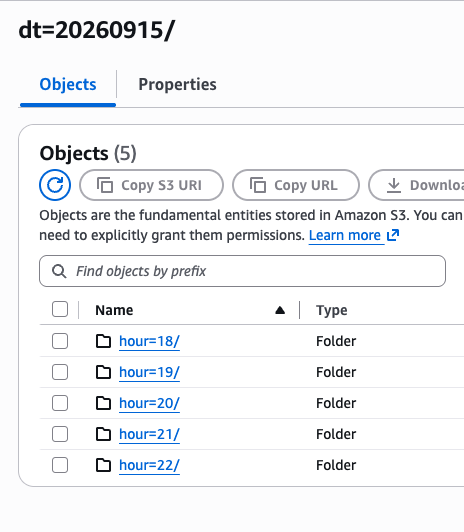

File name schema in the bucket:

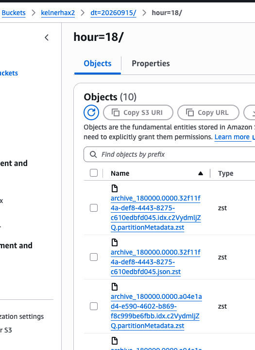

Archive setup in Datadog SaaS:

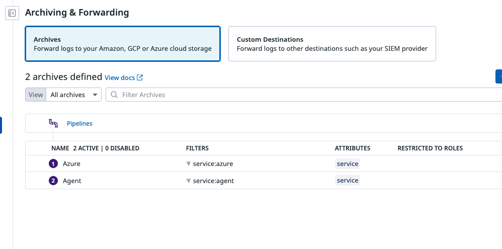

Azure and Agent archive configurations:

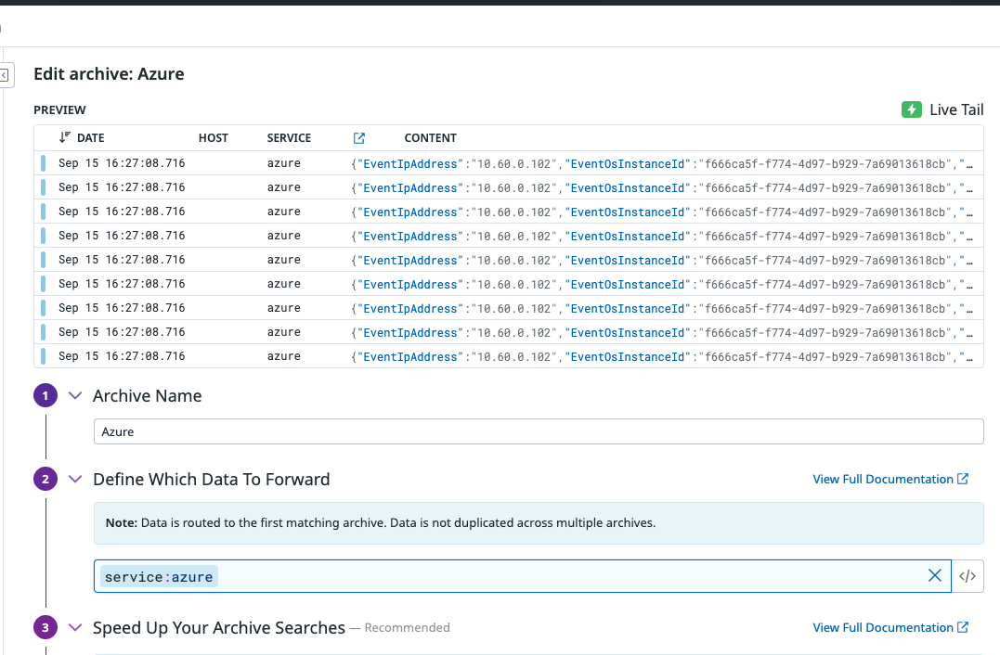

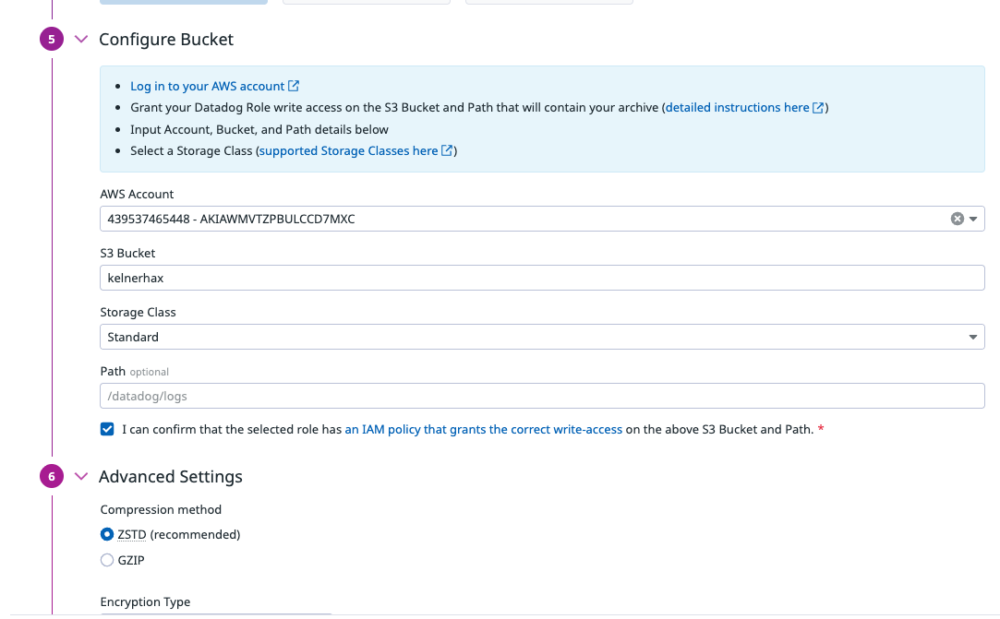

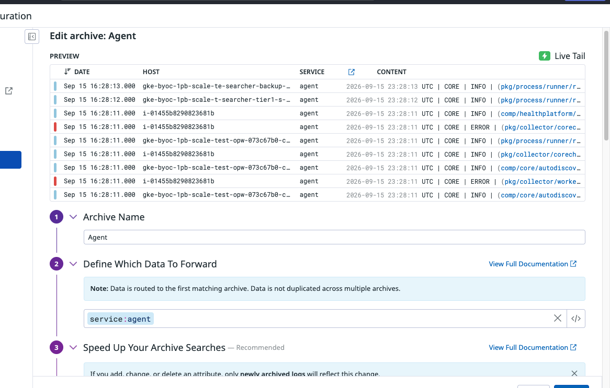

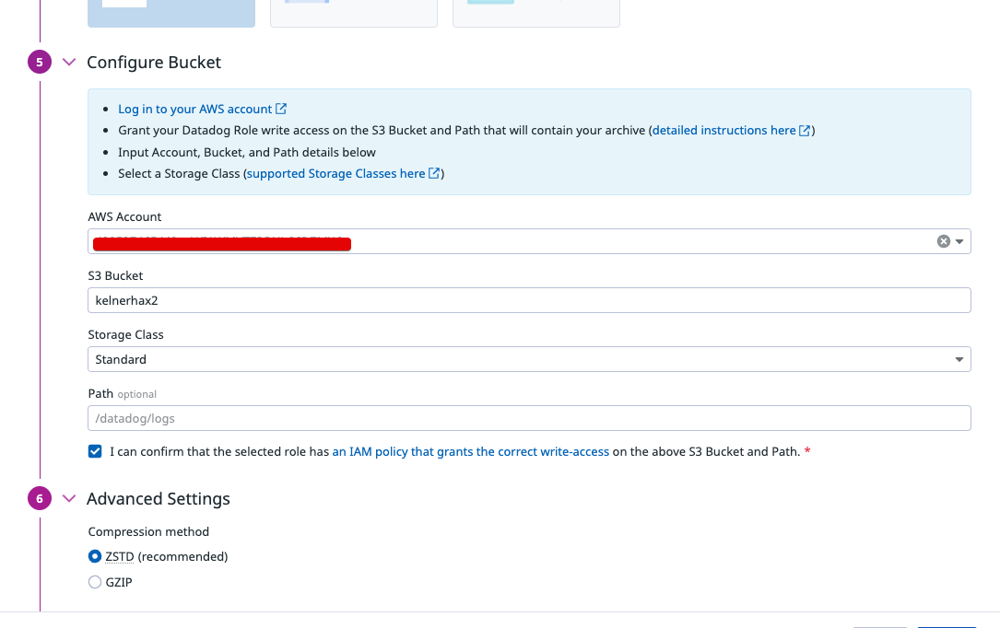

Rehydration configuration after copying the agent bucket contents into the azure bucket contents using `./copy-archive.sh`. Note `service:agent` in the query, but targeting the `Azure` archive.

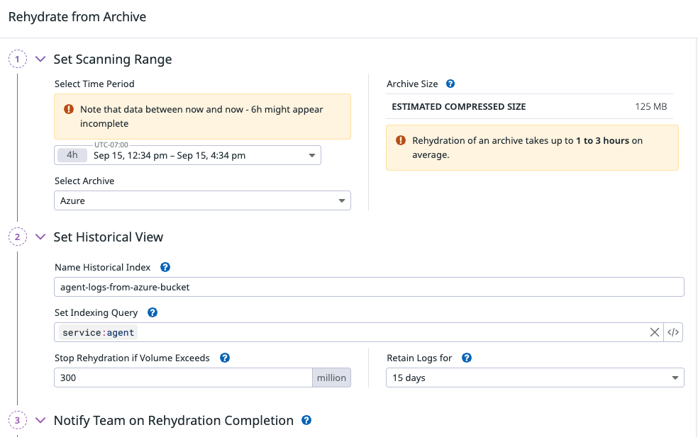

Rehydration complete, logs found and rehydrated:

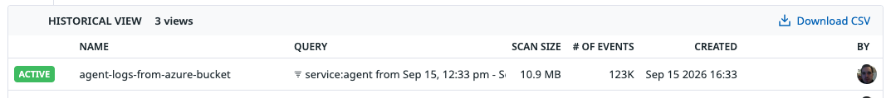

Results of historical index in log explorer:

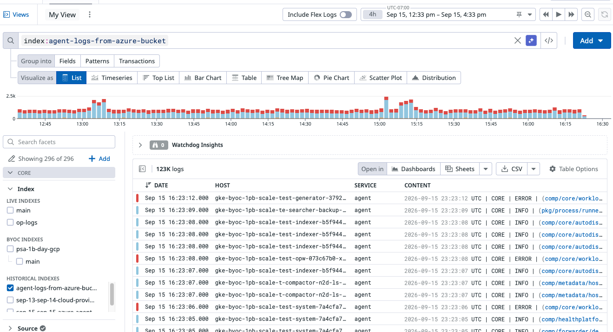

# Archive Search

This also works for archive search:

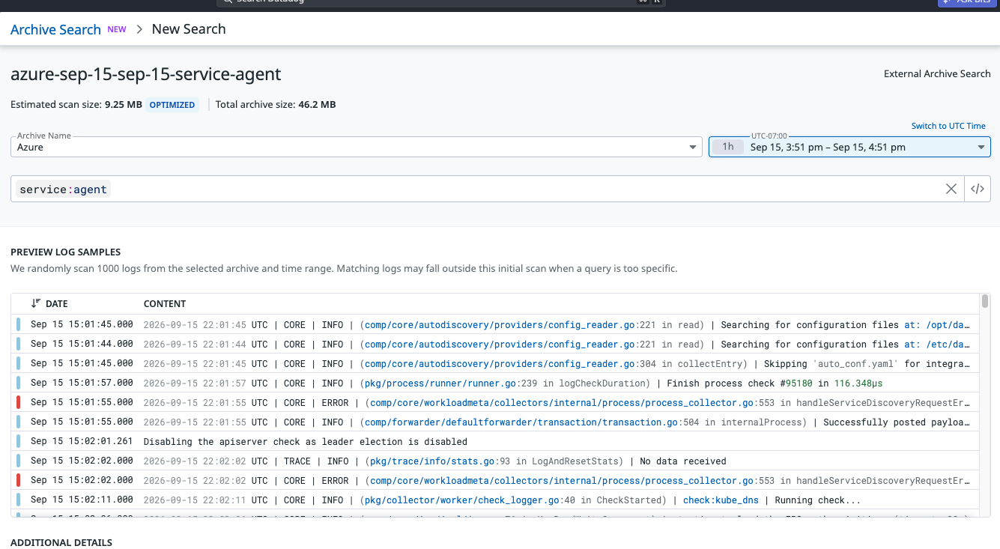

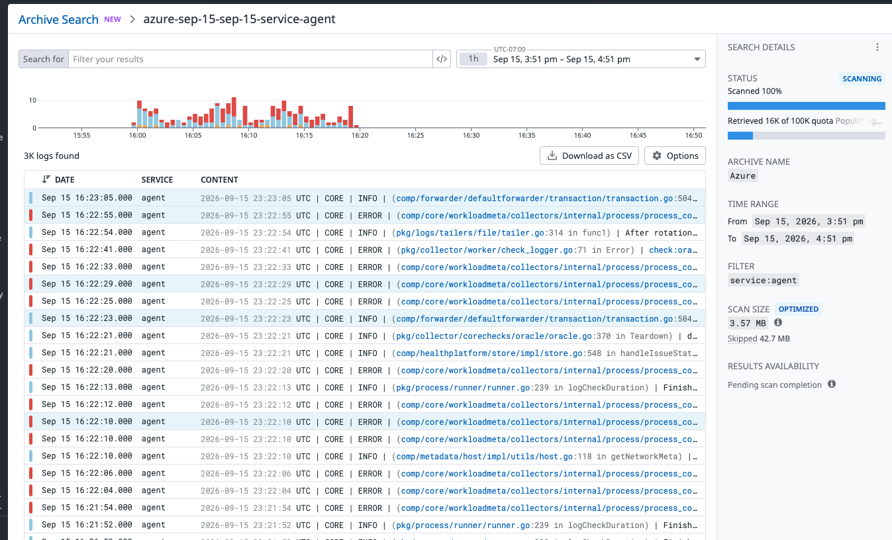
