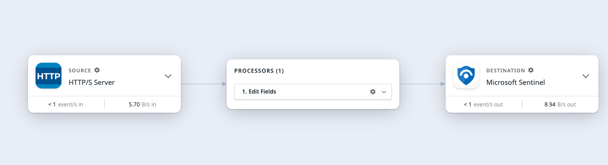
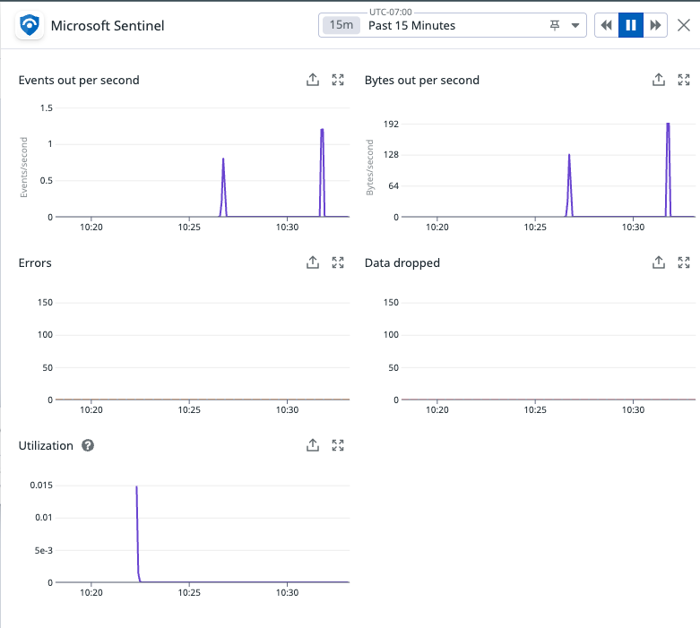
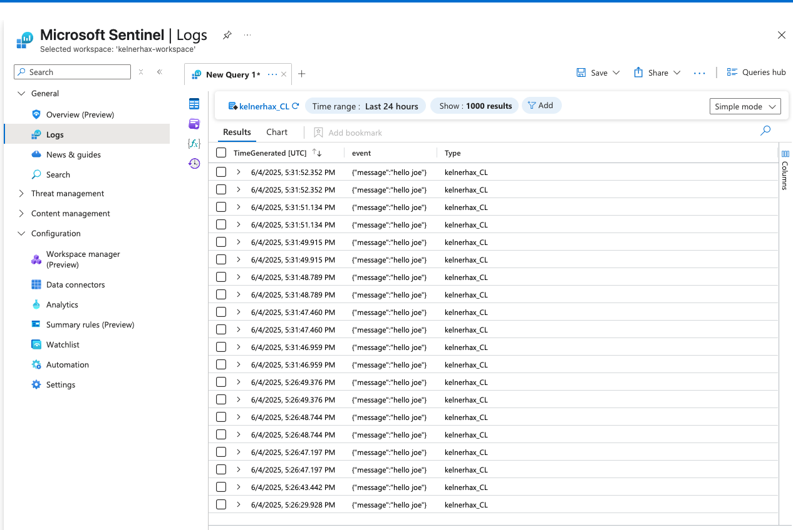

# Observability Pipelines Instructions for MS Sentinel

- In Azure create a workspace if you don't already have one (to be used in all following steps)
- Add microsoft sentinel to your workspace: https://portal.azure.com/#browse/microsoft.securityinsightsarg%2Fsentinel
- Create a Data Collection Endpoint: https://portal.azure.com/#view/HubsExtension/BrowseResource.ReactView/resourceType/microsoft.insights%2Fdatacollectionendpoints
- Create a Logs Analytics Workspace in your workspace if you don't already have one: https://portal.azure.com/#create/Microsoft.LogAnalyticsOMS
- In the Logs Analytics Workspace, navigate to "Settings" > "Tables"
	- Click "+ Create"
	- Select "New Custom Log (DCR-based)"
	- Click "Create a new data collection rule"
	- Select the DCE created earlier
	- Click "Next"
	- Upload a sample JSON Log. For testing purposes here-in we used the following JSON for "Schema and Transformation": `{"TimeGenerated":"2024-07-22T11:47:51Z","event": {}}` (`TimeGenerated` is required)
	- Click "Create"
- In azure navigate to "Microsoft Entra ID"
	- Click "Add" > "App Registration"
	- Click create
	- On the overview screen click "Client credentials: Add a certificate or secret"
	- Click "New client secret"
	- Give and name and click "Add"
	- Copy the value for later use with OP setup
- Now find your DCR in https://portal.azure.com/#view/HubsExtension/BrowseResource.ReactView/resourceType/microsoft.insights%2Fdatacollectionrules
	- Go to "Access Control (IAM)" > Click "Add" > "Add role assignment" and add the "Monitoring Metrics Publisher" role
	- On the "Members screen" select "User, group, or service principal" - click "Select Members" and search for the "Application" we made in the "App Registration" step
	- Click "Review + Assign"
- In the Datadog UI in an new OP Pipeline w/ a MS Sentinel destination
	- Input the "Application (client) ID" from the Microsoft Entra ID App Registration we created
	- Input the "Directory (tenant) ID" from the Microsoft Entra ID App Registration we created
	- Input the "Table" from the Logs Analytics Workspace table we created
		- Note the name we gave during setup is actually given a mutated name by Microsoft, the best way to find this is to go to your DCR, go to "Automation" > "Export Template" and a JSON view will be presented, under `resources.properties.dataFlows.streams` you'll find the table name. In our case we named the table `kelnerhax` but the output here is `Custom-kelnerhax_CL`
	- Input the "DCR Immutable ID" from the DCR we created
	- Click "Next: Install"
	- Fill out Listner address (`0.0.0.0:9997`) (using HTTP Server source)
	- Fill out "Data collection endpoint(DCE)" from the DCE we created
	- Fill out "Client Secret" from the secret we created for our "Microsoft Entra ID" "Application" step
- Copy the install command from the DD UI and run it
- Click "Deploy" when your OPW is detected
- Send logs to your OPW to test:

	```
	ts=$(($(date +%s%N)/1000000)) && curl -k http://localhost:9997/ -d '{ "TimeGenerated": "$ts", "event": { "message": "hello joe" }}'
	```

- Now we can see logs flowing:

    

    

- And we can find our logs in Azure MS Sentinel:

    
