# Observability Pipelines K8s Lab

This doc will guide you through a local (your labtop) Kubernetes (minikube) based Observability Pipelines lab.
You can follow this doc top to bottom to complete the lab on your own, no "teacher" led instruction is required.

> [!IMPORTANT]
> This is a k8s based workshop, if you are looking for something VM based with a load balancer instead, please [see this lab]([https://github.com/DataDog/...](https://github.com/DataDog/logs-psa/tree/main/workshops/op-workshop-vms#observability-pipelines-vm-based-workshop)).

## Lab goals

Get hands on with Observability Pipelines (OP) by:

- Deploying the OP Worker
- Creating an OP Pipeline and deploying it via the Datadog UI and Remote Config
- Configuring the Datadog Agent to send logs to our OP Worker
- Adding processors to our OP Pipeline


<!-- START doctoc generated TOC please keep comment here to allow auto update -->
<!-- DON'T EDIT THIS SECTION, INSTEAD RE-RUN doctoc TO UPDATE -->
**Table of Contents**

- [Prerequisites](#prerequisites)
  - [Prereq 1) docker desktop](#prereq-1-docker-desktop)
  - [Prereq 2) homebrew](#prereq-2-homebrew)
  - [Prereq 2) minikube](#prereq-2-minikube)
  - [Prereq 3) Install Helm](#prereq-3-install-helm)
  - [Prereq 4) Install kubectl](#prereq-4-install-kubectl)
  - [Prereq 5) Datadog Org](#prereq-5-datadog-org)
  - [Prereq 6) Enable Remote Config (RC) in your Datadog org](#prereq-6-enable-remote-config-rc-in-your-datadog-org)
- [Workshop](#workshop)
  - [Workshop 1) Start minikube](#workshop-1-start-minikube)
  - [Workshop 2) Create an OP Pipeline & Install OPW](#workshop-2-create-an-op-pipeline--install-opw)
  - [Workshop 3) Install the Datadog Agent](#workshop-3-install-the-datadog-agent)
  - [Workshop 4) Generate nginx logs](#workshop-4-generate-nginx-logs)
  - [Workshop 5) Live Capture](#workshop-5-live-capture)
  - [Workshop 6) Add Source Field and Grok Processor](#workshop-6-add-source-field-and-grok-processor)
  - [Workshop 7) Review our Grok Parser Processor results](#workshop-7-review-our-grok-parser-processor-results)
  - [Workshop 8) Filter Logs](#workshop-8-filter-logs)
  - [Workshop 9) Logs to metrics](#workshop-9-logs-to-metrics)
  - [Workshop 10) Sample by HTTP Status Code](#workshop-10-sample-by-http-status-code)
  - [Workshop 11) Deploy more logs](#workshop-11-deploy-more-logs)
  - [Workshop 12) Add Quota Processor](#workshop-12-add-quota-processor)
  - [Workshop 13) Add Environments Variable Processor](#workshop-13-add-environments-variable-processor)
  - [Workshop 14) Add a Parse JSON Processor](#workshop-14-add-a-parse-json-processor)
  - [Workshop 15) Add a local CSV and Add Enrichment Table Processor](#workshop-15-add-a-local-csv-and-add-enrichment-table-processor)
  - [Workshop 16) Add Reduce Processor](#workshop-16-add-reduce-processor)
  - [Workshop 17) Add the Redact Sensitive Data Processor](#workshop-17-add-the-redact-sensitive-data-processor)
  - [Workshop 18) Complete & Cleanup](#workshop-18-complete--cleanup)
- [Supplemental: OP worker logs and pipelines.* metrics](#supplemental-op-worker-logs-and-pipelines-metrics)
- [Additional Resources](#additional-resources)

<!-- END doctoc generated TOC please keep comment here to allow auto update -->

## Prerequisites

> [!TIP]
> If you already have a k8s cluster, e.g. GKE or EKS, then you can use that and skip installing docker desktop and minikube.

### Prereq 1) docker desktop

Follow [these instructions to install docker desktop on your mac](https://docs.docker.com/desktop/setup/install/mac-install/)

### Prereq 2) homebrew

> [!NOTE]
> Instructions were written for MacOS, but you can use any operating system, use the package manager for your OS in place of homebrew.

Follow [these instructions to install homebrew](https://brew.sh/):

```bash
/bin/bash -c "$(curl -fsSL https://raw.githubusercontent.com/Homebrew/install/HEAD/install.sh)"
```

### Prereq 2) minikube

Run: `brew install minikube` or follow https://minikube.sigs.k8s.io/docs/start/

Verify your installation by running `minikube version`:

```bash
minikube version

minikube version: v1.30.1
commit: 08896fd1dc362c097c925146c4a0d0dac715ace0
```

Run minikube to download the k8s images required and that you'll be able to run the lab locally:

```bash
minikube start --driver=docker
```

You should see the following message if everything starts correctly:

```bash
Done! kubectl is now configured to use "minikube" cluster and "default" namespace by default
```

You can stop minikube for now unless you plan to directly proceed with the lab: `minikube stop`

### Prereq 3) Install Helm

Run: `brew install helm` or follow https://helm.sh/docs/intro/install/

### Prereq 4) Install kubectl

Run: `brew install kubectl` or follow https://kubernetes.io/docs/tasks/tools/

### Prereq 5) Datadog Org

You'll need a Datadog Org in order to configure Observability Pipelines. Use an existing organization or start a trial: https://www.datadoghq.com/dg/monitor/free-trial/

### Prereq 6) Enable Remote Config (RC) in your Datadog org

- Navigate to https://app.datadoghq.com/organization-settings/remote-config/setup?page_id=org-enablement-step
- Click on "Enable for your Organization"
- Choice: Select an Existing API Key to enable or Create a new API key
- Existing API Key
    - Click on "Next Step"
    - Click on "Select API Keys"
    - Choose an existing API Key by checking the box next to it
    - Click "Enable 1 Key"
    - Click "Next Step"
    - Click "Done"
- Create new API Key
    - Navigate to https://app.datadoghq.com/organization-settings/api-keys
    - Click "New Key"
    - Give key a descriptive name
    - Click "Create Key"
    - RC is automatically applied

## Workshop

### Workshop 1) Start minikube

If you previously stopped minikube during the prerequisites steps start minikube again: `minikube start --driver=docker` otherwise you are good to proceed :)

### Workshop 2) Create an OP Pipeline & Install OPW

In your DD org do the following:

- Navigate to https://app.datadoghq.com/observability-pipelines
- Click on the template "Log Volume Control"
- Select "Datadog Agent" for your source
- Select "Datadog" for your destination
- Delete all of the default processors except the "Edit Fields" processor
- Expand the "Edit Fields" processor
    - Change it to `Add Field` type
    - For "Filter Query" enter `*` to select all logs flowing through OP
    - For "Field to add" enter `op_k8s_workshop`
    - For "Value to add" enter `true`
    - This will help us easily find our logs in Log Mgmt later on
- Click on "Next: Install"
- Choose "Kubernetes" as your "installation platform"
- For "Datadog Agent Address" enter `0.0.0.0:8282`
    - **NOTE**: This is often confusing terminology for customers that we are working on correcting in docs/in-app, but this is the interface and port that the OP worker listens on for traffic, this will almost _always_ be `0.0.0.0` and the desired port
- Select an API Key with Remote Config (RC) Enabled
- Use the [helm values.yaml file is already provided in this repo](./values.yaml)
    - It comes with a few small extra configuration items we will be using later
- Copy the command to install OPW
- Run the command to install OPW (use yours that you copied, the following is just an example):

    ```bash
    helm upgrade --install opw \
	-f values.yaml \
	--set datadog.apiKey=aeb53...fa756 \
	--set datadog.pipelineId=a536...0002 \
	--set env[0].name=DD_OP_SOURCE_DATADOG_AGENT_ADDRESS,env[0].value='0.0.0.0:8282' \
	--set service.ports[0].name=dd-op-source-datadog-agent-address-port,service.ports[0].protocol=TCP,service.ports[0].port=8282,service.ports[0].targetPort=8282 \
	datadog/observability-pipelines-worker
    ```

> [!NOTE]
> If you recieve an error like `zsh: no matches found` from your helm install command, run the command `noglob` infront of the `helm upgrade...` command - this is due to globbing and your shell is trying to interpret special characters, in our case the `[]` (brackets) in the command.

- Upon success you will see output similar to the following:

    ```bash
    Release "opw" does not exist. Installing it now.
    NAME: opw
    LAST DEPLOYED: Thu Dec 19 17:04:17 2024
    NAMESPACE: default
    STATUS: deployed
    REVISION: 1
    TEST SUITE: None
    NOTES:
    ```

- Now you can run `kubectl get po` to see your pods status:

    ```bash
    kubectl get po

    NAME                                           READY   STATUS    RESTARTS   AGE
    opw-observability-pipelines-worker-0           1/1     Running   0          28m
    opw-observability-pipelines-worker-1           1/1     Running   0          28m
    ```

### Workshop 3) Install the Datadog Agent

Install via helm:

- `helm repo add datadog https://helm.datadoghq.com`
- `helm repo update`
- Grab and API key and App Key from your DD org:
  - https://app.datadoghq.com/organization-settings/api-keys
  - https://app.datadoghq.com/organization-settings/application-keys
- Create a datadog API key and App key secret:
  - `kubectl create secret generic dd-api-key --from-literal api-key="<API-KEY>"`
  - `kubectl create secret generic dd-app-key --from-literal app-key="<APP-KEY>"`
- [Download the `agent-values.yaml` from this repo](agent-values.yaml)
  - It contains a few extra configuration items (like OPW env vars) that we'll need
- `helm upgrade --install datadog-agent datadog/datadog -f agent-values.yaml`
- If successful you'll see output like:

    ```bash
    Release "datadog-agent" has been upgraded. Happy Helming!
    NAME: datadog-agent
    LAST DEPLOYED: Fri Dec 20 09:40:52 2024
    NAMESPACE: default
    STATUS: deployed
    REVISION: 2
    TEST SUITE: None
    NOTES:
    Datadog agents are spinning up on each node in your cluster. After a few
    minutes, you should see your agents starting in your event stream:
        https://app.datadoghq.com/event/explorer
    ```

- Now you can run `kubectl get po` to see your pods status:

    ```bash
    kubectl get po

    NAME                                           READY   STATUS    RESTARTS   AGE
    datadog-agent-4ssck                            3/3     Running   0          18m
    datadog-agent-8m754                            3/3     Running   0          18m
    datadog-agent-cluster-agent-686bfd87df-tdqmm   1/1     Running   0          18m
    opw-observability-pipelines-worker-0           1/1     Running   0          38m
    opw-observability-pipelines-worker-1           1/1     Running   0          38m
    ```

- You won't yet see logs flowing from the agent to OP due to the `DD_CONTAINER_EXCLUDE` in the `agent-values.yaml`. But once we start generating logs (next step) you'll be be able use the log explorer query `@op_k8s_workshop:true`: https://app.datadoghq.com/logs?query=%40op_k8s_workshop%3Atrue


### Workshop 4) Generate nginx logs

We'll use the open source project https://github.com/kscarlett/nginx-log-generator to generate some fake nginx logs.

- Run the nginx log generator: `kubectl run nginx1 --env="RATE=750" --image=kscarlett/nginx-log-generator`
  - Where `RATE` is the number of logs generated per second
  - This docker image can only do about ~750 events per second, so exceeding that value doesn't do much
    - If you wish to generate more logs you can execute `kubectl run nginx<#> ...` multiple times
- Verify the container is running: `kubectl get po`

    ```
    NAME                        READY   STATUS    RESTARTS   AGE
    nginx1                      1/1     Running   0          15s
    ```

- Verify logs are being generated: `kubectl logs nginx1`
- You should also be able to see nginx logs in the Log Explorer in your DD Org, for example:

    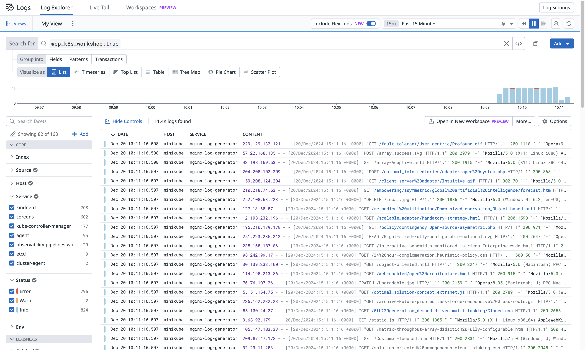

### Workshop 5) Live Capture

> [!NOTE]
> Live capture is in preview at this time. See information below on how it works. Contact your Customer Success Manager, Account Executive, or Datadog Support (https://www.datadoghq.com/support/) to get it enabled.

https://docs.datadoghq.com/observability_pipelines/live_capture/

> Use Live Capture to see the data a source sends through the pipeline, the data a processor receives and sends out, and whether or not that data was modified.

- Open the OP UI and select your pipeline that we built earlier
- Click the cog on the "Edit Fields" processor we added
- Select "Capture and view events" in the pop-out panel
- Click "Capture" in the slide out panel
- Click "Confirm" to start capturing events
  - Capturing events usually takes up to 60 seconds. Captured data is visible to all users with view access, and is stored in the Datadog Platform for 72 hours
- After the capture is complete, click a specific capture event to see the data that was received and sent out

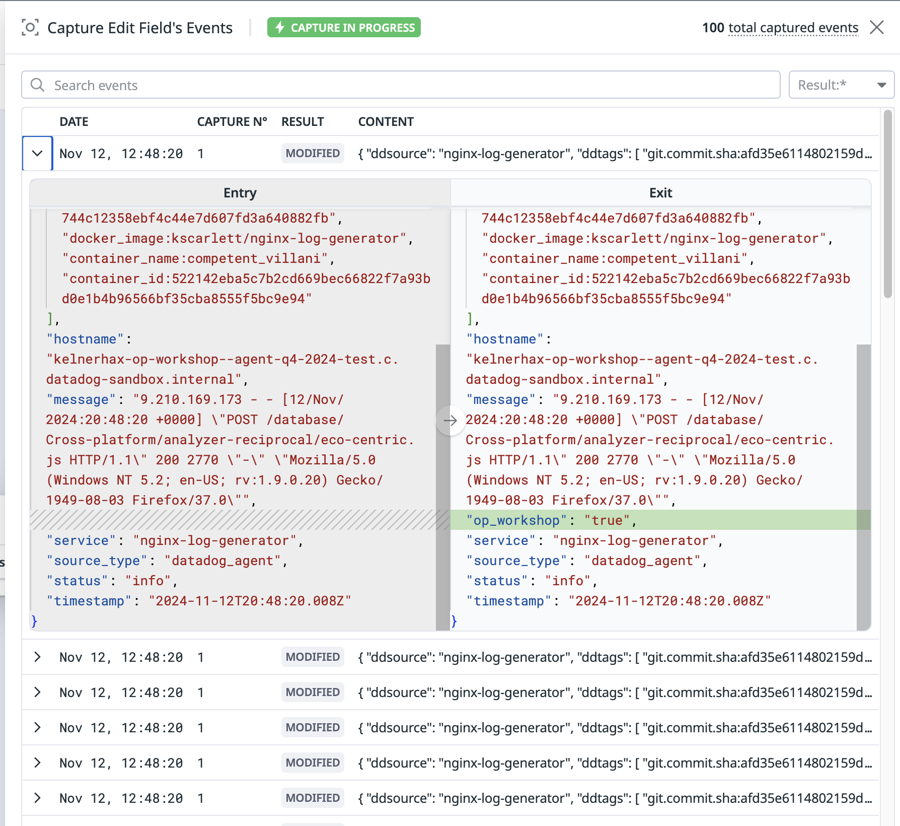

> [!NOTE]
> Live capture will show all events that reach the processor regardless of any filter on a given processor.

### Workshop 6) Add Source Field and Grok Processor

Based on a sample captured via live capture above (see event below) we can inspect our log event and see that there's some good data within the message body that could be extracted into attributes.

```
{
  "ddsource": "nginx-log-generator",
  "ddtags": [
    "git.commit.sha:afd35e6114802159da59685f758a7c082ec5e434",
    "git.repository_url:https://github.com/kscarlett/nginx-log-generator",
    "image_name:kscarlett/nginx-log-generator",
    "short_image:nginx-log-generator",
    "image_id:sha256:db43ea8db3662bf56b43b97fec3dad744c12358ebf4c44e7d607fd3a640882fb",
    "docker_image:kscarlett/nginx-log-generator",
    "container_name:competent_villani",
    "container_id:522142eba5c7b2cd669bec66822f7a93bd0e1b4b96566bf35cba8555f5bc9e94"
  ],
  "hostname": "kelnerhax-op-workshop--agent-q4-2024-test.c.datadog-sandbox.internal",
  "message": "9.210.169.173 - - [12/Nov/2024:20:48:20 +0000] \"POST /database/Cross-platform/analyzer-reciprocal/eco-centric.js HTTP/1.1\" 200 2770 \"-\" \"Mozilla/5.0 (Windows NT 5.2; en-US; rv:1.9.0.20) Gecko/1949-08-03 Firefox/37.0\"",
  "op_workshop": "true",
  "service": "nginx-log-generator",
  "source_type": "datadog_agent",
  "status": "info",
  "timestamp": "2024-11-12T20:48:20.008Z"
}
```

The Grok processor in OP, as it is implemented today, acts on a `source` attribute and applies either OOTB or custom parsing rules. The OOTB rules are derived from the Datadog SaaS Log Pipelines.

We can see that we don't have a `source` attribute in our event, so let's first add one to match on. Under less contrived (non-lab) circumstances it would be reasonable to expect this to already exist but that may not always be the case.

- Edit your OP Pipeline in the UI
- Click "Add" and choose the "Edit Fields" processor
- Select "Add field"
- For our "Filter query" we'll use some data from our sample captured event via Live Capture to key off of, enter `@ddsource:nginx-log-generator` here
- For "Field to add" set `source` and "Value to add" as `nginx`
- You should have something like this:

    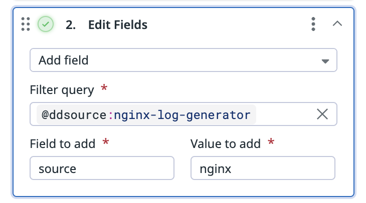

Now let's add the grok processor right after it:

- Click "Add" and choose the "Grok Parser" processor
- For Filter Query enter `@ddsource:nginx-log-generator` - this will match our nginx logs and using the `source` we set will have the OOTB Grok Parsers applied
    - You can find all the OOTB Grok Parser's by click on "Preview Library Rules" and selecting a source from the drop down

Now let's deploy! Click on "Deploy Changes" - after a few moments the config change will go out over Remote Config and the "Status" column will turn to a green "Deployed" indicator.

> [!NOTE]
> Notice we also have `ddsource` set by the Datadog Agent. This will actually take precendence when it hits the Datadog SaaS Log Pipelines, so these logs won't actually be parsed by the OOTB Nginx pipeline because it is currently set to `nginx-log-generator`. We could change this here, but since the purpose is to see the processing that OP can do we actually don't want to change this. But in a customer's environment this would be a suggestion we would make so they take full advantage of the platform out-of-the-box processing capabilities.

### Workshop 7) Review our Grok Parser Processor results

Return to the Log Explorer in your DD Org and open a recent log.

Recall that our log previously looked like this:

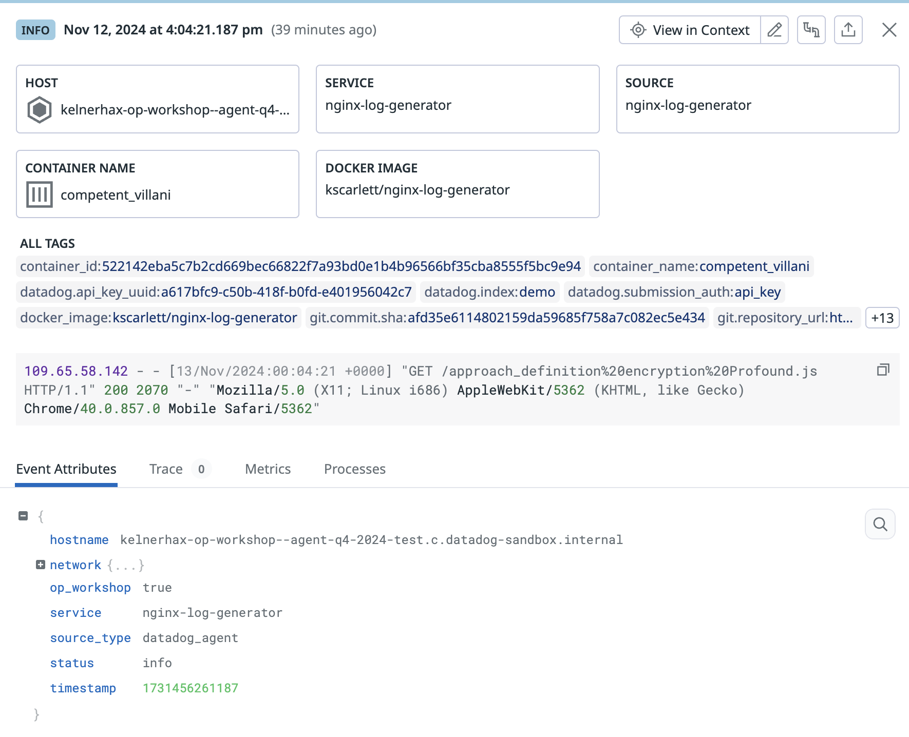

And now our newest logs look like this:

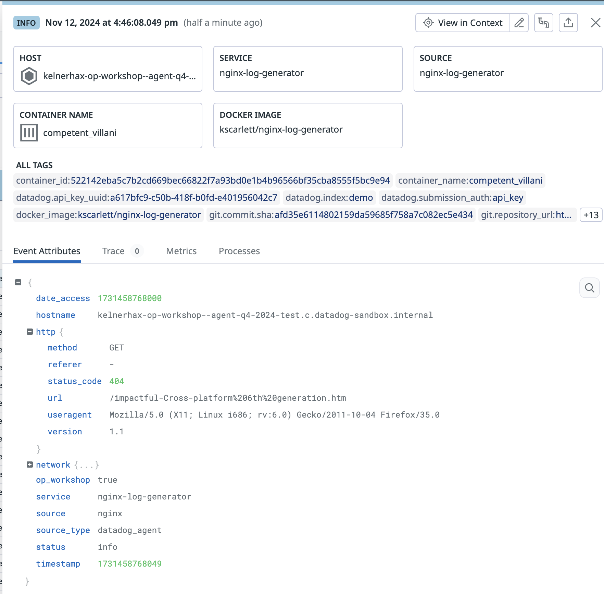

You could also use `observability-pipelines-worker tap <component-id>` or Live Capture here again to see the new log as it flows through OP, e.g.

```
{
  "ddsource": "nginx-log-generator",
  "ddtags": [
    "git.repository_url:https://github.com/kscarlett/nginx-log-generator",
    "git.commit.sha:afd35e6114802159da59685f758a7c082ec5e434",
    "image_name:kscarlett/nginx-log-generator",
    "short_image:nginx-log-generator",
    "image_id:sha256:db43ea8db3662bf56b43b97fec3dad744c12358ebf4c44e7d607fd3a640882fb",
    "docker_image:kscarlett/nginx-log-generator",
    "container_name:competent_villani",
    "container_id:522142eba5c7b2cd669bec66822f7a93bd0e1b4b96566bf35cba8555f5bc9e94"
  ],
  "hostname": "kelnerhax-op-workshop--agent-q4-2024-test.c.datadog-sandbox.internal",
  "message": {
    "date_access": 1731520232000,
    "http": {
      "method": "GET",
      "referer": "-",
      "status_code": 200,
      "url": "/Persevering.js",
      "useragent": "Mozilla/5.0 (Macintosh; U; Intel Mac OS X 10_6_7) AppleWebKit/5360 (KHTML, like Gecko) Chrome/40.0.889.0 Mobile Safari/5360",
      "version": "1.1"
    },
    "network": {
      "bytes_written": 1487,
      "client": {
        "ip": "241.134.188.217"
      }
    }
  },
  "op_workshop": "true",
  "service": "nginx-log-generator",
  "source": "nginx",
  "source_type": "datadog_agent",
  "status": "info",
  "timestamp": "2024-11-13T17:50:32.283Z"
}
```

You'll notice the original message is replaced `@message.<attributes>` - OP's Grok Processor does not preserve the message field, from [the docs](https://docs.datadoghq.com/observability_pipelines/processors/grok_parser/):

> If the `source` field of a log matches one of the grok parsing rule sets, the log’s `message` field is checked against those rules. If a rule matches, the resulting parsed data is added in the `message` field as a JSON object, overwriting the original `message`.

If you wanted to preserve the original message you could use a Grok Processor with custom rules instead of the OOTB Library rules.

### Workshop 8) Filter Logs

Now that we have some meaningful parsed attribute data to work with, let's filter out some of the noise. Perhaps we only want to send non-200 logs to Datadog, since these are nginx logs we can now act on the `@http.status_code` attribute to determine if we want to drop the log or not.

- Edit your OP Pipeline in the UI
- Click on "Add" and choose "Filter"
- For "Filter Query" enter `NOT (@message.http.status_code:200)`
    - We're telling OP to let anything passthrough that is _NOT_ an HTTP status code of `200`
    - You can find the [filter query syntax documented here](https://docs.datadoghq.com/observability_pipelines/processors/filter#filter-query-syntax)
- Click on "Deploy Changes" and wait for the config change to go out via RC

Once the config change has gone out, we can group our `@op_workshop:true` logs into fields by `@http.status_code` and immediately see a huge drop in our log volumes, all `@http.status_code:200` being dropped.

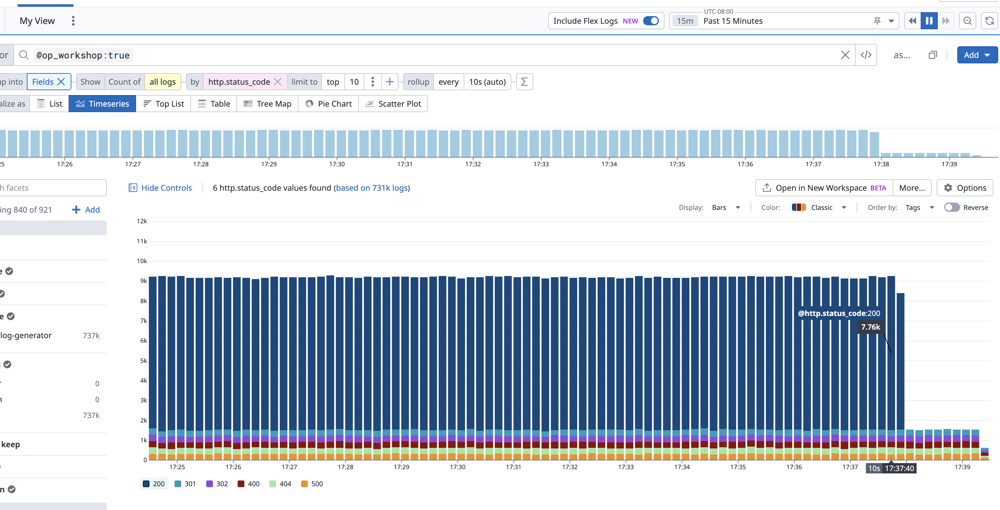

And we can also see a significant decrease between our source and destination events/bytes per second:

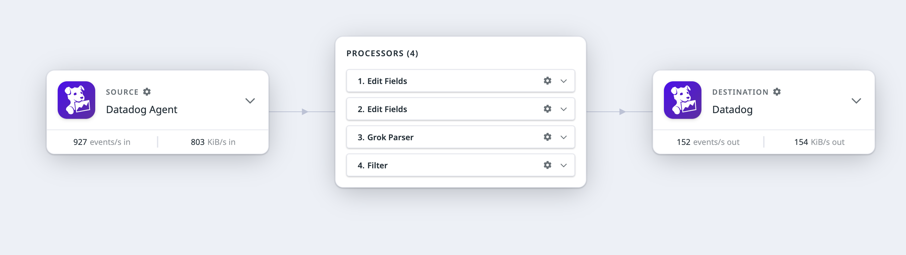

This is a pretty heavy handed approach, but hopefully it serves as an example of how OP can be used to reduce volumes.

Back in the OP Control Plane we can also observe the filter behavior by clicking on the gear icon next to the filter and selecting "view details" which will open a slide out pane with embedded metrics. Here we can observe the number of intentionally discarded events.

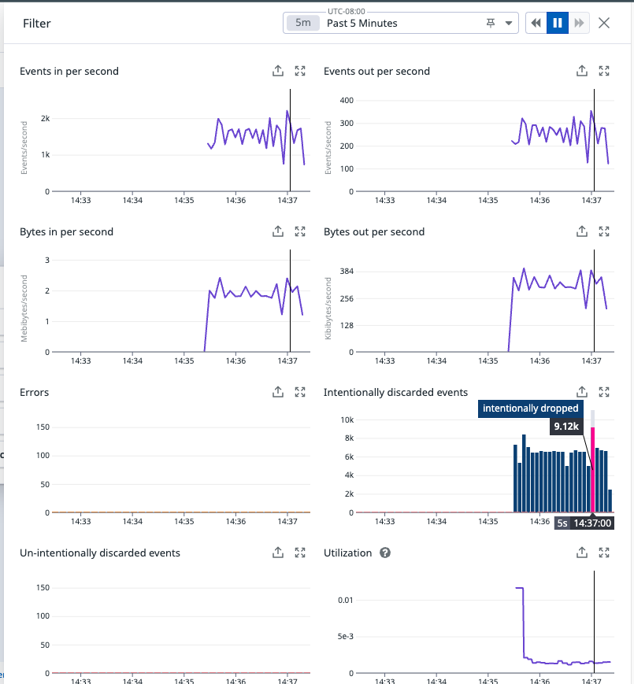

### Workshop 9) Logs to metrics

Finally, lets see how logs to metrics can work at the edge. Customers tend to use this option within the Datadog Platform on the ingest pipeline and will choose not to index those logs to save money. With OP we can do it before sending to Datadog, thus also eliminating ingest cost.

Here we can place a logs to metric processor before our filter to capture the number of requests as a metric. This is a pretty simple example, but serves to illustrate how it works.

- Edit your OP Pipeline in the UI again
- Click on "Add" and choose "Generate Metrics"
- Move this processor above your filter processor from the last step
- Click "Manage metrics"
- For "Filter Query" enter `@ddsource:nginx-log-generator`
- For "Set metric name" enter something like `op.nginx.http_requests.by_status_code` or another namespace you prefer
- For "Group By" we will set two values to tag our metric by `message.http.status_code` and `message.http.method`
    - _Note the lack of `@` here before the attribute unlike what gets used in filter queries_

    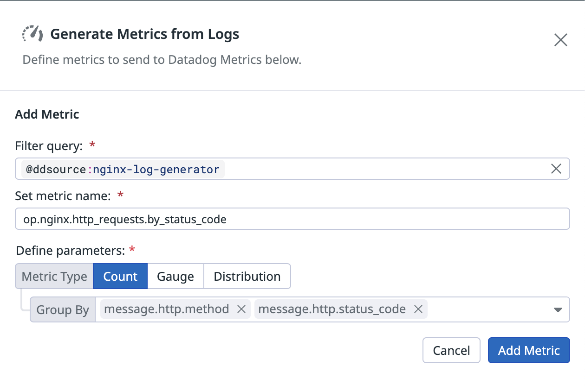

- Click "Add Metric" and close the slide out panel
- Double check the position of the metrics processor, it should be above the filter processor we added earlier - you can reposition processors by clicking the top left corner and dragging them.

    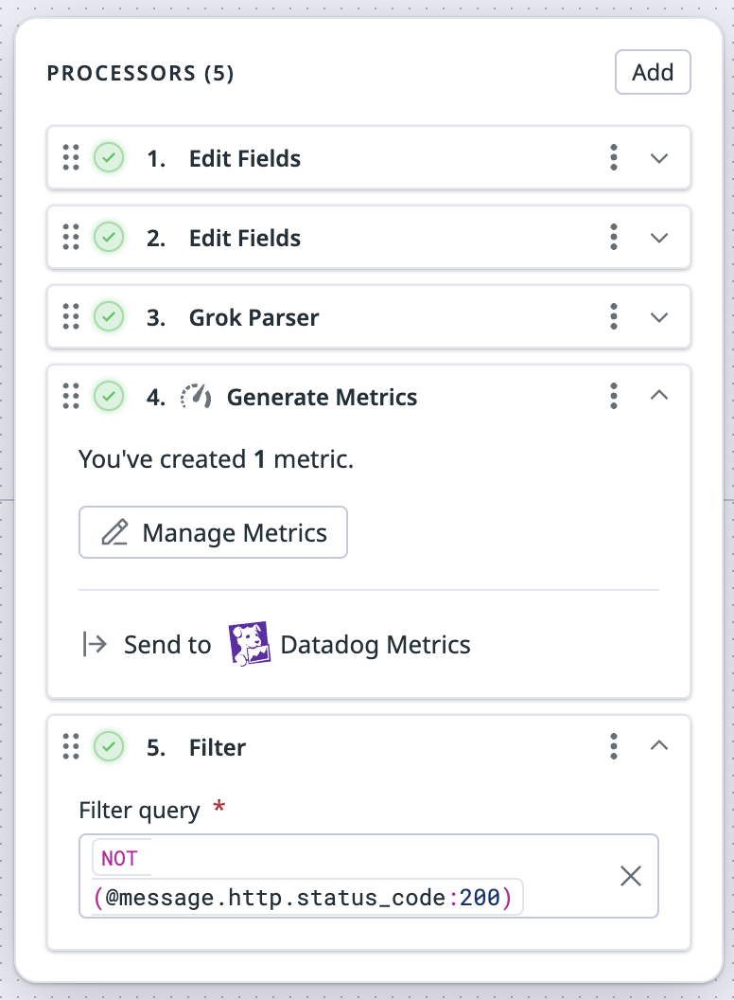

- Click "Deploy Changes"
- Now you can go to your metrics explorer you can type in your metric name `op.nginx.http_requests.by_status_code` and break them down by the dimensions we provided (`status_code` and `method`), e.g.

    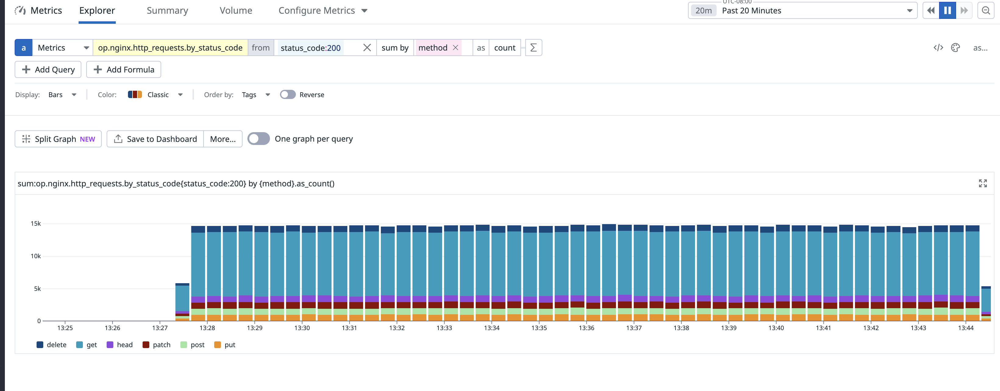

Now we have metrics for those logs we've filtered out (200 status codes) AND metrics for other Status Codes as well.

### Workshop 10) Sample by HTTP Status Code

Of our remaining logs, lets look to see where we could trim more logs using a sample processor. If we break our logs down by `@http.status_code` we can see we have ~30% of total volume being attributed by `301` and `302` which aren't super useful for us to keep them all since we have the metrics for these we could track the over all trend using our metric and drop some of them via sampling.

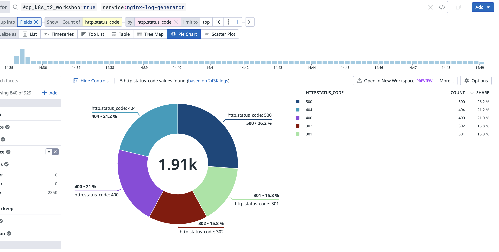

Add a sample processor with a filter value of: `@ddsource:nginx-log-generator (@message.http.status_code:301 OR @message.http.status_code:302)` and set the "Retain" value to `25`.

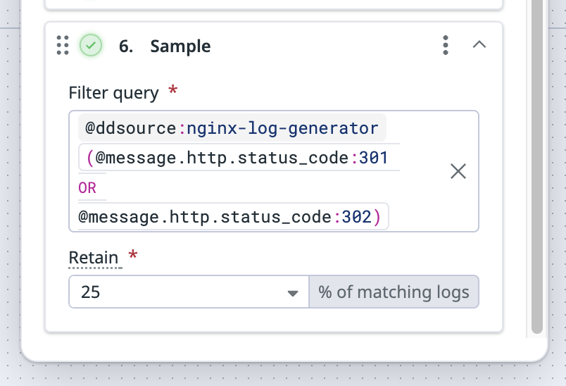

Click "Deploy Changes"

After our changes are applied we can click on the gear next to the Sample processor, click "View Details" and we can note that under "Intentionally discarded events" we are sampling out logs:

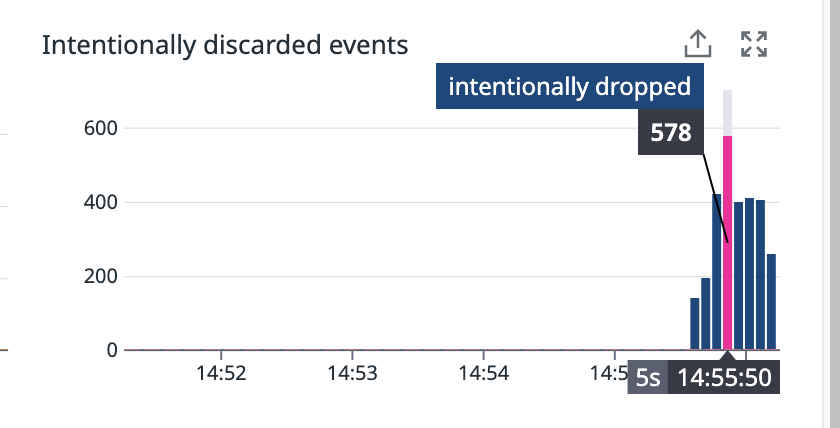

You'll also notice on the events that were samples a new attribute `sample_rate` which will be set to `4` (25% is 1 in 4 events).

### Workshop 11) Deploy more logs

- Either check out this repo or download [`extra-logs.yaml`](./extra-logs.yaml) to your local working directory
- Then run: `kubectl apply -f extra-logs.yaml`

Once the you hit the zero second of the next minute you should see a pod pop up for this cronjob:

```
k get po

NAME                                           READY   STATUS    RESTARTS        AGE
extra-logs-28935335-pkcnl                      1/1     Running   0               26s
```

Now if we query for `@op_k8s_t2_workshop:true service:extra-logs` in DD we should see something like:

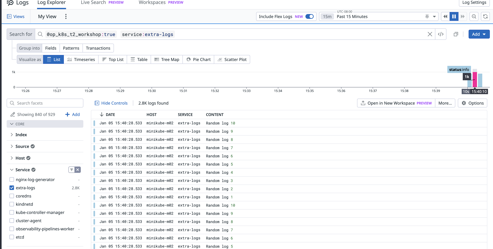

### Workshop 12) Add Quota Processor

Add a new processor and choose "Quota", set it up with the following fields:

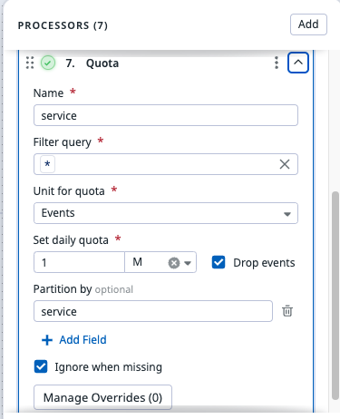

Deploy your changes.

After a few minutes switch to the quotas tab on the pipeline overview, you should see an uptick in the % of each service like below:

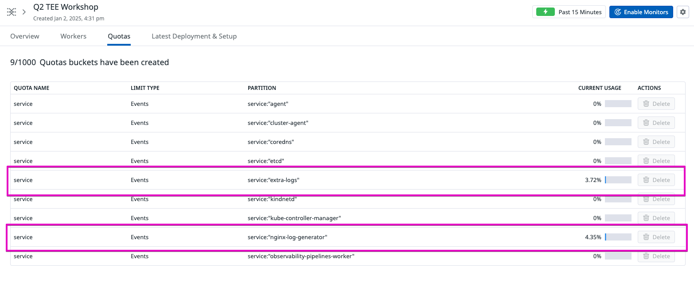

We have the same quota for each service. But you can manage individual quotas by uploading a CSV under the "Manage Overrides" screen on the quota processor as well to control individual volumes for each service.

### Workshop 13) Add Environments Variable Processor

> [!NOTE]
> If you didn't use the [`values.yaml`](./values.yaml) from this repo to deploy your OP worker, then you'll need to modify your local copy to include the `DD_OP_PROCESSOR_ADD_ENV_VARS_ALLOWLIST` ENV VAR as [seen here](https://github.com/DataDog/logs-psa-private/blob/main/workshop/op-workshop-k8s/values.yaml#L10-L12) to continue or you will get an error when you try to deploy. You can also download the [`values.yaml`](./values.yaml) and use it if you prefer.
>
> If your workers don't restart after applying this change automatically you may need to run `kubectl rollout restart statefulset opw-observability-pipelines-worker`
>
> Note: At the time of writing this is not in our public docs. It has been raised to the docs team.

- Make sure you saw the note above and that you've deployed your OP worker with `DD_OP_PROCESSOR_ADD_ENV_VARS_ALLOWLIST` and `HELLOCC` environment variables.
- Add the "Add Environment Variables" processor and configure it as seen below:
    - 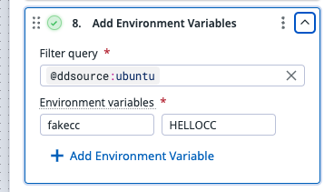
- Deploy your pipeline update

After a few moments once your update is applied you should see your logs now have a fake credit card value in them:

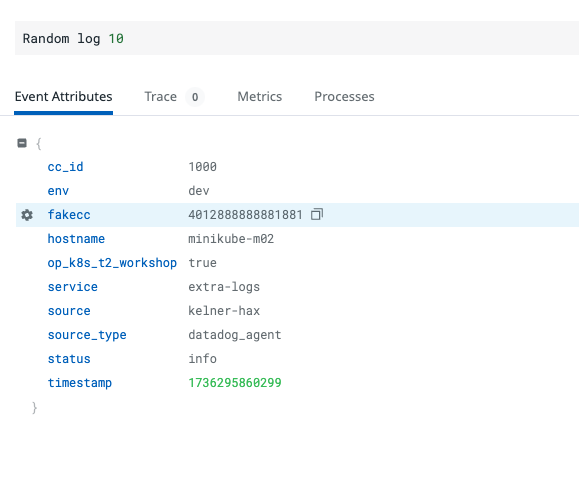

### Workshop 14) Add a Parse JSON Processor

Let's make sure our new `service:extra-logs` `message` field gets parsed into JSON properly so we can address fields within the message.

Add a new processor like the following then deploy it:

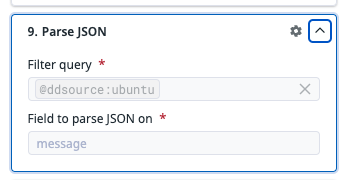

### Workshop 15) Add a local CSV and Add Enrichment Table Processor

> [!NOTE]
> This is just for demonstration purposes, no one would put credit card values in an enrichment table, but we will use this to power our next processor, SDS. These are fake credit cards numbers.

- Add the CSV to our OP environment via ConfigMap:
    - Download [`values-extra.yaml`](https://github.com/DataDog/logs-psa-private/blob/main/workshop/op-workshop-k8s/values-extra.yaml) and [`op-enrich-config.yaml`](https://github.com/DataDog/logs-psa-private/blob/main/workshop/op-workshop-k8s/op-enrich-config.yaml) from this repo
    - Install the ConfigMap: `kubectl apply -f op-enrich-config.yaml`
    - Upgrade our OPW deployment using `values-extra.yaml`:

        ```
        noglob helm upgrade --install opw \
        -f values-extra.yaml \
        --set datadog.apiKey=cee2...5927 \
        --set datadog.pipelineId=098f4b10-c96a-11ef-a040-da7ad0900002 \
        --set env[0].name=DD_OP_SOURCE_DATADOG_AGENT_ADDRESS,env[0].value='0.0.0.0:8282' \
        --set service.ports[0].name=dd-op-source-datadog-agent-address-port,service.ports[0].protocol=TCP,service.ports[0].port=8282,service.ports[0].targetPort=8282 \
        datadog/observability-pipelines-worker

        Release "opw" has been upgraded. Happy Helming!
        NAME: opw
        LAST DEPLOYED: Tue Jan  7 14:18:07 2025
        NAMESPACE: default
        STATUS: deployed
        REVISION: 23
        ```
    - You'll note that `values-extra.yaml` contains configuration for `extraVolumes` and `extraVolumeMounts` to mount our ConfigMap (`op-enrich-config.yaml`) which contains a CSV

- Add Enrichment Processor:
    - Edit your pipeline and add a new "Enrichment Table" Processor
    - For "Filter Query" enter `@ddsource:ubuntu`
    - For "Source field" set `message.cc_id`
    - For "Target field" set `fake_cc`
    - For "Reference Table type" set `File`
    - For "File Path" set `/cc/cc.csv`
        - **NOTE: While this LOOKS like an absolute path, OPW actually expects the file at `/var/lib/observability-pipelines-worker/config/` (it seems to be hardcoded to do so) as seen in the error below:**
            - 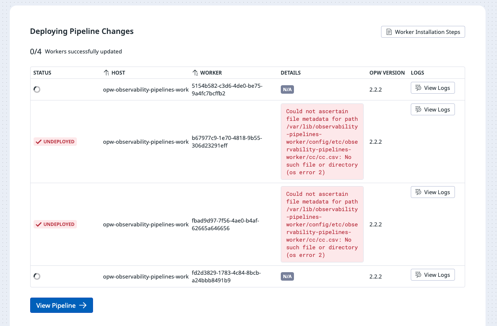
            - _[Read more in depth on the issue here](https://github.com/DataDog/logs-psa-private/tree/main/workshop/op-workshop-k8s/screenshots/enrichment_table#readme) - it has been reported_
    - For "Column Name" set `cc_id`
    - It should look like this:
        - 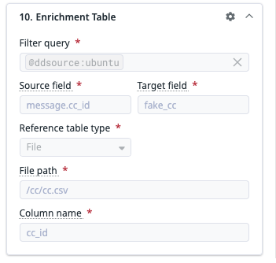
    - Deploy your updated pipeline

After your deployment has rolled out you can inspect a log and find our fake credit card value inserted by our enrichment table:

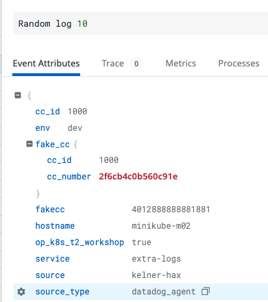

### Workshop 16) Add Reduce Processor

You might have noticed our `service:extra-logs` is just 10 repeating logs with the message `Random log <1-10>` repeated several times per second. This is not terribly useful to have the same message repeated, so lets reduce that down to unique values.

Edit your pipeline and add a Reduce processor before our Quota processor like so:

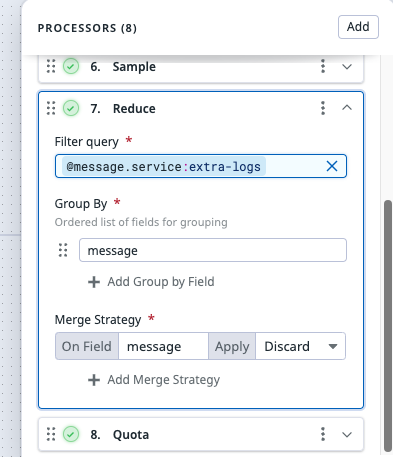

What this will do is collapse like for like messages into a single event, discarding all other values that the first match (e.g. `Random log 3`) in 10 second intervals.

Deploy your change.

Now you should see that we've gone from 100 events every second down to 10 events every 10 seconds as seen below:

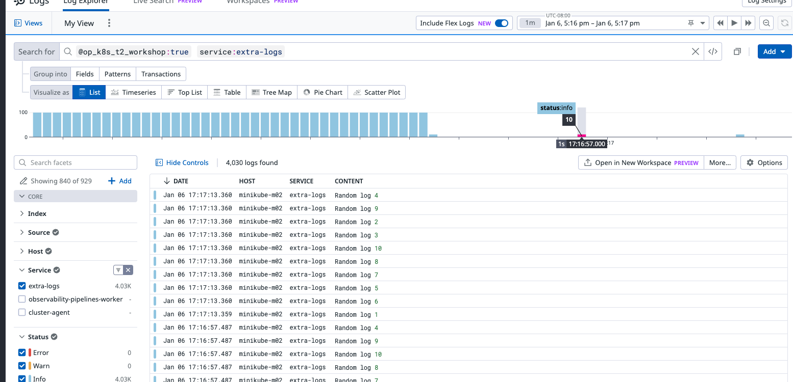

To visualize this another way, if we chose the `Array` strategy, then we would see the same log message repeated multiple times inside an array in the message field like this:

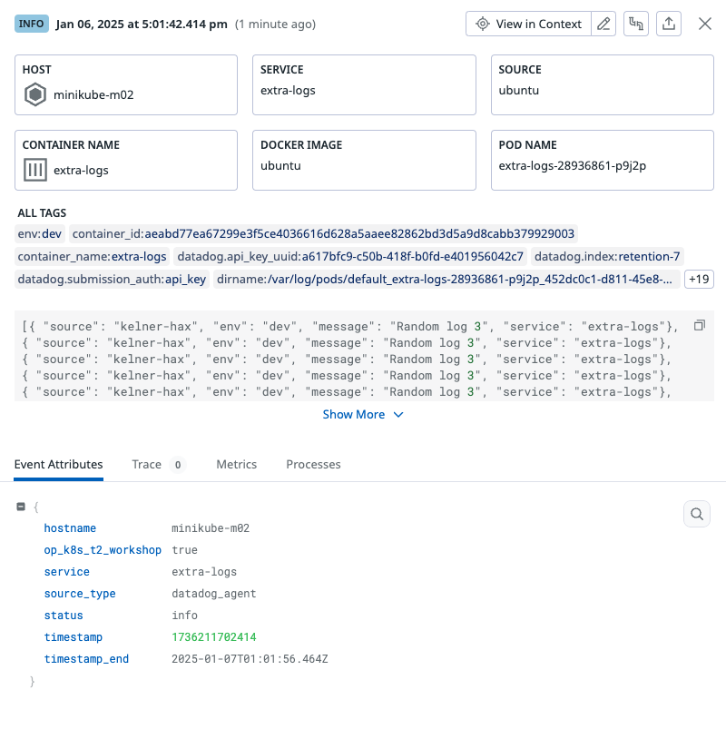

We've effectively cut our noisy messages down by 1/100th of the volume (if I did my math right).

> [!NOTE]
> A Deduplicate processor would also be effective here and would work in a similar way.

### Workshop 17) Add the Redact Sensitive Data Processor

- Edit your pipeline and add the SDS Processor
- Set the "Filter" to `@message.service:extra-logs`
- Click "Add Scanning Rule"
- Name the rule `Visa Card 4x4`
- Set "Select scanning rule type" to "From Library"
- Select `Visa Card Scanner (4x4 digits)` for the library pattern
- Set "Scan entire or part of event" to "Entire Event"
- Set "Define action on match" to "Redact"
- Set "Replacement Text" to `[redacted_cc]`
- Set "Add tag(s)" to `sensitive_data`
- Repeat this process for the following Library Rules:
    - `Visa Card Scanner (2x8 digits)`
    - `Visa Card Scanner (1x16 & 1x19 digits)`
    - `MasterCard Scanner (4x4 digits)`
    - `MasterCard Scanner (2x8 digits)`
    - `MasterCard Scanner (1x16 digits)`
- Deploy your changes

> [!NOTE]
> There are also fake AMEX CC's in our Enrichment Table, should you choose you can add rules for those also.

Once deployed if you inspect your logs all those with matching rules should have `[redacted_cc]` in place of the fake credit card numbers:

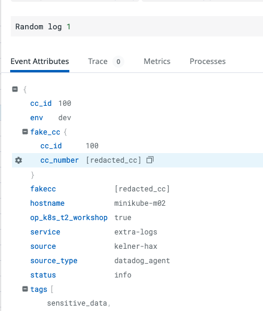

### Workshop 18) Complete & Cleanup

Congrats, you completed the workshop and now you have a lab environment where you can perform more testing and proof of concepts with OP.

To cleanup, simplely run `minikube stop`

## Supplemental: OP worker logs and pipelines.* metrics

OP exposes its internal metrics under the `pipelines.*` metric namespace.

I've included two dashboard json for use as starting points, see:

- [op-dash-1.json](./dashboards/op-dash-1.json) originally built for US Bank and meant to be a starting point for OOTB Dashboard for OP (we went embedded graphs within the OP UI instead)
- [op-dash-2.json](./dashboards/op-dash-1.json) originally used by Kelner when investigating ISA dropped logs issues, plots many of the `pipelines.*` metrics

You can copy this JSON and use the "Import" feature in a new dashboard to load them.

OP also ships its own logs to your DD Org, you can find these under "Latest Deployment & Setup" and in the table for each worker is a link to that worker's logs, as seen below:

    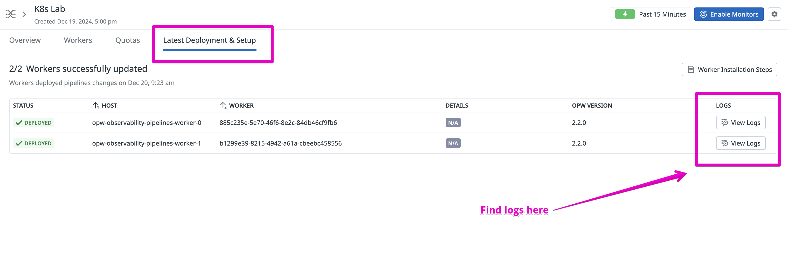

## Additional Resources

- https://docs.datadoghq.com/observability_pipelines/
- https://docs.datadoghq.com/observability_pipelines/best_practices_for_scaling_observability_pipelines/
- https://www.datadoghq.com/knowledge-center/telemetry-pipelines/
- https://www.datadoghq.com/blog/observability-pipelines/
- https://www.datadoghq.com/blog/observability-pipelines-log-volume-control/
- https://www.datadoghq.com/blog/observability-pipelines-dual-ship-logs/
- https://www.datadoghq.com/blog/observability-pipelines-archiving/
- https://www.datadoghq.com/blog/observability-pipelines-sensitive-data-redaction/
- https://www.datadoghq.com/blog/observability-pipelines-transform-and-enrich-logs/
