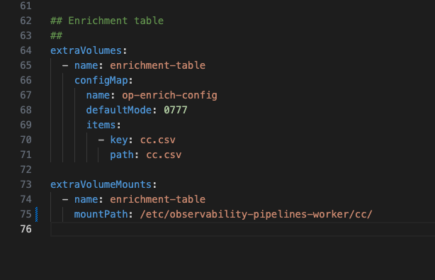

This expands on the fact that OP seems to be hardcoded to expect the CSV file should be placed in `/var/lib/observability-pipelines-worker/config/` - the following screenshots try to explain:

Here we have an Enrichment Table processor configured to pick up from `/etc/observability-pipelines-worker/cc/cc.csv`:

And here we have the mount point for that in our config:

And here we can see the file exists at the path in the container:

But we can see when we try to deploy OPW prepends `/var/lib/observability-pipelines-worker/config/` to our path even though we've specified in the config `/etc/observability-pipelines-worker/cc/cc.csv` and gives us an error:

When we change our helm values to `/var/lib/observability-pipelines-worker/config/cc`:

And our processor config to `/cc/cc.csv`

We get a successful deployment and functioning enrichment table processor, and re-affirming that OP is preprending `/var/lib/observability-pipelines-worker/config/`
