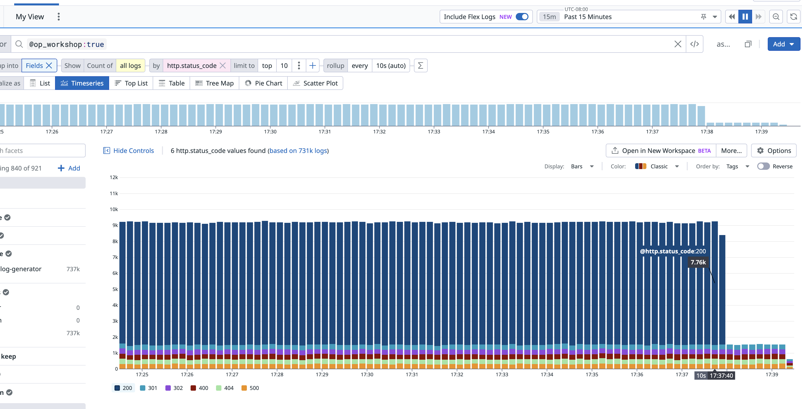

# Observability Pipelines VM based workshop

This doc will guide you through an Observability Pipelines Workshop based on a virtual machines.
You can follow this doc top to bottom to complete the workshop on your own, no "teacher" led instruction is required.

> [!IMPORTANT]
> This is a VM based workshop, you'll start with two VMs, one with the DD agent and a log generator, and another running OPW. If you decide to pursue the "Supplemental Learning" section here-in, you'll create a base image and create a managed instance group running the image behind a load balancer.
>
> If you are looking for something Kubernetes based instead, please [see this lab](https://github.com/DataDog/logs-psa/tree/main/workshops/op-workshop-k8s#observability-pipelines-k8s-lab).

## Workshop goals

Get hands on with Observability Pipelines (OP) by:

- Deploying the OP Worker
- Creating an OP Pipeline and deploying it via the Datadog UI and Remote Config
- Configuring the Datadog Agent to send logs to our OP Worker
- Adding processors to our OP Pipeline
- Keep it terribly simple!
    - This is meant to introduce you to OP, not deploy a production grade architecture. If you want something slightly more in that direction check out the self-led [Supplemental Learning](#supplemental-learning---placing-op-workers-behind-a-load-balancer) towards the end of this readme.

<!-- START doctoc generated TOC please keep comment here to allow auto update -->
<!-- DON'T EDIT THIS SECTION, INSTEAD RE-RUN doctoc TO UPDATE -->
**Table of Contents**

- [Prerequisites](#prerequisites)
- [Datadog Agent and logs generation](#datadog-agent-and-logs-generation)
  - [Create a VM for DD Agent and log generation](#create-a-vm-for-dd-agent-and-log-generation)
  - [Install the Datadog Agent](#install-the-datadog-agent)
  - [Install Docker](#install-docker)
  - [Generate logs](#generate-logs)
  - [Configure the Datadog Agent](#configure-the-datadog-agent)
  - [Verify logs are collected and shipped](#verify-logs-are-collected-and-shipped)
- [OP Worker](#op-worker)
  - [Create a VM for OP](#create-a-vm-for-op)
  - [Enable Remote Config (RC) in your Datadog account](#enable-remote-config-rc-in-your-datadog-account)
  - [Create an OP Pipeline](#create-an-op-pipeline)
  - [Install Observability Pipelines Worker](#install-observability-pipelines-worker)
  - [Enable the OPW API](#enable-the-opw-api)
  - [Return to our DD Agent instance and enable OPW routing](#return-to-our-dd-agent-instance-and-enable-opw-routing)
  - [View logs coming from OP in Datadog Log management](#view-logs-coming-from-op-in-datadog-log-management)
- [Working with Observability Pipelines](#working-with-observability-pipelines)
  - [Live Capture](#live-capture)
  - [Add Grok Processor](#add-grok-processor)
  - [Review our Grok Parser Processor results](#review-our-grok-parser-processor-results)
  - [Filter Logs](#filter-logs)
  - [Logs to metrics](#logs-to-metrics)
  - [OP worker logs and pipelines.* metrics](#op-worker-logs-and-pipelines-metrics)
- [Supplemental Learning - Placing OP workers behind a load balancer](#supplemental-learning---placing-op-workers-behind-a-load-balancer)
  - [Architecture we are implementing](#architecture-we-are-implementing)
  - [Update our firewall rules to allow GCP Probes to reach our instances](#update-our-firewall-rules-to-allow-gcp-probes-to-reach-our-instances)
  - [Create an Instance Group based on our OPW VM](#create-an-instance-group-based-on-our-opw-vm)
  - [Create a Load Balancer](#create-a-load-balancer)
  - [Return to our DD Agent instance and reroute to our OPW load balancer](#return-to-our-dd-agent-instance-and-reroute-to-our-opw-load-balancer)
  - [End of Supplemental](#end-of-supplemental)
- [Additional Resources](#additional-resources)

<!-- END doctoc generated TOC please keep comment here to allow auto update -->

## Prerequisites

- Access to at least two VMs, we'll use Ubuntu as our operating system, but you can find instructions for other OSes in the Datadog platform
- If you plan to complete [Supplemental Learning](#supplemental-learning---placing-op-workers-behind-a-load-balancer) - this lab will use GCP concepts, but those could be translated into AWS or Azure as needed.
- A Datadog account

## Datadog Agent and logs generation

Setup a VM with the Datadog Agent and generating logs to be sent to OP. We'll be using docker to easily generate some logs for the DD agent to pick up and send to OP.

### Create a VM for DD Agent and log generation

- Provision an Ubuntu VM in your cloud provider or choice, here we are using GCP
- Make sure you have SSH access (appropriate SSH keys and firewalls open)

### Install the Datadog Agent

- SSH into your Agent Ubuntu VM
- In your Datadog account navigate to the agent install screen: https://app.datadoghq.com/account/settings/agent/latest?platform=ubuntu
- Select an API key, then copy the command and run it on your VM, e.g.

    ```
    DD_API_KEY=aeb5...fa756 \
    DD_SITE="datadoghq.com" \
    bash -c "$(curl -L https://install.datadoghq.com/scripts/install_script_agent7.sh)"
    ```

### Install Docker

We'll use docker to easily generate some log volume to send from the agent to the observability pipelines worker.

- Install official docker package:

    ```
    sudo install -m 0755 -d /etc/apt/keyrings && \
    sudo curl -fsSL https://download.docker.com/linux/ubuntu/gpg -o /etc/apt/keyrings/docker.asc && \
    sudo chmod a+r /etc/apt/keyrings/docker.asc

    # Add the repository to Apt sources:
    echo \
    "deb [arch=$(dpkg --print-architecture) signed-by=/etc/apt/keyrings/docker.asc] https://download.docker.com/linux/ubuntu \
    $(. /etc/os-release && echo "$VERSION_CODENAME") stable" | \
    sudo tee /etc/apt/sources.list.d/docker.list > /dev/null

    # install
    sudo apt-get update && \\
    sudo apt-get install docker-ce docker-ce-cli containerd.io
    ```

- Make sure we don't fill up disk with docker logs: `sudo vi /etc/docker/daemon.json` - **NOTE** make sure to maintain formatting:

    ```
    {
        "log-driver": "json-file",
        "log-opts": {
            "max-size": "250m",
            "max-file": "3"
        }
    }
    ```

- Reload systemd daemon configuration: `sudo systemctl daemon-reload`
- `sudo systemctl restart docker`

### Generate logs

On the agent VM do the following:

- Run the nginx log generator: `sudo docker run -d -e "RATE=100" kscarlett/nginx-log-generator`
    - https://github.com/kscarlett/nginx-log-generator
    - Where `RATE` is the number of logs generated per second
- Verify the container is running: `sudo docker ps`

    ```
    CONTAINER ID   IMAGE                           COMMAND   CREATED          STATUS          PORTS     NAMES
    5f14ad47cdd0   kscarlett/nginx-log-generator   "/app"    27 seconds ago   Up 26 seconds             reverent_newton
    ```

- Verify logs are being generated: `sudo docker logs <CONTAINER ID>`

### Configure the Datadog Agent

We will be adding support to collect logs from docker socket instead of files given the unique nature of running the agent on the host versus in a container itself, typically ([as per our docs](https://docs.datadoghq.com/containers/docker/log/?tab=hostagent#docker-container-log-collection-from-a-file)) it is better to collect from files than the docker socket.

On the agent VM do the following:

- With your preferred editor open the Datadog Agent config: `sudo vi /etc/datadog-agent/datadog.yaml`
- Find the `Log collection Configuration` section and enable `logs_enabled` and `container_collect_all` by uncommenting them and setting their values to `true`:

    ```
    ##################################
    ## Log collection Configuration ##
    ##################################

    ## @param logs_enabled - boolean - optional - default: false
    ## @env DD_LOGS_ENABLED - boolean - optional - default: false
    ## Enable Datadog Agent log collection by setting logs_enabled to true.
    #
    logs_enabled: true

    ## @param logs_config - custom object - optional
    ## Enter specific configurations for your Log collection.
    ## Uncomment this parameter and the one below to enable them.
    ## See https://docs.datadoghq.com/agent/logs/
    #
    logs_config:

        ## @param container_collect_all - boolean - optional - default: false
        ## @env DD_LOGS_CONFIG_CONTAINER_COLLECT_ALL - boolean - optional - default: false
        ## Enable container log collection for all the containers (see ac_exclude to filter out containers)
        #
        container_collect_all: true
    ```

- Find the `Container Autodiscovery Configuration` section and enable the docker listener by uncommenting the lines, be sure to maintain proper YAML spacing (2 space indent):

    ```
    ###########################################
    ## Container Autodiscovery Configuration ##
    ###########################################

    ## @param listeners - list of key:value elements - optional
    ## @env DD_LISTENERS - list of key:value elements - optional
    ## Choose "auto" if you want to let the Agent find any relevant listener on your host
    ## At the moment, the only auto listener supported is Docker
    ## If you have already set Docker anywhere in the listeners, the auto listener is ignored
    #
    listeners:
      - name: docker
    ```

- In the `Autoconfig Configuration` uncomment `config_providers` and the docker entry, be sure to maintain proper YAML spacing (2 space indent)::

    ```
    ##############################
    ## Autoconfig Configuration ##
    ##############################

    ## @param config_providers - List of custom object - optional
    ## @env DD_CONFIG_PROVIDERS - List of custom object - optional
    ## The providers the Agent should call to collect checks configurations. Available providers are:
    ##   * kubelet - The kubelet provider handles templates embedded in pod annotations.
    ##   * docker -  The Docker provider handles templates embedded in container labels.
    ##   * clusterchecks - The clustercheck provider retrieves cluster-level check configurations from the cluster-agent.
    ##   * kube_services - The kube_services provider watches Kubernetes services for cluster-checks
    ##
    ## See https://docs.datadoghq.com/guides/autodiscovery/ to learn more
    #
    config_providers:
    #  - name: kubelet
    #    polling: true
      - name: docker
        polling: true
    ```

- Add the agent to the docker user group: `sudo usermod -a -G docker dd-agent` so we can read from the docker socket
- Restart the agent `sudo systemctl restart datadog-agent`

### Verify logs are collected and shipped

On the agent VM do the following:

- Verify logs are being collected, run `sudo datadog-agent status` and look for the following information:

    ```
    ==========
    Logs Agent
    ==========

        Reliable: Sending compressed logs in HTTPS to agent-http-intake.logs.datadoghq.com on port 443
        BytesSent: 601309451
        EncodedBytesSent: 39787520
        LogsProcessed: 716185
        LogsSent: 701085
        RetryCount: 0
    ```

- Verify logs are showing up in your personal DD account:

    

## OP Worker

### Create a VM for OP

- Provision an Ubuntu VM in your cloud provider or choice, here we are using GCP
- Make sure you have SSH access (appropriate SSH keys and firewalls open)
- If necessary create firewall rules that allow traffic inbound from the Agent VM to this OP VM (this could be as open as `0.0.0.0` on port `8282` or better restrict it to the `/32` of your Agent VM's ip address)

### Enable Remote Config (RC) in your Datadog account

Remote Configuration is required for the Observability Pipelines Worker (OPW) to communicate with the Datadog SaaS control plane.

- Navigate to https://app.datadoghq.com/organization-settings/remote-config/setup?page_id=org-enablement-step
- Click on "Enable for your Organization"
- Choice: Select an Existing API Key to enable or Create a new API key
- Existing API Key
    - Click on "Next Step"
    - Click on "Select API Keys"
    - Choose an existing API Key by checking the box next to it
    - Click "Enable 1 Key"
    - Click "Next Step"
    - Click "Done"
- Create new API Key
    - Navigate to https://app.datadoghq.com/organization-settings/api-keys
    - Click "New Key"
    - Give key a descriptive name
    - Click "Create Key"
    - RC is automatically applied

### Create an OP Pipeline

In your DD Account org do the following:

- Navigate to https://app.datadoghq.com/observability-pipelines
- Click on the template "Log Volume Control"
- Select "Datadog Agent" for your source
- Select "Datadog" for your destination
- Delete all of the default processors except the "Edit Fields" processor
- Expand the "Edit Fields" processor
    - Change it to `Add Field` type
    - For "Filter Query" enter `*` to select all logs flowing through OP
    - For "Field to add" enter `op_workshop`
    - For "Value to add" enter `true`
    - This will help us easily find our logs in DD Log Mgmt later on
- Click on "Next: Install"
- Choose "Ubuntu" as your "installation platform"
- For "Datadog Agent Address" enter `0.0.0.0:8282`
- Select an API Key with Remote Config (RC) Enabled from the step [Enable Remote Config (RC) in your Datadog account](#enable-remote-config-rc-in-your-datadog-account)
- Copy the command to install OPW

### Install Observability Pipelines Worker

On the OPW VM do the following:

- SSH into your instance from the step [Create a VM for OP](#create-a-vm-for-op)
- Run the command to install OPW copied from the last section, e.g.

    ```
    DD_API_KEY=aeb53...fa756 DD_OP_PIPELINE_ID=8e22b686-9fbd-11ef-ac35-da7ad0900002 DD_SITE=datadoghq.com DD_OP_SOURCE_DATADOG_AGENT_ADDRESS='0.0.0.0:8282' bash -c "$(curl -L https://install.datadoghq.com/scripts/install_script_op_worker2.sh)"
    ```

- Start the service on boot: `sudo systemctl enable observability-pipelines-worker.service`
- Verify the OPW service is running:

    ```
    sudo systemctl status observability-pipelines-worker.service
    ● observability-pipelines-worker.service - "Observability Pipelines Worker"
        Loaded: loaded (/usr/lib/systemd/system/observability-pipelines-worker.service; enabled; preset: enabled)
        Active: active (running) since Mon 2024-11-11 21:52:52 UTC; 33min ago
        ...
    ```

- For now we'll skip the "Connect the Datadog Agent" section, coming back into it in a bit
- Once the Datadog backend detects the worker is running and connected, under the "Deploy your pipeline" section you'll see the message "Worker(s) detected!"
- Click on "Deploy"
- The "Deploy your pipeline" section will update showing the status of the remote config deploying the configuration to our VM
- The "Status" column will update with "Deployed"
- Click "View Pipeline"
- You now have OPW running on your host, we've yet to direct any logs to it so our events per second will read `0`

### Enable the OPW API

We'll [Enable the OPW API](https://docs.datadoghq.com/observability_pipelines/troubleshooting/#enable-the-observability-pipelines-worker-api) which will allow us to run a few helpful troubleshooting commands locally for OP.

**NOTE**: This can be done during the install step by passing these environment variables to the install script.

On the OPW VM do the following:

- `sudo vi /etc/default/observability-pipelines-worker`
- Add `DD_OP_API_ENABLED=true`
- Add `DD_OP_API_ADDRESS=0.0.0.0:8686`
    - If you continue with the [Supplemental Learning](#supplemental-learning---placing-op-workers-behind-a-load-balancer) this exposes the `/health` endpoint on `8686` that is used for the load balancer.
- Reload systemd: `sudo systemctl daemon-reload`
- Restart the OPW service: `sudo systemctl restart observability-pipelines-worker.service`
- Verify the OPW API is running by running `observability-pipelines-worker top`
    - Right now we won't see any data flowing because we haven't started sending logs to the worker yet
- Press ESC to quit

The `observability-pipelines-worker top` command can show you the log events volume flowing through your OPW. The API also enables `observability-pipelines-worker tap <component-id>` where `<component-id>` will be a value to the top command, e.g. `processor-0-1` - example of both below. These can be useful for troubleshooting in certain situations.

`top`:


`tap`:


### Return to our DD Agent instance and enable OPW routing

On the agent VM do the following:

- Edit the Datadog Agent config: `sudo vi /etc/datadog-agent/datadog.yaml`
- Find the OPW section and uncomment the section to enable logs, be sure to change the port to `8282`:

    ```
    ## @param observability_pipelines_worker - custom object - optional
    ## Configuration for forwarding telemetry to an Observability Pipelines Worker instead of Datadog.
    ## https://www.datadoghq.com/product/observability-pipelines/
    ## Note: This config is interchangeable with `vector`
    #
    observability_pipelines_worker:

    ## @param  logs - custom object - optional
    ## Specific configurations for logs
    #
    logs:

        ## @param enabled - boolean - optional - default: false
        ## @env DD_OBSERVABILITY_PIPELINES_WORKER_LOGS_ENABLED - boolean - optional - default: false
        ## Enables forwarding of logs to an Observability Pipelines Worker
        #
        enabled: true

        ## @param url - string - optional - default: ""
        ## @env DD_OBSERVABILITY_PIPELINES_WORKER_LOGS_URL - string - optional - default: ""
        ## URL endpoint for the Observability Pipelines Worker to send logs to
        #
        url: "http://<YOUR-OPW-INSTANCE-IP>:8282"
    ```

- Replace `<YOUR-OPW-INSTANCE-IP>` with your OPW VM's IP Address
- Restart the agent `sudo systemctl restart datadog-agent`
- Verify logs are being sent to your OPW instance: `sudo datadog-agent status`

    ```
    ==========
    Logs Agent
    ==========

        Reliable: Sending compressed logs in HTTP to 34.30.68.5 on port 8282
        BytesSent: 418825568
        EncodedBytesSent: 27478584
        LogsProcessed: 482820
        LogsSent: 481738
        RetryCount: 0
    ```

### View logs coming from OP in Datadog Log management

- Open the log explorer and query for `@op_workshop:true`
    - https://app.datadoghq.com/logs?query=%40op_workshop%3Atrue
- You should see logs shipped via your OP worker:

    

- Take note of how the log looks as we'll be applying some processors that will change it

    

## Working with Observability Pipelines

### Live Capture

https://docs.datadoghq.com/observability_pipelines/live_capture/
> Use Live Capture to see the data a source sends through the pipeline, the data a processor receives and sends out, and whether or not that data was modified.

Live capture is not generally available (in preview) at this time, you can request access via your customer success manager or account team.

This can be a useful tool for to help understand the structure of the logs flowing through your pipeline so that you can more accurately target processors for their logs.

- Open the OP UI and select your pipeline that we built earlier
- Click the cog on the "Edit Fields" processor we added
- Select "Capture and view events" in the pop-out panel
- Click "Capture" in the slide out panel
- Click "Confirm" to start capturing events
    - Capturing events usually takes up to 60 seconds. Captured data is visible to all users with view access, and is stored in the Datadog Platform for 72 hours
- After the capture is complete, click a specific capture event to see the data that was received and sent out


### Add Grok Processor

Based on a sample captured via live capture above (seen below) we can inspect our log event and see that there's some good data within the message body that could be extracted into attributes.

```
{
  "ddsource": "nginx-log-generator",
  "ddtags": [
    "git.commit.sha:afd35e6114802159da59685f758a7c082ec5e434",
    "git.repository_url:https://github.com/kscarlett/nginx-log-generator",
    "image_name:kscarlett/nginx-log-generator",
    "short_image:nginx-log-generator",
    "image_id:sha256:db43ea8db3662bf56b43b97fec3dad744c12358ebf4c44e7d607fd3a640882fb",
    "docker_image:kscarlett/nginx-log-generator",
    "container_name:competent_villani",
    "container_id:522142eba5c7b2cd669bec66822f7a93bd0e1b4b96566bf35cba8555f5bc9e94"
  ],
  "hostname": "kelnerhax-op-workshop--agent-q4-2024-test.c.datadog-sandbox.internal",
  "message": "9.210.169.173 - - [12/Nov/2024:20:48:20 +0000] \"POST /database/Cross-platform/analyzer-reciprocal/eco-centric.js HTTP/1.1\" 200 2770 \"-\" \"Mozilla/5.0 (Windows NT 5.2; en-US; rv:1.9.0.20) Gecko/1949-08-03 Firefox/37.0\"",
  "op_workshop": "true",
  "service": "nginx-log-generator",
  "source_type": "datadog_agent",
  "status": "info",
  "timestamp": "2024-11-12T20:48:20.008Z"
}
```

The Grok processor in OP acts on a `source` attribute and applies either OOTB or custom parsing rules. The OOTB rules are derived from the Datadog SaaS Log Pipelines.

We can see that we don't have a `source` attribute in our event, so let's first add one to match on. Under less contrived (non-lab) circumstances it would be reasonable to expect this to already exist but that may not always be the case.

- Edit your OP Pipeline in the UI
- Click "Add" and choose the "Edit Fields" processor
- Select "Add field"
- For our "Filter query" we'll use some data from our sample captured event via Live Capture to key off of, enter `ddsource:nginx-log-generator` here
- For "Field to add" set `source` and "Value to add" as `nginx`
- You should have something like this:

    

Now let's add the grok processor right after it:

- Click "Add" and choose the "Grok Parser" processor
- For Filter Query enter `*` - this will match all logs and any logs that have `source` set will have the OOTB Grok Parsers applied
    - You can find all the OOTB Grok Parser's by click on "Preview Library Rules" and selecting a source from the drop down

Now let's deploy! Click on "Deploy Changes" - after a few moments the config change will go out over Remote Config and the "Status" column will turn to a green "Deployed" indicator.

### Review our Grok Parser Processor results

Return to the Log Explorer in your DD Org and open a recent log.

Recall that our log previously looked like this:


And now our newest logs look like this:


You could also use `observability-pipelines-worker tap <component-id>` or Live Capture here again to see the new log as it flows through OP, e.g.

```
{
  "ddsource": "nginx-log-generator",
  "ddtags": [
    "git.repository_url:https://github.com/kscarlett/nginx-log-generator",
    "git.commit.sha:afd35e6114802159da59685f758a7c082ec5e434",
    "image_name:kscarlett/nginx-log-generator",
    "short_image:nginx-log-generator",
    "image_id:sha256:db43ea8db3662bf56b43b97fec3dad744c12358ebf4c44e7d607fd3a640882fb",
    "docker_image:kscarlett/nginx-log-generator",
    "container_name:competent_villani",
    "container_id:522142eba5c7b2cd669bec66822f7a93bd0e1b4b96566bf35cba8555f5bc9e94"
  ],
  "hostname": "kelnerhax-op-workshop--agent-q4-2024-test.c.datadog-sandbox.internal",
  "message": {
    "date_access": 1731520232000,
    "http": {
      "method": "GET",
      "referer": "-",
      "status_code": 200,
      "url": "/Persevering.js",
      "useragent": "Mozilla/5.0 (Macintosh; U; Intel Mac OS X 10_6_7) AppleWebKit/5360 (KHTML, like Gecko) Chrome/40.0.889.0 Mobile Safari/5360",
      "version": "1.1"
    },
    "network": {
      "bytes_written": 1487,
      "client": {
        "ip": "241.134.188.217"
      }
    }
  },
  "op_workshop": "true",
  "service": "nginx-log-generator",
  "source": "nginx",
  "source_type": "datadog_agent",
  "status": "info",
  "timestamp": "2024-11-13T17:50:32.283Z"
}
```

You'll notice the original message is replaced by `message.<attributes>` - OP's Grok Processor does not preserve the message field, from [the docs](https://docs.datadoghq.com/observability_pipelines/processors/grok_parser/):

> If the `source` field of a log matches one of the grok parsing rule sets, the log’s `message` field is checked against those rules. If a rule matches, the resulting parsed data is added in the `message` field as a JSON object, overwriting the original `message`.

If you wanted to preserve the original message you could use an Edit Field processor to remap the message to a new field and preserve the message attribute.

### Filter Logs

Now that we have some meaningful parsed attribute data to work with, let's filter out some of the noise. Perhaps we only want to send nginx logs that are not `200` http status logs to Datadog, since these are nginx logs we can now act on the `@http.status_code` attribute to determine if we want to drop the log or not.

- Edit your OP Pipeline in the UI
- Click on "Add" and choose "Filter"
- For "Filter Query" enter `NOT (message.http.status_code:200)`
    - We're telling OP to let anything passthrough that is _NOT_ an HTTP status code of `200`
    - You can find the [filter query syntax documented here](https://docs.datadoghq.com/observability_pipelines/processors/filter#filter-query-syntax)
- Click on "Deploy Changes" and wait for the config change to go out via RC

Once the config change has gone out, we can group our `@op_workshop:true` logs into fields by `@http.status_code` and immediately see a huge drop in our log volumes, all `@http.status_code:200` being dropped.



And we can also see a significant decrease between our source and destination events/bytes per second:


This is a pretty heavy handed approach, but hopefully it serves as an example of how OP can be used to reduce volumes.

### Logs to metrics

Finally, lets see how logs to metrics can work at the edge. Customers tend to use this option within the Datadog Platform on the ingest pipeline and will choose not to index those logs to save money. With OP we can do it before sending to Datadog, thus also eliminating ingest cost.

Here we can place a logs to metric processor before our filter to capture the number of requests as a metric. This is a pretty simple example, but serves to illustrate how it works.

- Edit your OP Pipeline in the UI again
- Click on "Add" and choose "Generate Metrics"
- Move this processor above your filter processor from the last step
- Click "Manage metrics"
- For "Filter Query" enter `ddsource:nginx-log-generator`
- For "Set metric name" enter something like `op.nginx.http_requests.by_status_code` or another namespace you prefer
- For "Group By" we will set two values to tag our metric by `message.http.status_code` and `message.http.method`

    

- Click "Add Metric" and close the slide out panel
- Double check the position of the metrics processor, it should be above the filter processor we added earlier - you can reposition processors by clicking the top left corner and dragging them.

    

- Click "Deploy Changes"
- Now you can go to your metrics explorer you can type in your metric name `op.nginx.http_requests.by_status_code` and break them down by the dimensions we provided (`status_code` and `method`), e.g.

    

Now we have metrics for those logs we've filtered out (200 status codes) AND metrics for other Status Codes as well.

### OP worker logs and pipelines.* metrics

OP exposes its internal metrics under the `pipelines.*` metric namespace.

I've included two dashboard json for use as starting points, see:

- [op-dash-1.json](./dashboards/op-dash-1.json) meant to be a starting point for OOTB Dashboard for OP
- [op-dash-2.json](./dashboards/op-dash-1.json) plots many of the `pipelines.*` metrics

You can copy this JSON and use the "Import" feature in a new dashboard to load them.

OP also ships its own logs to your DD Org, you can find these under "Latest Deployment & Setup" and in the table for each worker is a link to that worker's logs, as seen below:


## Supplemental Learning - Placing OP workers behind a load balancer

This is focused on GCP, but this strategy of creating a "golden image", an autoscaling group, and putting it behind a load balancer is applicable to other Cloud Service Providers though the exact steps and terminology may differ. Obviously in a production setting it would be ideal to have your golden image build process automated and Infrastructure as Code in place to control these resources and process, but for the sake of hands-on-learning in a proof-of-concept like stage, doing so manually is helpful to understand each of the components conceptually versus just running something like `terraform apply` w/o understanding the underlying pieces.

It is worth noting we do have a CloudFormation template for AWS which will deploy this architecture for you, [see our docs for reference](https://docs.datadoghq.com/observability_pipelines/set_up_pipelines/log_volume_control/datadog_agent/?tab=cloudformation#:~:text=Follow%20the%20instructions%20for%20your%20environment%20to%20install%20the%20Worker.) (find the [yaml here](https://datadog-cloudformation-template.s3.amazonaws.com/observability-pipelines-worker/main.yml)).

We'll do the following:

- Allow traffic from GCP Probes to hit our instances
- Create an instance group based on our OPW VM
    - This process creates a base image for our OPW VMs (in GCP terms an "instance template")
- Place the instance group behind a load balancer
- Configure our Datadog agent on the VM to send logs to our OP load balancer

### Architecture we are implementing


### Update our firewall rules to allow GCP Probes to reach our instances

Before we proceed with creating an instance group or a load balancer, we need to update our firewall to allow the GCP probes to reach our instances so they won't immediately begin failing healthchecks.

The CIDRs for these probes can be found in two locations:
- For MIGs: https://cloud.google.com/compute/docs/instance-groups/autohealing-instances-in-migs#:~:text=Create%20a%20firewall%20rule%20to%20allow%20health%20check%20probes%20to%20connect%20to%20your%20app.
    - "Health check probes come from addresses in the ranges `130.211.0.0/22` and `35.191.0.0/16`"
- For Regional Loadbalancers (we'll create in a minute): https://cloud.google.com/load-balancing/docs/health-check-concepts#ip-ranges
    - "Global external Application Load Balancer `35.191.0.0/16`"

Create a new firewall rule by navigating to https://console.cloud.google.com/net-security/firewall-manager/firewall-policies/add

- Give your rule a descriptive name
- For "Target tags" set the network tag you gave to your instances when you created them
- For "Source IPv4 Ranges" add `130.211.0.0/22` and `35.191.0.0/16`
- For protocols select TCP and enter `8282,8686`
- Click "Create"

### Create an Instance Group based on our OPW VM

- Back in the GCP UI for our OPW VM from the workshop we'll click on "Create a group based on this VM"


- You can keep the default instance template name
- Select "Stop the VM" under "On image generation"
    - It is worth noting that our original VM is **NOT** used in the Instance Group - new VMs will be created, the original VM is used as a template (an instance template is created from it, an image is generated from the disk), so we don't want to keep it running to save resources
- Under "Instance group properties" give your instance group a unique name
- Click "Customize Instance Template"
    - Scroll down and expand "Advanced Options"
    - Open "Management"
    - Under "Automation > Startup Script" enter the following:
        ```bash
        sudo rm -f /var/lib/observability-pipelines-worker/uuid.txt
        sudo systemctl restart observability-pipelines-worker
        ```
    - A golden image is an image with all the software pre-installed and configured on it, which is generally what you want in an autoscaling situation because you don't want a long startup time for your instances. Because OP generated a UUID the first time it is started and stores it in `/var/lib/observability-pipelines-worker/uuid.txt` - creating a golden image with OP already installed poses problems for the Datadog Backend unless we delete this file on startup from our existing installation.
    - An alternative to this would be to do it how our AWS CloudFormation template does it, by _not_ creating a golden image and rather installing OPW at boot time which will add latency to the startup period:
        - [Viewable copy of template](https://github.com/DataDog/logs-psa-private/blob/main/POCs-Opps-hacks/op_cf_q2_2024/op-20-cf-template.yaml#L232-L270)
        - [Official CF template](https://datadog-cloudformation-template.s3.amazonaws.com/observability-pipelines-worker/main.yml)
    - Click "Save and continue"
- For "Location" switch to "Multiple Zones" and select the region in which you originally deployed your VM
    - The "Zones" will automatically fill in on your behalf
- Click "Configure Instance Group"
- For "Number of instance" put `2`
- Click on "Configure Autoscaling"
- For Minimum number of instance input `2`
- Edit the default "Autoscaling Signals"
    - Change CPU utilization to `85`
- Under "Port Mapping" click "Add Port"
- For the name add "logs" with a port number of `8282`
- Click "Add Port" again
- For the name add "health" with a port number of `8686`
- Click "Done"
- Click "Create Group"
- It will take awhile for the group to be created, once you recieve notification from GCP that it was created you can search for it on the instance group screen that you are redirected to; open your instance group and observe that you have 2 healthy instances like below:


### Create a Load Balancer

- Navigate to https://console.cloud.google.com/net-services/loadbalancing/add
- Select "Application Load Balancer"
- Click "Next"
- Select "Public facing"
- Click "Next"
- Select "Best for global workloads"
    - While our use case is simple and we are contained to a single region, we select global here for ease of use and to avoid having to [create a proxy only subnet as described in GCP's documentation](https://cloud.google.com/load-balancing/docs/https#proxy-only-subnet)
- Click "next"
- Select "Global external Application Load Balancer"
- Click "Next"
- Click "Configure"
- Give your loadbalancer a unique name
- Adjust the frontend
    - Give it a name
    - For the frontend port input `8282`
    - No need to adjust keep-alive, per GCP docs: "For a global external Application Load Balancer and a classic Application Load Balancer defaults to 610 seconds."
    - Click "done" for the frontend config
- Click on "Backend configuration"
    - Click on the dropdown and click "Create backend service"
    - Give your backend a name
    - Keep "backend type" as "instance group"
    - Search for your instance group by name
    - When the "Instance group has a named port" prompt comes up choose "Use Selected Port Name"
    - For "Maximum Backend Utilization" input `85`
        - This tells the LB that once the target instance has reached 85% CPU it will direct traffic to other instances
    - Uncheck "Enable Cloud CDN"
    - Click "Create Health Check"
        - Port set to `8686`
        - Check interval set to `10`
        - Click "Save"
    - Set "Request Count" to `10000`
    - Click "Create" to create the backend
- "Routing Rules" can be left as-is
- Click "Create"
- It will take a little time to create, you'll be redirect to the overview screen, type in your LB name and watch for the completed notification; once your LB is active you can click into it and check that it has 2 healthy instances behind it like below:


- Grab the IP address of your Load Balancer for use in the next step

### Return to our DD Agent instance and reroute to our OPW load balancer

On the agent VM do the following:

- Edit the Datadog Agent config: `sudo vi /etc/datadog-agent/datadog.yaml`
- Find the OPW section and change the URL to your load balancer IP address:

    ```
    ## @param observability_pipelines_worker - custom object - optional
    ## Configuration for forwarding telemetry to an Observability Pipelines Worker instead of Datadog.
    ## https://www.datadoghq.com/product/observability-pipelines/
    ## Note: This config is interchangeable with `vector`
    #
    observability_pipelines_worker:

    ## @param  logs - custom object - optional
    ## Specific configurations for logs
    #
    logs:

        ## @param enabled - boolean - optional - default: false
        ## @env DD_OBSERVABILITY_PIPELINES_WORKER_LOGS_ENABLED - boolean - optional - default: false
        ## Enables forwarding of logs to an Observability Pipelines Worker
        #
        enabled: true

        ## @param url - string - optional - default: ""
        ## @env DD_OBSERVABILITY_PIPELINES_WORKER_LOGS_URL - string - optional - default: ""
        ## URL endpoint for the Observability Pipelines Worker to send logs to
        #
        url: "http://<YOUR-LOADBALANCER-IP>:8282"
    ```

- Replace `<YOUR-LOADBALANCER-IP>` with your LB IP Address
- Restart the agent `sudo systemctl restart datadog-agent`

### End of Supplemental

Congrats you've now got multiple OP workers running behind a Load Balancer in an autoscaling group. If you really wanted to "exercise" OP at scale you could now run more log generation docker containers on your agent host (the VM should support about ten containers generating ~10k EPS total), and for further load you could spin up more agent VMs as well. But this provides a very basic "production grade" architecture.

## Additional Resources

- [K8s OPW Lab](https://github.com/DataDog/logs-psa/tree/main/workshops/op-workshop-k8s#observability-pipelines-k8s-lab)
- https://docs.datadoghq.com/observability_pipelines/
- https://docs.datadoghq.com/observability_pipelines/best_practices_for_scaling_observability_pipelines/
- https://www.datadoghq.com/blog/observability-pipelines/
- https://www.datadoghq.com/blog/observability-pipelines-log-volume-control/
- https://www.datadoghq.com/blog/observability-pipelines-dual-ship-logs/
- https://www.datadoghq.com/blog/observability-pipelines-archiving/
- https://www.datadoghq.com/blog/observability-pipelines-sensitive-data-redaction/
- https://www.datadoghq.com/blog/observability-pipelines-transform-and-enrich-logs/
